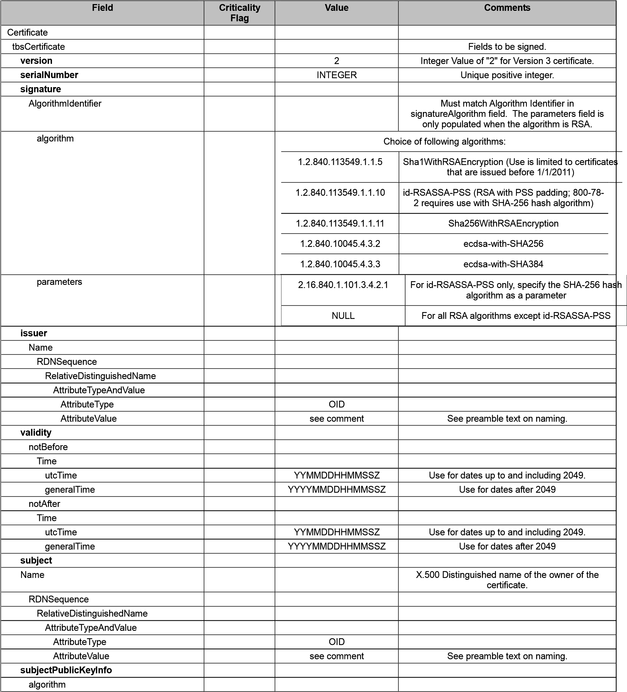

**X.509 Certificate and Certificate **

**Revocation List (CRL) Extensions Profile for Personal Identity Verification Interoperable (PIV-I) Cards **

**Federal PKI Policy Authority **

**Version 1.1 **

**May 5, 2015 **

**Revision History Table **

| **Date **        | **Version **   |                              | **Description ** |
|------------------|----------------|------------------------------|------------------|
| April 23, 2010   | 1.0            | Initial version of profile   |                  |
| May 5, 2015      | 1.1            | Make anyEKU optional         |                  |

1. Introduction 
================

This document specifies the X.509 version 3 certificate and version 2 certificate revocation list (CRL) profiles for certificates and CRLs issued for use with Personal Identity Verification Interoperable (PIV-I) cards. The profiles serve to identify unique parameter settings for certificates and CRLs issued for use with these cards.

This profile is based the X.509 Certificate and Certificate Revocation List (CRL) Extensions Profile for the Shared Service Providers (SSP) Program \[13\], which is based on the Internet Engineering Task Force (IETF) Public Key Infrastructure (PKIX) profile developed by the PKIX working group \[3\]. The PKIX profile identifies the format and semantics of certificates and CRLs for the Internet PKI. Procedures are described for processing and validating certification paths in the Internet environment. Encoding rules are provided for all fields and extensions profiled in both the X.509 v3 certificate and v2 CRL. Encoding rules for cryptographic algorithms specified in this profile are specified in \[7\] and \[10\].

 1.1. Structure 
----------------

This document is divided into six sections. Section 1 includes this introduction. Sections 2 and 3 describe the v3 certificate and v2 CRL respectively. These sections specifically describe the differences in generation and processing requirements between the PKIX profile and the profile for certificates and CRLs issued for PIV-I. Unless otherwise noted in this profile, the reader should follow the PKIX generation and processing requirements for a particular field. Section 4 specifies rules for choosing character encoding sets for attribute values of type DirectoryString in distinguished names. Section 5 profiles the use of uniform resource identifiers (URIs) in certificates. Section 6 highlights certificate contents that are particular to PIV-I. Section 7 provides an overview of each of the certificate and CRL profiles included in the worksheets corresponding to this document.

 1.2. Acronyms 
---------------

| AKID   | Authority Key Identifier                       |
|--------|------------------------------------------------|
| CA     | Certification Authority                        |
| CMS    | Cryptographic Message Syntax                   |
| CRL    | Certificate Revocation List                    |
| DER    | Distinguished Encoding Rules                   |
| DN     | Distinguished Name                             |
| ECDSA  | Elliptic Curve Digital Signature Algorithm     |
| FBCA   | Federal Bridge Certification Authority         |
| FBI    | Federal Bureau of Investigation                |
| FIPS   | Federal Information Processing Standards       |
| FPKI   | Federal Public Key Infrastructure              |
| FTP    | File Transfer Protocol                         |
| HTTP   | Hypertext Transfer Protocol                    |
| IETF   | Internet Engineering Task Force                |
| IP     | Internet Protocol                              |
| LDAP   | Lightweight Directory Access Protocol          |
| NIST   | National Institute of Standards and Technology |
| OCSP   | Online Certificate Status Protocol             |
| OID    | Object Identifier                              |
| PIV-I  | Personal Identity Verification Interoperable   |
| PKI    | Public Key Infrastructure                      |
| PKIX   | Public Key Infrastructure (X.509)              |
| PSS    | Probabilistic Signature Scheme                 |
| RFC    | Request For Comments                           |
| RSA    | Rivest-Shamir-Adelman                          |
| SHA    | Secure Hash Algorithm                          |
| SKID   | Subject Key Identifier                         |
| S/MIME | Secure/Multipurpose Internet Mail Extensions   |
| TLS    | Transport Layer Security                       |
| UPN    | User Principal Name                            |
| URI    | Uniform Resource Identifier                    |
| URL    | Uniform Resource Locator                       |
| URN    | Uniform Resource Name                          |
| UUID   | Universally Unique IDentifier                  |

 1.3. References 
-----------------

1.  [X.509 Certificate Policy For The Federal Bridge Certification Authority (FBCA).](http://www.idmanagement.gov/fpkipa/documents/FBCA_CP_RFC3647.pdf)

2.  Russel Housley and Paul Hoffman. Internet X.509 Public Key Infrastructure: *Operational Protocols: FTP and HTTP*, [RFC 2585,](http://www.ietf.org/rfc/rfc2585.txt) May 1999.

3.  David Cooper, Stefan Santesson, Stephen Farrell, Sharon Boeyen, Russel Housley, and Tim Polk. *Internet X.509 Public Key Infrastructure Certificate and Certificate Revocation List (CRL) Profile*, [RFC 5280,](http://www.ietf.org/rfc/rfc5280.txt) May 2008.

4.  Mark Smith and Tim Howes. *Lightweight Directory Access Protocol (LDAP): Uniform Resource Locator*, [RFC 4516,](http://www.ietf.org/rfc/rfc4516.txt) June 2006.

5.  Roy T. Fielding, James Gettys, Jeffrey C. Mogul, Henrik Frystyk Nielsen, Larry Masinter, Paul J. Leach, and Tim Berners-Lee. *Hypertext Transfer Protocol -- HTTP/1.1*, [RFC 2616,](http://www.ietf.org/rfc/rfc2616.txt) June 1999.

6.  Steve Lloyd. [*AKID/SKID Implementation Guideline*,](http://www.oasis-pki.org/pdfs/AKID_SKID1-af3.pdf) September 2002.

7.  Tim Polk, Russel Housley, and Larry Bassham. Internet Public Key Infrastructure: *Algorithms and Identifiers for the Internet X.509 Public Key Infrastructure Certificate and CRL Profile*, [RFC 3279,](http://www.ietf.org/rfc/rfc3279.txt) April 2002.

8.  W. Timothy Polk, Donna F. Dodson, and William E. Burr. *Cryptographic Algorithms and Key Sizes for Personal Identity Verification*, [NIST Special Publication 800-78-2,](http://csrc.nist.gov/publications/nistpubs/800-78-2/sp800-78-2.pdf) February 2010.

9.  Blake Ramsdell and Sean Turner. *Secure/Multipurpose Internet Mail Extensions (S/MIME) Version 3.2 Message Specification*, [RFC 5751,](http://www.ietf.org/rfc/rfc5751.txt) January 2010.

10. Jim Schaad, Burt Kaliski, and Russell Housley, Additional Algorithms and

> Identifiers for RSA Cryptography for use in the Internet X.509 Public Key Infrastructure Certificate and Certificate Revocation List (CRL) Profile, [RFC 4055,](http://www.ietf.org/rfc/rfc4055.txt) June 2005.

1.  Personal Identity Verification (PIV) of Federal Employees and Contractors, [FIPS 201-1,](http://csrc.nist.gov/publications/fips/fips201-1/FIPS-201-1-chng1.pdf) March 2006.

2.  Paul J. Leach, Michael Mealling, and Rich Salz. *A Universally Unique IDentifier (UUID) URN Namespace*, [RFC 4122,](http://www.ietf.org/rfc/rfc4122.txt) July 2005.

3.  [X.509 Certificate and Certificate Revocation List (CRL) Extensions Profile for the Shared Service Providers (SSP) Program.](http://www.idmanagement.gov/fpkipa/documents/CertCRLprofileForCP.pdf)

2. X.509 v3 Certificates 
=========================

X.509 v3 certificates contain the identity and attribute data of a subject using the base certificate with applicable extensions. The base certificate contains such information as the version number of the certificate, the certificate’s identifying serial number, the signature algorithm used to sign the certificate, the issuer’s distinguished name, the validity period of the certificate, the distinguished name of the subject, and information about the subject’s public key. To this base certificate are appended numerous certificate extensions. More detailed information about X.509 certificates can be found in Recommendation X.509 and RFC 5280.

CAs create certificates for user authentication procedures that require one user to obtain another user’s public key. So that users trust the public key, the CA employs a digital signature to cryptographically sign the certificate in order to provide assurance that the information within the certificate is correct. The fields in a certificate identify the issuer (i.e., CA), subject (i.e., user), version number, subject’s public key, validity period, and serial number of the certificate along with the public key algorithm used to certify the certificate. A CA may also add certificate extensions containing additional information about the user or the CA, depending on the implementation.

3. X.509 v2 Certificate Revocation Lists 
=========================================

CAs use CRLs to publicize the revocation of a subject’s certificate. The CRLs are stored in the directory as attributes and are checked by relying parties to verify that a user’s certificate has not been revoked. The fields in a CRL identify the issuer, the date the current CRL was generated, the date by which the next CRL will be generated, and the revoked users’ certificates.

The CRLs issued to comply with the requirements of Section 4.9.7 of the FBCA \[1\] must be complete for scope: they may not be indirect CRLs, delta-CRLs, or CRLs segmented by reason code. CAs may optionally issue additional CRLs, such as delta-CRLs, so long as complete for scope CRLs are also made available and are issued with sufficient frequency to meet the requirements specified in Section 4.9.7 of the FBCA. CAs that issue segmented CRLs are strongly encouraged to also issue full CRLs in order to accommodate third parties that use CRLs to generate OCSP responses. CAs may optionally supplement the CRL based revocation mechanisms with on-line revocation mechanisms.

If delta-CRLs are issued, then either the certificates or the complete CRLs that correspond to the delta-CRLs should include a FreshestCRL extension that points to the delta-CRLs. If an OCSP server is available that provides status information about a certificate, then the authorityInfoAccess extension for that certificate should include a pointer to the OCSP server.

4. Encoding Distinguished Names with Attributes of type DirectoryString 
========================================================================

X.509 certificates and CRLs include distinguished names to identify issuers (of certificates and CRLs), subjects of certificates, and to specify CRL distribution points.

Many of the attributes in distinguished names use the DirectoryString syntax.

DirectoryString permits encoding of names in a choice of character sets: PrintableString, TeletexString, BMPString, UniversalString, and UTF8String.

PrintableString is currently the most widely used encoding for attribute values in distinguished names. PrintableString is a subset of ASCII; it does not include characters required for most international languages. UTF8String is an encoding that supports all recognized written languages, including some ancient languages (e.g., Runic). Any name that can be represented in PrintableString can also be encoded using UTF8String.

Name comparison is an important step in X.509 path validation, particularly for name chaining and name constraints computation. Many legacy implementations are unable to perform name comparisons when names are encoded using different character sets. To simplify correct operation of path validation, CAs are strongly encouraged to honor the subject’s chosen character set when issuing CA certificates or populating extensions. That is, if a subject CA encodes its own name in the issuer field of certificates and CRLs it generates using TeletexString, the cross certificate should use the same character set to specify that CA’s name.

Name constraints are specified in CA certificates. The names specified in name constraints must be compared with the subject names in subsequent certificates in a certification path. To help ensure that name constraints are applied correctly, CAs should encode each attribute value in a name constraint using the same encoding as is used to encode the corresponding attribute value in subject names in subsequent certificates. In general, it may be assumed that subject names are encoded in the same way as the issuer field in the certificates issued by the subject of the certificate containing the name constraints extension.

For certificates and CRLs issued for PIV-I, attributes of type DirectoryString shall be encoded in either PrintableString or UTF8String. Attribute values should be encoded in PrintableString whenever possible.

5. Use of URIs in Distribution Points, AuthorityInfoAccess, and subjectInfoAccess Extensions 
=============================================================================================

Uniform Resource Identifiers (URIs) are used in four different extensions within the certificate and CRL profiles in this document: authorityInfoAccess, subjectInfoAccess, cRLDistributionPoints, and issuingDistributionPoint. Two different protocols are used in this document: LDAP and HTTP. The specifications for URIs for these protocols may be found in RFC 4516 and RFC 2616, respectively.

Except for the id-ad-ocsp access method of the authorityInfoAccess extension, the scheme portion of all URIs must be either "http" or "ldap" to indicate that the relevant information is located in an LDAP accessible directory or via HTTP. For the id-ad-ocsp access method of the authorityInfoAccess, the scheme portion of the URI must be "http" to indicate that the transport protocol for the OCSP request/response messages is HTTP. The hostname of every URI must be specified as either a fully qualified domain name or an IP address. The information must be made available via the default port number for the relevant protocol (80 for HTTP and 389 for LDAP) and so does not need to be specified in the URI.

In the cRLDistributionPoints extension, the URI is a pointer to a current CRL that provides status information about the certificate. If LDAP is used, the URI must include the DN of the entry containing the CRL and specify the directory attribute in which the CRL is located (certificateRevocationList, authorityRevocationList, or deltaRevocationList). If the directory in which the CRL is stored expects the "binary" option to be specified, then the attribute type must be followed by ";binary" in the URI. If HTTP is used, the URI must point to a file that has an extension of ".crl" that contains the DER encoded CRL (see RFC 2585). When a URI is used as the

DistributionPointName in the issuingDistributionPoint extension in a CRL, the value must match the URI in the corresponding distribution points in the cRLDistributionPoints extensions in certificates covered by the CRL.

Some examples of URIs that may appear in a cRLDistributionPoints or issuingDistributionPoint extension are:

http://www.example.com/fictitiousCRLdirectory/fictitiousCRL1.crl ldap://ldap.example.com/cn=Good%20CA,c=US?certificateRevocationList;binary

The authorityInfoAccess extension uses URIs for two purposes. When the id-adcaIssuers access method is used, the access location specifies where certificates issued to the issuer of the certificate may be found. If LDAP is used, the URI must include the DN of the entry containing the relevant certificates and specify the directory attribute in which the certificates are located. If the directory in which the certificates are stored expects the "binary" option to be specified, then the attribute type must be followed by ";binary" in the URI. If HTTP is used, the URI must point to a file that has an extension of ".p7c" that contains a certs-only CMS message (see RFC 5751). The CMS message should include all certificates issued to the issuer of this certificate, but must at least contain all certificates issued to the issuer of this certificate in which the subject public key may be used to verify the signature on this certificate.

Certificates issued for PIV-I must include an authorityInfoAccess extension that contains at least one instance of the id-ad-caIssuers access method. The access location for this instance must be an HTTP URI.

For a certificate issued by “Good CA”, some examples of URIs that may appear as the access location in an authorityInfoAccess extension when the id-ad-caIssuers access method is used are:

http://www.example.com/fictitiousCertsOnlyCMSdirectory/certsIssuedToGoodCA.p7c ldap://ldap.example.com/cn=Good%20CA,o=Test%20Certificates,c=US?cACertificate,crossCertificatePair; binary

When the id-ad-ocsp access method is used, the access location specifies the location of an OCSP server that provides status information about the certificate. The URI may include a path. Where privacy is a requirement, the URI may specify the "https" scheme to indicate that the transport protocol for OCSP requests/responses is HTTP over SSL/TLS. In this case, the default port number is 443, and the URI must include the server's port number if this default port number is not used.

The id-ad-caRepository access method for the subjectInfoAccess extension uses URIs to specify the location where CA certificates issued by the subject of the certificate may be found. If LDAP is used, the URI must include the DN of the entry containing the relevant certificates and specify the directory attribute in which the certificates are located. If the directory in which the certificates are stored expects the "binary" option to be specified, then the attribute type must be followed by ";binary" in the URI. If HTTP is used, the URI must point to a file that has an extension of ".p7c" that contain a certs-only CMS message (see RFC 5751). The CMS message should include all CA certificates issued by the subject of this certificate, but must at least contain all CA certificates issued by the subject of this certificate in which the signature on the certificate may be verified using the subject public key in this certificate.

CA certificates for PIV-I should include a subjectInfoAccess extension that contains at least one instance of the id-ad-caRepository access method. The access location for this instance should be an HTTP URI . If the subject of the certificate only issues end entity certificates, then the subjectInfoAccess extension may be excluded.

For a certificate issued to “Good CA”, some examples of URIs that may appear as the access location in an subjectInfoAccess extension when the id-ad-caRepository access method is used are:

http://www.example.com/fictitiousCertsOnlyCMSdirectory/CAcertsIssuedByGoodCA.p7c ldap://ldap.example.com/cn=Good%20CA,c=US?cACertificate,crossCertificatePair;binary

6. PIV-I Certificates 
======================

The certificate profiles for PIV-I are based on the profile for End Entity Signature Certificates, but these profiles differ in a number of ways based on requirements that are specified in the FBCA \[1\]. The main differences in these profiles are as follows:

-   There must be an OCSP server that responds on port 80 that provides certificate status information for PIV-I certificates and the authorityInfoAccess extension in these certificates must include an access method of type id-ad-ocsp where the access location is a URI with a scheme of "http".

-   PIV-I Card Authentication certificates must include a critical extended key usage extension that asserts id-PIV-cardAuth.

-   Authentication certificates and PIV-I Card Authentication certificates must include a subjectAltName extension that includes the UUID from the PIV-I card that holds the certificates.

-   The subjectAltName extension in the PIV-I Card Authentication certificates must not include any name forms other than the UUID.

-   The nonRepudiation key usage bit must not be set in either PIV-I Authentication or PIV-I Card Authentication certificates.

-   PIV-I Content Signing certificates that are used to verify signatures on the CHUID or biometric data on PIV-I cards include an extended key usage extension that asserts id-fpki-pivi-content-signing.

1. Worksheet Contents 
======================

The certificate and CRL profiles consist of nine worksheets. Each worksheet lists mandatory contents of a particular class of certificates or CRLs. Optional features that will be widely supported in the Federal PKI are also identified. These features MAY be included at the issuer's option. Certificate and CRL issuers may include additional information in non-critical extensions for local use, but should not expect clients in the Federal PKI to process this additional information. Critical extensions that are not listed in these worksheets MUST NOT be included in certificates or CRLs issued for PIV-I.

The nine worksheets are:

1.  The *Self-Issued CA Certificate Profile* worksheet defines the mandatory and optional contents of key rollover certificates.

2.  The *Cross Certificate* *Profile* worksheet defines the mandatory and optional contents of certificates issued by CAs for PIV-I where the subject is another CA and the public key will be used to verify the signature on certificates and CRLs.

3.  The *CRL Profile* worksheet table defines the mandatory and optional contents of CRLs issued by CAs that issue certificates for PIV-I.

4.  The *PIV-I Card Authentication Certificate Profile* worksheet defines the mandatory and optional contents of certificates that correspond to the Card Authentication Key defined in Section 4.3 of FIPS 201.

5.  The *PIV-I Authentication Certificate Profile* worksheet defines the mandatory and optional contents of certificates that correspond to the PIV Authentication Key defined in Section 4.3 of FIPS 201.

6.  The *PIV-I Digital Signature Certificate Profile* worksheet defines the mandatory and optional contents of certificates that correspond to the Digital Signature Key defined in Section 4.3 of FIPS 201.

7.  The *PIV-I* *Key Management Certificate Profile* worksheet defines the mandatory and optional contents of certificates that correspond to the Key Management Key defined in Section 4.3 of FIPS 201.

8.  The *PIV-I Content Signing Certificate Profile* worksheet defines the mandatory and optional contents of certificates issued by CAs to Card Management Systems for use in signing data objects on the PIV-I card.

9.  The *Delegated OCSP Responder* *Certificate Profile* worksheet defines the mandatory and optional contents of certificates issued to OCSP responders that are delegated to provide certificate revocation status.

Worksheet 1: Self-Issued CA Certificate Profile 
================================================

| **Field **                  | **Criticality Flag **   | **Value **                        | **Comments **                                                                               |
|-----------------------------|-------------------------|-----------------------------------|---------------------------------------------------------------------------------------------|
| Certificate                 |                         |                                   |                                                                                             |
| tbsCertificate              |                         |                                   | Fields to be signed.                                                                        |
| **version **                |                         | 2                                 | Integer Value of "2" for Version 3 certificate.                                             |
| **serialNumber **           |                         | INTEGER                           | Unique positive integer.                                                                    |
| **signature **              |                         |                                   |                                                                                             |
| AlgorithmIdentifier         |                         |                                   | Must match Algorithm Identifier in signatureAlgorithm field. The parameters field is only populated when the algorithm is RSA.  |
| algorithm                   |                         | Choice of following algorithms:   |
|                             |                         | 1.2.840.113549.1.1.5              | Sha1WithRSAEncryption (Use is limited to certificates that are issued before 1/1/2011)      |
|                             |                         | 1.2.840.113549.1.1.10             | id-RSASSA-PSS (RSA with PSS padding; 800-78-2 requires use with SHA-256 hash algorithm)                                             |
|                             |                         | 1.2.840.113549.1.1.11             | Sha256WithRSAEncryption                                                                     |
|                             |                         | 1.2.840.10045.4.3.2               | ecdsa-with-Sha256                                                                           |
|                             |                         | 1.2.840.10045.4.3.3               | ecdsa-with-Sha384                                                                           |
| parameters                  |                         | 2.16.840.1.101.3.4.2.1            | For id-RSASSA-PSS only, specify the SHA-256 hash algorithm as a parameter                   |
|                             |                         | NULL                              | For all RSA algorithms except id-RSASSA-PSS                                                 |
| **issuer **                 |                         |                                   |                                                                                             |
| Name                        |                         |                                   |                                                                                             |
| RDNSequence                 |                         |                                   |                                                                                             |
| RelativeDistinguishedName   |                         |                                   |                                                                                             |
| AttributeTypeAndValue       |                         |                                   |                                                                                             |
| AttributeType               |                         | OID                               |                                                                                             |
| AttributeValue              |                         | see comment                       | See preamble text on naming.                                                                |
| **validity **               |                         |                                   |                                                                                             |
| notBefore                   |                         |                                   |                                                                                             |
| Time                        |                         |                                   |                                                                                             |
| utcTime                     |                         | YYMMDDHHMMSSZ                     | Use for dates up to and including 2049.                                                     |
| generalTime                 |                         | YYYYMMDDHHMMSSZ                   | Use for dates after 2049                                                                    |
| notAfter                    |                         |                                   |                                                                                             |
| Time                        |                         |                                   |                                                                                             |
| utcTime                     |                         | YYMMDDHHMMSSZ                     | Use for dates up to and including 2049.                                                     |
| generalTime                 |                         | YYYYMMDDHHMMSSZ                   | Use for dates after 2049                                                                    |
| **subject **                |                         |                                   |                                                                                             |
| Name                          |                         |                                                                                                            | Subject name should be encoded exactly as it is encoded in the issuer field of this certificate.                                                                                                     |
| RDNSequence                   |                         |                                                                                                            |                                                                                                                                                                                                      |
| RelativeDistinguishedName     |                         |                                                                                                            |                                                                                                                                                                                                      |
| AttributeTypeAndValue         |                         |                                                                                                            |                                                                                                                                                                                                      |
| AttributeType                 |                         | OID                                                                                                        |                                                                                                                                                                                                      |
| AttributeValue                |                         | see comment                                                                                                | Encoding of name must use the encoding of the issuer field in certificates and CRLs issued by this subject CA                                                                                                                                                                                          |
| **subjectPublicKeyInfo **     |                         |                                                                                                            |                                                                                                                                                                                                      |
| algorithm                     |                         |                                                                                                            |                                                                                                                                                                                                      |
| AlgorithmIdentifier           |                         |                                                                                                            | Public key algorithm associated with the public key. May be either RSA or elliptic curve.                                                                                                            |
| algorithm                     |                         | 1.2.840.113549.1.1.1                                                                                       | RSA Encryption                                                                                                                                                                                       |
|                               |                         | 1.2.840.10045.2.1                                                                                          | Elliptic curve key                                                                                                                                                                                   |
| parameters                    |                         |                                                                                                            | Format and meaning dependent upon algorithm                                                                                                                                                          |
| RSAParameters                 |                         | NULL                                                                                                       | For RSA, parameters field is populated with NULL.                                                                                                                                                    |
| EcpkParameters                |                         |                                                                                                            |                                                                                                                                                                                                      |
| namedCurve                    |                         | Implicitly specify parameters through an OID associated with a NIST approved curve referenced in 800-78-2: |
|                               |                         | 1.2.840.10045.3.1.7                                                                                        | Curve P-256                                                                                                                                                                                          |
|                               |                         | 1.3.132.0.34                                                                                               | Curve P-384                                                                                                                                                                                          |
| subjectPublicKey              |                         | BIT STRING                                                                                                 | For RSA public keys certificates shall have a modulus of 2048 or 3072 bits.                                                                                                                          |
| **required extensions **      |                         |                                                                                                            |                                                                                                                                                                                                      |
| **authorityKeyIdentifier **   | FALSE                   |                                                                                                            |                                                                                                                                                                                                      |
| keyIdentifier                 |                         | OCTET STRING                                                                                               | Derived using the SHA-1 hash of the public key.                                                                                                                                                      |
| **subjectKeyIdentifier **     | FALSE                   |                                                                                                            |                                                                                                                                                                                                      |
| keyIdentifier                 |                         | OCTET STRING                                                                                               | Derived using the SHA-1 hash of the public key.                                                                                                                                                      |
| **keyUsage **                 | TRUE                    |                                                                                                            | If the subject public key may be used for purposes other than certificate and CRL signing (e.g., signing OCSP responses), then the digitalSignature and/or nonRepudiation bits may be set as well.   |
| digitalSignature              |                         | 0                                                                                                          |                                                                                                                                                                                                      |
| nonRepudiation                |                         | 0                                                                                                          |                                                                                                                                                                                                      |
| keyEncipherment               |                         | 0                                                                                                          |                                                                                                                                                                                                      |
| dataEncipherment              |                         | 0                                                                                                          |                                                                                                                                                                                                      |
| keyAgreement                  |                         | 0                                                                                                          |                                                                                                                                                                                                      |
| keyCertSign                  |                         | 1                                       |                                                                                                                                               |
| cRLSign                      |                         | 1                                       |                                                                                                                                               |
| encipherOnly                 |                         | 0                                       |                                                                                                                                               |
| decipherOnly                 |                         | 0                                       |                                                                                                                                               |
| **certificatePolicies **     | FALSE                   |                                         |                                                                                                                                               |
| PolicyInformation            |                         |                                         |                                                                                                                                               |
| policyIdentifier             |                         |                                         |                                                                                                                                               |
| **basicConstraints **        | TRUE                    |                                         | This extension must appear in all CA certificates. The pathLenConstraint field should not appear in self-issued certificates.                                                                     |
| cA                           |                         | TRUE                                    |                                                                                                                                               |
| **cRLDistributionPoints **   | FALSE                   |                                         | This extension is required in all CA certificates and must contain at least one HTTP URI. The reasons and cRLIssuer fields must be omitted.   |
| DistributionPoint            |                         |                                         |                                                                                                                                               |
| distributionPoint            |                         |                                         |                                                                                                                                               |
| DistributionPointName        |                         |                                         |                                                                                                                                               |
| fullName                     |                         |                                         |                                                                                                                                               |
| GeneralNames                 |                         |                                         |                                                                                                                                               |
| GeneralName                  |                         |                                         |                                                                                                                                               |
| directoryName                |                         |                                         |                                                                                                                                               |
| Name                         |                         |                                         |                                                                                                                                               |
| RDNSequence                  |                         |                                         |                                                                                                                                               |
| RelativeDistinguishedName    |                         |                                         |                                                                                                                                               |
| AttributeTypeAndValue        |                         |                                         |                                                                                                                                               |
| AttributeType                |                         | OID                                     |                                                                                                                                               |
| AttributeValue               |                         | see comment                             | See preamble text on naming.                                                                                                                  |
| uniformResourceIdentifier    |                         | ldap://… or http://…                    | See preamble text on URIs.                                                                                                                    |
| **authorityInfoAccess **     | FALSE                   |                                         | authorityInfoAccess consists of a sequence of accessMethod and accessLocation pairs. Two access methods are defined: one for locating certificates issued to the certificate issuer and one for locating an OCSP server that provides status information about this certificate. Certificates issued for PIV-I must include an authorityInfoAccess extension with at least one instance of the caIssuers access method that specifies an HTTP URI. The OCSP access method may also be included if status information for this certificate is available via OCSP.                                                  |
| AccessDescription            |                         |                                         |                                                                                                                                               |
| accessMethod                 |                         | id-ad-caIssuers (1.3.6.1.5.5.7.48.2)                     | When this access method is used, the access location should use the URI name form to specify the location of an LDAP accessible directory server or HTTP accessible Web server where certificates issued to the issuer of this certificate may be found.                                                                            |
| accessLocation               |                         |                                         |                                                                                                                                               |
| GeneralName                  |                         |                                         |                                                                                                                                               |
| uniformResourceIdentifier    |                         | ldap://… or http://…                    | See preamble text on URIs.                                                                                                                    |
| **optional extensions **     |                         |                                         |                                                                                                                                               |
| **subjectInfoAccess **       | FALSE                   |                                         | CA Certificates issued for PIV-I may include a subjectInfoAccess extension. subjectInfoAccess consists of a sequence of accessMethod and accessLocation pairs. Only one access method is defined for use in CA certificates.                                                            |
| AccessDescription            |                         |                                         |                                                                                                                                               |
| accessMethod                 |                         | id-ad-caRepository (1.3.6.1.5.5.7.48.5) | Each CA certificate should include at least one instance of this access method that includes a URI name form to specify an HTTP accessible Web server. The URI should point to a location where certificates issued by the subject of this certificate may be found.                      |
| accessLocation               |                         |                                         |                                                                                                                                               |
| GeneralName                  |                         |                                         |                                                                                                                                               |
| uniformResourceIdentifier    |                         | ldap://… or http://…                    | See preamble text on URIs.                                                                                                                    |
| **issuerAltName **           | FALSE                   |                                         | Any name types may be present; only the most common are specified here.                                                                       |
| GeneralNames                 |                         |                                         |                                                                                                                                               |
| GeneralName                  |                         |                                         |                                                                                                                                               |
| rfc822Name                   |                         | IA5String                               | Electronic mail address of the PKI administration                                                                                             |

Worksheet 2: Cross Certificate Profile 
=======================================

| **Field **                  | **Criticality Flag **   | **Value **                        | **Comments **                                                                                 |
|-----------------------------|-------------------------|-----------------------------------|-----------------------------------------------------------------------------------------------|
| Certificate                 |                         |                                   |                                                                                               |
| tbsCertificate              |                         |                                   | Fields to be signed.                                                                          |
| **version **                |                         | 2                                 | Integer Value of "2" for Version 3 certificate.                                               |
| **serialNumber **           |                         | INTEGER                           | Unique positive integer.                                                                      |
| **signature **              |                         |                                   |                                                                                               |
| AlgorithmIdentifier         |                         |                                   | Must match Algorithm Identifier in signatureAlgorithm field. The parameters field is only populated when the algorithm is RSA.  |
| algorithm                   |                         | Choice of following algorithms:   |
|                             |                         | 1.2.840.113549.1.1.5              | Sha1WithRSAEncryption (Use is limited to certificates that are issued before 1/1/2011)        |
|                             |                         | 1.2.840.113549.1.1.10             | id-RSASSA-PSS (RSA with PSS padding; 800-78-2 requires use with SHA-256 hash algorithm)       |
|                             |                         | 1.2.840.113549.1.1.11             | Sha256WithRSAEncryption                                                                       |
|                             |                         | 1.2.840.10045.4.3.2               | ecdsa-with-SHA256                                                                             |
|                             |                         | 1.2.840.10045.4.3.3               | ecdsa-with-SHA384                                                                             |
| parameters                  |                         | 2.16.840.1.101.3.4.2.1            | For id-RSASSA-PSS only, specify the SHA-256 hash algorithm as a parameter                     |
|                             |                         | NULL                              | For all RSA algorithms except id-RSASSA-PSS                                                   |
| **issuer **                 |                         |                                   |                                                                                               |
| Name                        |                         |                                   |                                                                                               |
| RDNSequence                 |                         |                                   |                                                                                               |
| RelativeDistinguishedName   |                         |                                   |                                                                                               |
| AttributeTypeAndValue       |                         |                                   |                                                                                               |
| AttributeType               |                         | OID                               |                                                                                               |
| AttributeValue              |                         | see comment                       | See preamble text on naming.                                                                  |
| **validity **               |                         |                                   |                                                                                               |
| notBefore                   |                         |                                   |                                                                                               |
| Time                        |                         |                                   |                                                                                               |
| utcTime                     |                         | YYMMDDHHMMSSZ                     | Use for dates up to and including 2049.                                                       |
| generalTime                 |                         | YYYYMMDDHHMMSSZ                   | Use for dates after 2049                                                                      |
| notAfter                    |                         |                                   |                                                                                               |
| Time                        |                         |                                   |                                                                                               |
| utcTime                     |                         | YYMMDDHHMMSSZ                     | Use for dates up to and including 2049.                                                       |
| generalTime                 |                         | YYYYMMDDHHMMSSZ                   | Use for dates after 2049                                                                      |
| **subject **                |                         |                                   |                                                                                               |
| Name                            |                         |                                                                                                            | X.500 Distinguished name of the owner of the subject public key in the certificate. Subject name should be encoded exactly as it is encoded in the issuer field of certificates issued by the subject. |
| RDNSequence                     |                         |                                                                                                            |                                                                                                                                                                                                        |
| RelativeDistinguishedName       |                         |                                                                                                            |                                                                                                                                                                                                        |
| AttributeTypeAndValue           |                         |                                                                                                            |                                                                                                                                                                                                        |
| AttributeType                   |                         | OID                                                                                                        |                                                                                                                                                                                                        |
| AttributeValue                  |                         | see comment                                                                                                | Encoding of name must use the encoding of the issuer field in certificates and CRLs issued by this subject CA                                                                                                                                                                                              |
| **subjectPublicKeyInfo **       |                         |                                                                                                            |                                                                                                                                                                                                        |
| algorithm                       |                         |                                                                                                            |                                                                                                                                                                                                        |
| AlgorithmIdentifier algorithm   |                         |                                                                                                            | Public key algorithm associated with the public key. May be either RSA or elliptic curve.                                                                                                              |
|                                 |                         | 1.2.840.113549.1.1.1                                                                                       | RSA Encryption                                                                                                                                                                                         |
|                                 |                         | 1.2.840.10045.2.1                                                                                          | Elliptic curve key                                                                                                                                                                                     |
| parameters                      |                         |                                                                                                            | Format and meaning dependent upon algorithm                                                                                                                                                            |
| RSAParameters                   |                         | NULL                                                                                                       | For RSA, parameters field is populated with NULL.                                                                                                                                                      |
| EcpkParameters namedCurve                     |                         | Implicitly specify parameters through an OID associated with a NIST approved curve referenced in 800-78-2: |
|                                 |                         | 1.2.840.10045.3.1.7                                                                                        | Curve P-256                                                                                                                                                                                            |
|                                 |                         | 1.3.132.0.34                                                                                               | Curve P-384                                                                                                                                                                                            |
| subjectPublicKey                |                         | BIT STRING                                                                                                 | For RSA public keys certificates shall have a modulus of 2048 or 3072 bits.                                                                                                                            |
| **required extensions **        |                         |                                                                                                            |                                                                                                                                                                                                        |
| **authorityKeyIdentifier **     | FALSE                   |                                                                                                            |                                                                                                                                                                                                        |
| keyIdentifier                   |                         | OCTET STRING                                                                                               | Derived using the SHA-1 hash of the public key.                                                                                                                                                        |
| **subjectKeyIdentifier **       | FALSE                   |                                                                                                            |                                                                                                                                                                                                        |
| keyIdentifier                   |                         | OCTET STRING                                                                                               | The value in this field must be the same as the value that the subject CA uses in the authority key identifier extension of the certificates and CRLs that it signs with the private key that corresponds to the subject public key included in this certificate.                                         |
| **keyUsage **                   | TRUE                    |                                                                                                            | If the subject public key may be used for purposes other than certificate and CRL signing (e.g., signing OCSP responses), then the digitalSignature and/or nonRepudiation bits may be set as well.                                                                                                               |
| digitalSignature                |                         | 0                                                                                                          |                                                                                                                                                                                                        |
| nonRepudiation                  |                         | 0                                                                                                          |                                                                                                                                                                                                        |
| keyEncipherment                 |                         | 0                                                                                                          |                                                                                                                                                                                                        |
| dataEncipherment             |                         | 0                    |                                                                                                                                             |
| keyAgreement                 |                         | 0                    |                                                                                                                                             |
| keyCertSign                  |                         | 1                    |                                                                                                                                             |
| cRLSign                      |                         | 1                    |                                                                                                                                             |
| encipherOnly                 |                         | 0                    |                                                                                                                                             |
| decipherOnly                 |                         | 0                    |                                                                                                                                             |
| **certificatePolicies **     | FALSE                   |                      |                                                                                                                                             |
| PolicyInformation            |                         |                      |                                                                                                                                             |
| policyIdentifier             |                         |                      |                                                                                                                                             |
| **basicConstraints **        | TRUE                    |                      | This extension must appear in all CA certificates.                                                                                          |
| cA                           |                         | TRUE                 |                                                                                                                                             |
| pathLenConstraint            |                         | INTEGER              | The use of a path length constraint is optional.                                                                                            |
| **cRLDistributionPoints **   | FALSE                   |                      | This extension is required in all CA certificates and must contain at least one HTTP URI. The reasons and cRLIssuer fields must be omitted. |
| DistributionPoint            |                         |                      |                                                                                                                                             |
| distributionPoint            |                         |                      |                                                                                                                                             |
| DistributionPointName        |                         |                      |                                                                                                                                             |
| fullName                     |                         |                      |                                                                                                                                             |
| GeneralNames                 |                         |                      |                                                                                                                                             |
| GeneralName                  |                         |                      |                                                                                                                                             |
| directoryName                |                         |                      |                                                                                                                                             |
| Name                         |                         |                      |                                                                                                                                             |
| RDNSequence                  |                         |                      |                                                                                                                                             |
| RelativeDistinguishedName    |                         |                      |                                                                                                                                             |
| AttributeTypeAndValue        |                         |                      |                                                                                                                                             |
| AttributeType                |                         | OID                  |                                                                                                                                             |
| AttributeValue               |                         | see comment          | See preamble text on naming.                                                                                                                |
| uniformResourceIdentifier    |                         | ldap://… or http://… | See preamble text on URIs.                                                                                                                  |
| **authorityInfoAccess **     | FALSE                   |                      | authorityInfoAccess consists of a sequence of accessMethod and accessLocation pairs. Two access methods are defined: one for locating certificates issued to the certificate issuer and one for locating an OCSP server that provides status information about this certificate. Certificates issued for PIV-I must include an authorityInfoAccess extension with at least one instance of the caIssuers access method that specifies an HTTP URI. The OCSP access method may also be included if status information for this certificate is available via OCSP.         |
| AccessDescription           |                         |                      |                                                                                                                                                                           |
| accessMethod                |                         | id-ad-caIssuers (1.3.6.1.5.5.7.48.2)  | When this access method is used, the access location should use the URI name form to specify the location of an LDAP accessible directory server or HTTP accessible Web server where certificates issued to the issuer of this certificate may be found.                |
| accessLocation              |                         |                      |                                                                                                                                                                           |
| GeneralName                 |                         |                      |                                                                                                                                                                           |
| uniformResourceIdentifier   |                         | ldap://… or http://… | See preamble text on URIs.                                                                                                                                                |
| **optional extensions **    |                         |                      |                                                                                                                                                                           |
| **subjectInfoAccess **      | FALSE                   |                      | CA Certificates issued for PIV-I may include a subjectInfoAccess extension (unless the certificate subject does not issue any CA certificates, as specified in Section 8). subjectInfoAccess consists of a sequence of accessMethod and accessLocation pairs. Only one access method is defined for use in CA certificates.  |
| AccessDescription           |                         |                      |                                                                                                                                                                           |
| accessMethod                |                         | id-ad-caRepository (1.3.6.1.5.5.7.48.5)  | Each CA certificate should include at least one instance of this access method that includes a URI name form to specify an HTTP accessible Web server. The URI should point to a location where certificates issued by the subject of this certificate may be found.                                                                                                       |
| accessLocation              |                         |                      |                                                                                                                                                                           |
| GeneralName                 |                         |                      |                                                                                                                                                                           |
| uniformResourceIdentifier   |                         | ldap://… or http://… | See preamble text on URIs.                                                                                                                                                |
| **issuerAltName **          | FALSE                   |                      | Any name types may be present; only the most common are specified here.                                                                                                   |
| GeneralNames                |                         |                      |                                                                                                                                                                           |
| GeneralName                 |                         |                      |                                                                                                                                                                           |
| rfc822Name                  |                         | IA5String            | Electronic mail address of the PKI administration                                                                                                                         |
| **policyMappings **         | FALSE                   |                      | This extension may be included in cross-certificates if the subject CA issues certificates under a different set of policies than the issuing CA and the subject CA's policies are deemed by the issuer to map to the issuer's policies.                                      |
| issuerDomainPolicy          |                         | OID                  | OID of policy from the issuing CA domain that maps to the equivalent policy in the subject CA's domain.                                                                   |
| subjectDomainPolicy         |                         | OID                  | OID of policy in the subject CA's domain that may be accepted in lieu of the issuing domain policy.                                                                       |
| **nameConstraints **        | TRUE                    |                      | This extension is optional in CA certificates. If present, any combination of permitted and excluded subtrees may appear. If permitted and excluded subtrees overlap, the excluded subtree takes precedence.                                                                                                          |
| permittedSubtrees           |                         |                      | minimum is always zero, maximum is never present.                                                                                                                         |
| GeneralSubtrees             |                         |                      |                                                                                                                                                                           |
| GeneralSubtree              |                         |                      |                                                                                                                                                                           |
| base                        |                         |                      |                                                                                                                                                                           |
| GeneralName                 |                         |                      |                                                                                                                                                                           |
| directoryName               |                         |                      |                                                                                                                                                                           |
| Name                        |                         |                      |                                                                                                                                                                           |
| RDNSequence                 |                         |                      |                                                                                                                                                                           |
| RelativeDistinguishedName   |                         |                      |                                                                                                                                                                           |
| AttributeTypeAndValue       |                         |                      |                                                                                                                                                                           |
| AttributeType               |                         | OID                  |                                                                                                                                                                           |
| AttributeValue              |                         | see comment          | See preamble text on naming.                                                                                                                                              |
| minimum                     |                         | 0                    | minimum is always zero, maximum is never present.                                                                                                                         |
| excludedSubtrees            |                         |                      |                                                                                                                                                                           |
| GeneralSubtrees             |                         |                      |                                                                                                                                                                           |
| GeneralSubtree              |                         |                      |                                                                                                                                                                           |
| base                        |                         |                      |                                                                                                                                                                           |
| GeneralName                 |                         |                      |                                                                                                                                                                           |
| directoryName               |                         |                      |                                                                                                                                                                           |
| Name                        |                         |                      |                                                                                                                                                                           |
| RDNSequence                 |                         |                      |                                                                                                                                                                           |
| RelativeDistinguishedName   |                         |                      |                                                                                                                                                                           |
| AttributeTypeAndValue       |                         |                      |                                                                                                                                                                           |
| AttributeType               |                         | OID                  |                                                                                                                                                                           |
| AttributeValue              |                         | see comment          | See preamble text on naming.                                                                                                                                              |
| minimum                     |                         | 0                    | minimum is always zero, maximum is never present.                                                                                                                         |

Worksheet 3: CRL Profile 
=========================

| **Field **                  | **Criticality Flag **   | **Value **                        | **Comments **                                                                                                                 |
|-----------------------------|-------------------------|-----------------------------------|-------------------------------------------------------------------------------------------------------------------------------|
| CertificateList             |                         |                                   |                                                                                                                               |
| tbsCertList                 |                         |                                   | Fields to be signed.                                                                                                          |
| **version **                |                         | 1                                 | Integer Value of "1" for Version 2 CRL.                                                                                       |
| **signature **              |                         |                                   |                                                                                                                               |
| AlgorithmIdentifier         |                         |                                   | Must match Algorithm Identifier in signatureAlgorithm field. The parameters field is only populated when the algorithm is RSA.                                    |
| algorithm                   |                         | Choice of following algorithms:   |
|                             |                         | 1.2.840.113549.1.1.5              | Sha1WithRSAEncryption (may only be used in CRLs issued before January 1, 2011)                                                |
|                             |                         | 1.2.840.113549.1.1.10             | id-RSASSA-PSS (RSA with PSS padding; 800-782 requires use with SHA-256 hash algorithm)                                        |
|                             |                         | 1.2.840.113549.1.1.11             | Sha256WithRSAEncryption                                                                                                       |
|                             |                         | 1.2.840.10045.4.3.2               | ecdsa-with-SHA256                                                                                                             |
|                             |                         | 1.2.840.10045.4.3.3               | ecdsa-with-SHA384                                                                                                             |
| parameters                  |                         | 2.16.840.1.101.3.4.2.1            | For id-RSASSA-PSS only, specify the SHA-256 hash algorithm as a parameter                                                     |
|                             |                         | NULL                              | For all RSA algorithms except id-RSASSA-PSS                                                                                   |
| **issuer **                 |                         |                                   |                                                                                                                               |
| Name                        |                         |                                   | Issuer name should be encoded exactly as it is encoded in the issuer fields of the certificates that are covered by this CRL. |
| RDNSequence                 |                         |                                   |                                                                                                                               |
| RelativeDistinguishedName   |                         |                                   |                                                                                                                               |
| AttributeTypeAndValue       |                         |                                   |                                                                                                                               |
| AttributeType               |                         | OID                               |                                                                                                                               |
| AttributeValue              |                         | See Comment.                      | See preamble text on naming.                                                                                                  |
| **thisUpdate **             |                         |                                   |                                                                                                                               |
| Time                        |                         |                                   |                                                                                                                               |
| utcTime                     |                         | YYMMDDHHMMSSZ                     | Use for dates up to and including 2049.                                                                                       |
| generalTime                 |                         | YYYYMMDDHHMMSSZ                   | Use for dates after 2049                                                                                                      |
| **nextUpdate **             |                         |                                   |                                                                                                                               |
| Time                        |                         |                                   |                                                                                                                               |
| utcTime                         |                         | YYMMDDHHMMSSZ     | Use for dates up to and including 2049.                                                                                      |
| generalTime                     |                         | YYYYMMDDHHMMSSZ   | Use for dates after 2049                                                                                                     |
| **revokedCertificates **        |                         |                   |                                                                                                                              |
| userCertificate                 |                         | INTEGER           | serial number of certificate being revoked                                                                                   |
| revocationDate                  |                         |                   |                                                                                                                              |
| Time                            |                         |                   |                                                                                                                              |
| utcTime                         |                         | YYMMDDHHMMSSZ     | Use for dates up to and including 2049.                                                                                      |
| generalTime                     |                         | YYYYMMDDHHMMSSZ   | Use for dates after 2049                                                                                                     |
| crlEntryExtensions              |                         |                   |                                                                                                                              |
| Extensions                      |                         |                   |                                                                                                                              |
| **reasonCode **                 | FALSE                   |                   |                                                                                                                              |
| CRLReason                       |                         |                   | Any one of these CRL reasons may be asserted: keyCompromise, cAcompromise, affiliationChanged, superseded, cessationOfOperation, certificateHold. If the revocation reason is unspecified, then the reasonCode extension should not be included. The removeFromCRL reason code may only be used in delta CRLs.                                                                 |
| **invalidtyDate **              | FALSE                   |                   | This extension may be included if the invalidity date precedes the revocation date.                                          |
| GeneralizedTime                 |                         | YYYYMMDDHHMMSSZ   | use this format for all dates.                                                                                               |
| **crlExtensions **              |                         |                   |                                                                                                                              |
| Extensions                      |                         |                   |                                                                                                                              |
| **authorityKeyIdentifier **     | FALSE                   |                   | Must be included in all CRLs.                                                                                                |
| keyIdentifier                   |                         | OCTET STRING      | Derived using the SHA-1 hash of the public key.                                                                              |
| **cRLNumber **                  | FALSE                   | INTEGER           | Monotonically increasing sequential number. Must be included in all CRLs.                                                    |
| **issuingDistributionPoint **   | TRUE                    |                   | This extension appears in segmented CRLs. If the CRL covers all unexpired certificates issued by the CRL issuer (i.e., all unexpired certificates in which the issuer field contains the same name as the issuer field of the CRL), then this extension does not need to be included. CRLs must cover all reason codes and may not be indirect. Thus, the onlySomeReasons field must be absent and the indirectCRL flag must be false.  |
| distributionPoint               |                         |                   |                                                                                                                              |
| DistributionPointName           |                         |                   | If the issuer generates segmented CRLs (i.e., CRLs that do not cover all unexpired certificates in which the issuer field contains the same name as the issuer field in the CRL), this field must be present and must specify the same names as are specified in the distributionPoint field of the cRLDistributionPoints extensions of certificates covered by this CRL.                                                         |
| fullName                        |                         |                   |                                                                                                                              |
| GeneralNames                    |                         |                   |                                                                                                                              |
| GeneralName                     |                         |                   |                                                                                                                              |
| directoryName                   |                         |                   |                                                                                                                              |
| Name                            |                         |                   |                                                                                                                              |
| RDNSequence                     |                         |                   |                                                                                                                              |
| RelativeDistinguishedName       |                         |                   |                                                                                                                              |
| AttributeTypeAndValue           |                         |                   |                                                                                                                              |
| AttributeType                   |                         | OID               |                                                                                                                              |
| AttributeValue                  |                         | See comment.      |                                                                                                                              |
| uniformResourceIdentifier       |                         | IA5String         |                                                                                                                              |
| onlyContainsUserCerts           |                         | BOOLEAN           | If set to TRUE, this CRL only covers end entity certificates                                                                 |
| onlyContainsCACerts             |                         | BOOLEAN           | If set to TRUE, this CRL only covers CA certificates. If onlyContainsUserCerts is TRUE, this field must be FALSE.            |
| IndirectCRL                     |                         | FALSE             |                                                                                                                              |

Worksheet 4: PIV-I Card Authentication Certificate Profile 
===========================================================

| **Field **                  | **Criticality Flag **   | **Value **                        | **Comments **                                                                                 |
|-----------------------------|-------------------------|-----------------------------------|-----------------------------------------------------------------------------------------------|
| Certificate                 |                         |                                   |                                                                                               |
| tbsCertificate              |                         |                                   | Fields to be signed.                                                                          |
| **version **                |                         | 2                                 | Integer Value of "2" for Version 3 certificate.                                               |
| **serialNumber **           |                         | INTEGER                           | Unique positive integer.                                                                      |
| **signature **              |                         |                                   |                                                                                               |
| AlgorithmIdentifier         |                         |                                   | Must match Algorithm Identifier in signatureAlgorithm field. The parameters field is only populated when the algorithm is RSA.  |
| algorithm                   |                         | Choice of following algorithms:   |
|                             |                         | 1.2.840.113549.1.1.5              | Sha1WithRSAEncryption (Use is limited to certificates that are issued before 1/1/2011)        |
|                             |                         | 1.2.840.113549.1.1.10             | id-RSASSA-PSS (RSA with PSS padding; 800-78-2 requires use with SHA-256 hash algorithm)       |
|                             |                         | 1.2.840.113549.1.1.11             | Sha256WithRSAEncryption                                                                       |
|                             |                         | 1.2.840.10045.4.3.2               | ecdsa-with-SHA256                                                                             |
|                             |                         | 1.2.840.10045.4.3.3               | ecdsa-with-SHA384                                                                             |
| parameters                  |                         | 2.16.840.1.101.3.4.2.1            | For id-RSASSA-PSS only, specify the SHA-256 hash algorithm as a parameter                     |
|                             |                         | NULL                              | For all RSA algorithms except id-RSASSA-PSS                                                   |
| **issuer **                 |                         |                                   |                                                                                               |
| Name                        |                         |                                   |                                                                                               |
| RDNSequence                 |                         |                                   |                                                                                               |
| RelativeDistinguishedName   |                         |                                   |                                                                                               |
| AttributeTypeAndValue       |                         |                                   |                                                                                               |
| AttributeType               |                         | OID                               |                                                                                               |
| AttributeValue              |                         | see comment                       | See preamble text on naming.                                                                  |
| **validity **               |                         |                                   |                                                                                               |
| notBefore                   |                         |                                   |                                                                                               |
| Time                        |                         |                                   |                                                                                               |
| utcTime                     |                         | YYMMDDHHMMSSZ                     | Use for dates up to and including 2049.                                                       |
| generalTime                 |                         | YYYYMMDDHHMMSSZ                   | Use for dates after 2049                                                                      |
| notAfter                    |                         |                                   | The notAfter time MUST not be after the PIV-I card expiration date.                           |
| Time                        |                         |                                   |                                                                                               |
| utcTime                     |                         | YYMMDDHHMMSSZ                     | Use for dates up to and including 2049.                                                       |
| generalTime                 |                         | YYYYMMDDHHMMSSZ                   | Use for dates after 2049                                                                      |
| **subject **                  |                         |                                                                                                            |                                                                                                                                                    |
| Name                          |                         |                                                                                                            | MUST include a Non-NULL Subject DN see naming requirements in \[1\]                                                                                |
| RDNSequence                   |                         |                                                                                                            |                                                                                                                                                    |
| RelativeDistinguishedName     |                         |                                                                                                            |                                                                                                                                                    |
| AttributeTypeAndValue         |                         |                                                                                                            |                                                                                                                                                    |
| AttributeType                 |                         | OID                                                                                                        |                                                                                                                                                    |
| AttributeValue                |                         | see comment                                                                                                | See preamble text on naming.                                                                                                                       |
| **subjectPublicKeyInfo **     |                         |                                                                                                            |                                                                                                                                                    |
| algorithm                     |                         |                                                                                                            |                                                                                                                                                    |
| AlgorithmIdentifier           |                         |                                                                                                            | Public key algorithm associated with the public key. May be either RSA or elliptic curve.                                                          |
| algorithm                     |                         | 1.2.840.113549.1.1.1                                                                                       | RSA Encryption                                                                                                                                     |
|                               |                         | 1.2.840.10045.2.1                                                                                          | Elliptic curve key                                                                                                                                 |
| parameters                    |                         |                                                                                                            | Format and meaning dependent upon algorithm                                                                                                        |
| RSAParameters                 |                         | NULL                                                                                                       | For RSA, parameters field is populated with NULL.                                                                                                  |
| EcpkParameters namedCurve                   |                         | Implicitly specify parameters through an OID associated with a NIST approved curve referenced in 800-78-2: |
|                               |                         | 1.2.840.10045.3.1.7                                                                                        | Curve P-256                                                                                                                                        |
| subjectPublicKey              |                         | BIT STRING                                                                                                 | For RSA public keys: certificates that expire before January 1, 2014 shall have a modulus of 1024 or 2048 bits; certificates that expire on or after January 1, 2014 shall have a modulus of 2048 bits. (No sunset date for specified elliptic curve.)                                                                                                      |
| **required extensions **      |                         |                                                                                                            |                                                                                                                                                    |
| **authorityKeyIdentifier **   | FALSE                   |                                                                                                            |                                                                                                                                                    |
| keyIdentifier                 |                         | OCTET STRING                                                                                               | Derived using the SHA-1 hash of the public key.                                                                                                    |
| **subjectKeyIdentifier **     | FALSE                   |                                                                                                            |                                                                                                                                                    |
| keyIdentifier                 |                         | OCTET STRING                                                                                               | Derived using the SHA-1 hash of the public key.                                                                                                    |
| **keyUsage **                 | TRUE                    |                                                                                                            | Only digitalSignature shall be set.                                                                                                                |
| digitalSignature              |                         | 1                                                                                                          |                                                                                                                                                    |
| nonRepudiation                |                         | 0                                                                                                          |                                                                                                                                                    |
| keyEncipherment               |                         | 0                                                                                                          |                                                                                                                                                    |
| dataEncipherment              |                         | 0                                                                                                          |                                                                                                                                                    |
| keyAgreement                  |                         | 0                                                                                                          |                                                                                                                                                    |
| keyCertSign                   |                         | 0                                                                                                          |                                                                                                                                                    |
| cRLSign                       |                         | 0                                                                                                          |                                                                                                                                                    |
| encipherOnly                 |                       | 0                    |                                                                                                                                                                                                   |
| decipherOnly                 |                       | 0                    |                                                                                                                                                                                                   |
| **extKeyUsage **             | TRUE                  |                      | This extension shall assert only the id-PIV-cardAuth keyPurposeID.                                                                                                                                |
| keyPurposeID                 |                       | 2.16.840.1.101.3.6.8 | The id-PIV-cardAuth keyPurposeID specifies that the public key is used to authenticate the PIV-I card rather than the PIV-I card holder.                                                          |
| **certificatePolicies **     | FALSE                 |                      |                                                                                                                                                                                                   |
| PolicyInformation            |                       |                      |                                                                                                                                                                                                   |
| policyIdentifier             |                       |                      |                                                                                                                                                                                                   |
| **cRLDistributionPoints **   | FALSE                 |                      | This extension is required in all end entity certificates and must contain at least one HTTP URI. The reasons and cRLIssuer fields must be omitted.                                                                                                                                             |
| DistributionPoint            |                       |                      |                                                                                                                                                                                                   |
| distributionPoint            |                       |                      |                                                                                                                                                                                                   |
| DistributionPointName        |                       |                      |                                                                                                                                                                                                   |
| fullName                     |                       |                      |                                                                                                                                                                                                   |
| GeneralNames                 |                       |                      |                                                                                                                                                                                                   |
| GeneralName                  |                       |                      |                                                                                                                                                                                                   |
| directoryName                |                       |                      |                                                                                                                                                                                                   |
| Name                         |                       |                      |                                                                                                                                                                                                   |
| RDNSequence                  |                       |                      |                                                                                                                                                                                                   |
| RelativeDistinguishedName    |                       |                      |                                                                                                                                                                                                   |
| AttributeTypeAndValue        |                       |                      |                                                                                                                                                                                                   |
| AttributeType                |                       | OID                  |                                                                                                                                                                                                   |
| AttributeValue               |                       | see comment          | See preamble text on naming.                                                                                                                                                                      |
| uniformResourceIdentifier    |                       | ldap://… or http://… | See preamble text on URIs.                                                                                                                                                                        |
| **authorityInfoAccess **     | FALSE                 |                      | authorityInfoAccess consists of a sequence of accessMethod and accessLocation pairs. Two access methods are defined: one for locating certificates issued to the certificate issuer and one for locating an OCSP server that provides status information about this certificate. Certificates issued for PIV-I must include an authorityInfoAccess extension with at least one instance of the caIssuers access method that specifies an HTTP URI. The OCSP access method must also be included since the FBCA mandates OCSP distribution of status information for this certificate.                                                                     |
| AccessDescription            |                       |                      |                                                                                                                                                                                                   |
| accessMethod                 |                       | id-ad-caIssuers (1.3.6.1.5.5.7.48.2)  | When this access method is used, the access location should use the URI name form to specify the location of an HTTP accessible Web server or an LDAP accessible directory server where certificates issued to the issuer of this certificate may be found.                                                                                                                               |
| accessLocation               |                       |                      |                                                                                                                                                                                                   |
| GeneralName                  |                       |                      |                                                                                                                                                                                                   |
| uniformResourceIdentifier    |                       | ldap://… or http://… | See preamble text on URIs.                                                                                                                                                                        |
| accessMethod                 |                       | id-ad-ocsp (1.3.6.1.5.5.7.48.1)  | When this access method is used, the access location should use the URI name form to specify the location of an HTTP accessible OCSP server distributing status information for this certificate. |
| accessLocation               |                       |                      |                                                                                                                                                                                                   |
| GeneralName                  |                       |                      |                                                                                                                                                                                                   |
| uniformResourceIdentifier    |                       | http://…             | See preamble text on URIs.                                                                                                                                                                        |
| **subjectAltName **          | FALSE                 |                      |                                                                                                                                                                                                   |
| GeneralNames                 |                       |                      | Must only include UUID name form.                                                                                                                                                                 |
| GeneralName                  |                       |                      |                                                                                                                                                                                                   |
| uniformResourceIdentifier    |                       | UUID                 | This field contains the UUID from the CHUID of the PIV-I card encoded as a URI as specified in Section 3 of RFC 4122.                                                                             |
| **optional extensions **     |                       |                      |                                                                                                                                                                                                   |
| **issuerAltName **           | FALSE                 |                      | Any name types may be present; only the most common are specified here.                                                                                                                           |
| GeneralNames                 |                       |                      |                                                                                                                                                                                                   |
| GeneralName                  |                       |                      |                                                                                                                                                                                                   |
| rfc822Name                   |                       | IA5String            | Electronic mail address of the PKI administration                                                                                                                                                 |

Worksheet 5: PIV-I Authentication Certificate Profile 
======================================================

| **Field **                  | **Criticality Flag **   | **Value **                        | **Comments **                                                                                 |
|-----------------------------|-------------------------|-----------------------------------|-----------------------------------------------------------------------------------------------|
| Certificate                 |                         |                                   |                                                                                               |
| tbsCertificate              |                         |                                   | Fields to be signed.                                                                          |
| **version **                |                         | 2                                 | Integer Value of "2" for Version 3 certificate.                                               |
| **serialNumber **           |                         | INTEGER                           | Unique positive integer.                                                                      |
| **signature **              |                         |                                   |                                                                                               |
| AlgorithmIdentifier         |                         |                                   | Must match Algorithm Identifier in signatureAlgorithm field. The parameters field is only populated when the algorithm is RSA.  |
| algorithm                   |                         | Choice of following algorithms:   |
|                             |                         | 1.2.840.113549.1.1.5              | Sha1WithRSAEncryption (Use is limited to certificates that are issued before 1/1/2011)        |
|                             |                         | 1.2.840.113549.1.1.10             | id-RSASSA-PSS (RSA with PSS padding; 800-78-2 requires use with SHA-256 hash algorithm)       |
|                             |                         | 1.2.840.113549.1.1.11             | Sha256WithRSAEncryption                                                                       |
|                             |                         | 1.2.840.10045.4.3.2               | ecdsa-with-SHA256                                                                             |
|                             |                         | 1.2.840.10045.4.3.3               | ecdsa-with-SHA384                                                                             |
| parameters                  |                         | 2.16.840.1.101.3.4.2.1            | For id-RSASSA-PSS only, specify the SHA-256 hash algorithm as a parameter                     |
|                             |                         | NULL                              | For all RSA algorithms except id-RSASSA-PSS                                                   |
| **issuer **                 |                         |                                   |                                                                                               |
| Name                        |                         |                                   |                                                                                               |
| RDNSequence                 |                         |                                   |                                                                                               |
| RelativeDistinguishedName   |                         |                                   |                                                                                               |
| AttributeTypeAndValue       |                         |                                   |                                                                                               |
| AttributeType               |                         | OID                               |                                                                                               |
| AttributeValue              |                         | see comment                       | See preamble text on naming.                                                                  |
| **validity **               |                         |                                   |                                                                                               |
| notBefore                   |                         |                                   |                                                                                               |
| Time                        |                         |                                   |                                                                                               |
| utcTime                     |                         | YYMMDDHHMMSSZ                     | Use for dates up to and including 2049.                                                       |
| generalTime                 |                         | YYYYMMDDHHMMSSZ                   | Use for dates after 2049                                                                      |
| notAfter                    |                         |                                   | The notAfter time MUST not be after the PIV-I card expiration date.                           |
| Time                        |                         |                                   |                                                                                               |
| utcTime                     |                         | YYMMDDHHMMSSZ                     | Use for dates up to and including 2049.                                                       |
| generalTime                 |                         | YYYYMMDDHHMMSSZ                   | Use for dates after 2049                                                                      |
| **subject **                  |                         |                                                                                                            |                                                                                                                                                    |
| Name                          |                         |                                                                                                            | X.500 Distinguished name of the owner of the certificate. See naming requirements in \[1\].                                                        |
| RDNSequence                   |                         |                                                                                                            |                                                                                                                                                    |
| RelativeDistinguishedName     |                         |                                                                                                            |                                                                                                                                                    |
| AttributeTypeAndValue         |                         |                                                                                                            |                                                                                                                                                    |
| AttributeType                 |                         | OID                                                                                                        |                                                                                                                                                    |
| AttributeValue                |                         | see comment                                                                                                | See preamble text on naming.                                                                                                                       |
| **subjectPublicKeyInfo **     |                         |                                                                                                            |                                                                                                                                                    |
| algorithm                     |                         |                                                                                                            |                                                                                                                                                    |
| AlgorithmIdentifier           |                         |                                                                                                            | Public key algorithm associated with the public key. May be either RSA or elliptic curve.                                                          |
| algorithm                     |                         | 1.2.840.113549.1.1.1                                                                                       | RSA Encryption                                                                                                                                     |
|                               |                         | 1.2.840.10045.2.1                                                                                          | Elliptic curve key                                                                                                                                 |
| parameters                    |                         |                                                                                                            | Format and meaning dependent upon algorithm                                                                                                        |
| RSAParameters                 |                         | NULL                                                                                                       | For RSA, parameters field is populated with NULL.                                                                                                  |
| EcpkParameters namedCurve                   |                         | Implicitly specify parameters through an OID associated with a NIST approved curve referenced in 800-78-2: |
|                               |                         | 1.2.840.10045.3.1.7                                                                                        | Curve P-256                                                                                                                                        |
| subjectPublicKey              |                         | BIT STRING                                                                                                 | For RSA public keys: certificates that expire before January 1, 2014 shall have a modulus of 1024 or 2048 bits; certificates that expire on or after January 1, 2014 shall have a modulus of 2048 bits. (No sunset date for specified elliptic curve.)                                                                                                      |
| **required extensions **      |                         |                                                                                                            |                                                                                                                                                    |
| **authorityKeyIdentifier **   | FALSE                   |                                                                                                            |                                                                                                                                                    |
| keyIdentifier                 |                         | OCTET STRING                                                                                               | Derived using the SHA-1 hash of the public key.                                                                                                    |
| **subjectKeyIdentifier **     | FALSE                   |                                                                                                            |                                                                                                                                                    |
| keyIdentifier                 |                         | OCTET STRING                                                                                               | Derived using the SHA-1 hash of the public key.                                                                                                    |
| **keyUsage **                 | TRUE                    |                                                                                                            | Only digitalSignature shall be set.                                                                                                                |
| digitalSignature              |                         | 1                                                                                                          |                                                                                                                                                    |
| nonRepudiation                |                         | 0                                                                                                          |                                                                                                                                                    |
| keyEncipherment               |                         | 0                                                                                                          |                                                                                                                                                    |
| dataEncipherment              |                         | 0                                                                                                          |                                                                                                                                                    |
| keyAgreement                  |                         | 0                                                                                                          |                                                                                                                                                    |
| keyCertSign                   |                         | 0                                                                                                          |                                                                                                                                                    |
| cRLSign                       |                         | 0                                                                                                          |                                                                                                                                                    |
| encipherOnly                 |                       | 0                    |                                                                                                                                                                  |
| decipherOnly                 |                       | 0                    |                                                                                                                                                                  |
| **certificatePolicies **     | FALSE                 |                      |                                                                                                                                                                  |
| PolicyInformation            |                       |                      |                                                                                                                                                                  |
| policyIdentifier             |                       |                      |                                                                                                                                                                  |
| **cRLDistributionPoints **   | FALSE                 |                      | This extension is required in all end entity certificates and must contain at least one HTTP URI. The reasons and cRLIssuer fields must be omitted.                                                                                                            |
| DistributionPoint            |                       |                      |                                                                                                                                                                  |
| distributionPoint            |                       |                      |                                                                                                                                                                  |
| DistributionPointName        |                       |                      |                                                                                                                                                                  |
| fullName                     |                       |                      |                                                                                                                                                                  |
| GeneralNames                 |                       |                      |                                                                                                                                                                  |
| GeneralName                  |                       |                      |                                                                                                                                                                  |
| directoryName                |                       |                      |                                                                                                                                                                  |
| Name                         |                       |                      |                                                                                                                                                                  |
| RDNSequence                  |                       |                      |                                                                                                                                                                  |
| RelativeDistinguishedName    |                       |                      |                                                                                                                                                                  |
| AttributeTypeAndValue        |                       |                      |                                                                                                                                                                  |
| AttributeType                |                       | OID                  |                                                                                                                                                                  |
| AttributeValue               |                       | see comment          | See preamble text on naming.                                                                                                                                     |
| uniformResourceIdentifier    |                       | ldap://… or http://… | See preamble text on URIs.                                                                                                                                       |
| **authorityInfoAccess **     | FALSE                 |                      | authorityInfoAccess consists of a sequence of accessMethod and accessLocation pairs. Two access methods are defined: one for locating certificates issued to the certificate issuer and one for locating an OCSP server that provides status information about this certificate. Certificates issued for PIV-I must include an authorityInfoAccess extension with at least one instance of the caIssuers access method that specifies an HTTP URI. The OCSP access method must also be included since the FBCA mandates OCSP distribution of status information for this certificate.                                    |
| AccessDescription            |                       |                      |                                                                                                                                                                  |
| accessMethod                 |                       | id-ad-caIssuers (1.3.6.1.5.5.7.48.2)  | When this access method is used, the access location should use the URI name form to specify the location of an HTTP accessible Web server or an LDAP accessible directory server where certificates issued to the issuer of this certificate may be found.  |
| accessLocation               |                       |                      |                                                                                                                                                                  |
| GeneralName                  |                       |                      |                                                                                                                                                                  |
| uniformResourceIdentifier   |                       | ldap://… or http://…   | See preamble text on URIs.                                                                                                                                                                        |
| accessMethod                |                       | id-ad-ocsp (1.3.6.1.5.5.7.48.1)    | When this access method is used, the access location should use the URI name form to specify the location of an HTTP accessible OCSP server distributing status information for this certificate. |
| accessLocation              |                       |                        |                                                                                                                                                                                                   |
| GeneralName                 |                       |                        |                                                                                                                                                                                                   |
| uniformResourceIdentifier   |                       | http://…               | See preamble text on URIs.                                                                                                                                                                        |
| **subjectAltName **         | FALSE                 |                        |                                                                                                                                                                                                   |
| GeneralNames                |                       |                        | This extension MUST include the UUID as specified below. Any additional name types may be present; only the most common are specified here. Other names may be included to support local applications.                                                                                                |
| GeneralName                 |                       |                        |                                                                                                                                                                                                   |
| uniformResourceIdentifier   |                       | UUID                   | This field contains the UUID from the CHUID of the PIV-I card encoded as a URI as specified in Section 3 of RFC 4122.                                                                             |
| otherName                   |                       |                        |                                                                                                                                                                                                   |
| type-id                     |                       | 1.3.6.1.4.1.311.20.2.3 | UPN OtherName OID                                                                                                                                                                                 |
| value                       |                       | UTF8String             | This field specifies Microsoft user principal name for use with Microsoft Windows logon.                                                                                                          |
| directoryName               |                       |                        |                                                                                                                                                                                                   |
| Name                        |                       |                        |                                                                                                                                                                                                   |
| RDNSequence                 |                       |                        |                                                                                                                                                                                                   |
| RelativeDistinguishedName   |                       |                        |                                                                                                                                                                                                   |
| AttributeTypeAndValue       |                       |                        |                                                                                                                                                                                                   |
| AttributeType               |                       | OID                    |                                                                                                                                                                                                   |
| AttributeValue              |                       | see comment            | See preamble text on naming.                                                                                                                                                                      |
| **optional extensions **    |                       |                        |                                                                                                                                                                                                   |
| **issuerAltName **          | FALSE                 |                        | Any name types may be present; only the most common are specified here.                                                                                                                           |
| GeneralNames                |                       |                        |                                                                                                                                                                                                   |
| GeneralName                 |                       |                        |                                                                                                                                                                                                   |
| rfc822Name                  |                       | IA5String              | Electronic mail address of the PKI administration                                                                                                                                                 |
| **extKeyUsage **   | FALSE                   |                          | This extension need not appear. If included to support specific applications, the extension should be non-critical and may include the anyExtendedKeyUsage value. If anyExtendedKeyUsage is not included, the 3 values listed for keyPurposeID should be included for authentication purposes. Additional key purposes may be specified. Note: Organizations that choose not to include the *anyExtendedKeyUsage* value may experience interoperability issues if the specific EKU required by an application is absent.  |
| keyPurposeID       |                         | 1.3.6.1.4.1.311.20.2.2   | Microsoft Smart Card Logon                                                                                                                                                        |
|                    |                         | 1.3.6.1.5.5.7.3.2        | TLS client authentication                                                                                                                                                         |
|                    |                         | 1.3.6.1.5.2.3.4          | id-pkinit-KPClientAuth                                                                                                                                                            |
|                    |                         | 2.5.29.37.0              | anyExtendedKeyUsage OID indicates that the certificate may also be used for other purposes meeting the requirements specified in the key usage extension.                         |

Worksheet 6: PIV-I Digital Signature Certificate Profile 
=========================================================

| **Field **                    | **Criticality Flag ** | **Value **                                                                                                 | **Comments **                                                                                  |
|-------------------------------|-----------------------|------------------------------------------------------------------------------------------------------------|------------------------------------------------------------------------------------------------|
| AlgorithmIdentifier           |                       |                                                                                                            | Public key algorithm associated with the public key. May be either RSA or elliptic curve.      |
| algorithm                     |                       | 1.2.840.113549.1.1.1                                                                                       | RSA Encryption                                                                                 |
|                               |                       | 1.2.840.10045.2.1                                                                                          | Elliptic curve key                                                                             |
| parameters                    |                       |                                                                                                            | Format and meaning dependent upon algorithm                                                    |
| RSAParameters                 |                       | NULL                                                                                                       | For RSA, parameters field is populated with NULL.                                              |
| EcpkParameters                |                       |                                                                                                            |                                                                                                |
| namedCurve                    |                       | Implicitly specify parameters through an OID associated with a NIST approved curve referenced in 800-78-2: |
|                               |                       | 1.2.840.10045.3.1.7                                                                                        | Curve P-256                                                                                    |
|                               |                       | 1.3.132.0.34                                                                                               | Curve P-384                                                                                    |
| subjectPublicKey              |                       | BIT STRING                                                                                                 | For RSA public keys: certificates shall have a modulus of 2048 bits.                           |
| **required extensions **      |                       |                                                                                                            |                                                                                                |
| **authorityKeyIdentifier **   | FALSE                 |                                                                                                            |                                                                                                |
| keyIdentifier                 |                       | OCTET STRING                                                                                               | Derived using the SHA-1 hash of the public key.                                                |
| **subjectKeyIdentifier **     | FALSE                 |                                                                                                            |                                                                                                |
| keyIdentifier                 |                       | OCTET STRING                                                                                               | Derived using the SHA-1 hash of the public key.                                                |
| **keyUsage **                 | TRUE                  |                                                                                                            | Both digitalSignature and nonRepudiation shall be set.                                         |
| digitalSignature              |                       | 1                                                                                                          |                                                                                                |
| nonRepudiation                |                       | 1                                                                                                          |                                                                                                |
| keyEncipherment               |                       | 0                                                                                                          |                                                                                                |
| dataEncipherment              |                       | 0                                                                                                          |                                                                                                |
| keyAgreement                  |                       | 0                                                                                                          |                                                                                                |
| keyCertSign                   |                       | 0                                                                                                          |                                                                                                |
| cRLSign                       |                       | 0                                                                                                          |                                                                                                |
| encipherOnly                  |                       | 0                                                                                                          |                                                                                                |
| decipherOnly                  |                       | 0                                                                                                          |                                                                                                |
| **certificatePolicies **      | FALSE                 |                                                                                                            |                                                                                                |
| PolicyInformation             |                       |                                                                                                            |                                                                                                |
| policyIdentifier              |                       |                                                                                                            |                                                                                                |
| **cRLDistributionPoints **    | FALSE                 |                                                                                                            | This extension is required in all end entity certificates and must contain at least one HTTP URI. The reasons and cRLIssuer fields must be omitted.                                          |
| DistributionPoint             |                       |                                                                                                            |                                                                                                |
| distributionPoint             |                       |                                                                                                            |                                                                                                |
| DistributionPointName         |                       |                                                                                                            |                                                                                                |
| fullName                      |                       |                                                                                                            |                                                                                                |
| GeneralNames                  |                       |                                                                                                            |                                                                                                |
| GeneralName                   |                       |                                                                                                            |                                                                                                |
| directoryName                 |                       |                                                                                                            |                                                                                                |
| Name                          |                       |                                                                                                            |                                                                                                |
| RDNSequence                   |                       |                                                                                                            |                                                                                                |
| RelativeDistinguishedN ame    |                       |                                                                                                            |                                                                                                |
| AttributeTypeAndValu e        |                       |                                                                                                            |                                                                                                |
| AttributeType               |                       | OID                     |                                                                                                                                                                                                   |
| AttributeValue              |                       | see comment             | See preamble text on naming.                                                                                                                                                                      |
| uniformResourceIdentifier   |                       | ldap://… or http://…    | See preamble text on URIs.                                                                                                                                                                        |
| **authorityInfoAccess **    | FALSE                 |                         | authorityInfoAccess consists of a sequence of accessMethod and accessLocation pairs. Two access methods are defined: one for locating certificates issued to the certificate issuer and one for locating an OCSP server that provides status information about this certificate. Certificates issued for PIV-I must include an authorityInfoAccess extension with at least one instance of the caIssuers access method that specifies an HTTP URI. The OCSP access method must also be included since the FBCA mandates OCSP distribution of status information for this certificate.                                                                                        |
| AccessDescription           |                       |                         |                                                                                                                                                                                                   |
| accessMethod                |                       | id-ad-caIssuers (1.3.6.1.5.5.7.48.2)     | When this access method is used, the access location should use the URI name form to specify the location of an LDAP accessible directory server or HTTP accessible Web server where certificates issued to the issuer of this certificate may be found.                                        |
| accessLocation              |                       |                         |                                                                                                                                                                                                   |
| GeneralName                 |                       |                         |                                                                                                                                                                                                   |
| uniformResourceIdentifier   |                       | ldap://… or http://…    | See preamble text on URIs.                                                                                                                                                                        |
| accessMethod                |                       | id-ad-ocsp (1.3.6.1.5.5.7.48.1)     | When this access method is used, the access location should use the URI name form to specify the location of an HTTP accessible OCSP server distributing status information for this certificate. |
| accessLocation              |                       |                         |                                                                                                                                                                                                   |
| GeneralName                 |                       |                         |                                                                                                                                                                                                   |
| uniformResourceIdentifier   |                       | http://…                | See preamble text on URIs.                                                                                                                                                                        |
| **optional extensions **    |                       |                         |                                                                                                                                                                                                   |
| **extKeyUsage **            | BOOLEAN               |                         | This extension need not appear. If included to support specific applications, the extension should be non-critical and may include the anyExtendedKeyUsage value. If anyExtendedKeyUsage is not included, the 3 values listed for keyPurposeID shall be included for signing purposes. Additional key purposes may be specified. Note: Organizations that choose not to include the anyExtendedKeyUsage value may experience interoperability issues if the specific EKU required by an application is absent.                      |
| keyPurposeID                |                       | 1.3.6.1.5.5.7.3.4       | id-kp-emailProtection                                                                                                                                                                             |
|                             |                       | 1.3.6.1.4.1.311.10.3.12 | MSFT Document Signing                                                                                                                                                                             |
|                             |                       | 1.2.840.113583.1.1.5    | Adobe Certified Document Signing                                                                                                                                                                  |
|                             |                       | 2.5.29.37.0             | anyExtendedKeyUsage OID indicates that the certificate may also be used for other purposes meeting the requirements specified in the key usage extension.                                                                                     |
| **issuerAltName **          | FALSE                 |                         | Any name types may be present; only the most common are specified here.                                                                                                                           |
| GeneralNames                |                       |                         |                                                                                                                                                                                                   |
| GeneralName                 |                       |                         |                                                                                                                                                                                                   |
| rfc822Name                  |                       | IA5String               | Electronic mail address of the PKI administration                                                                                                                                                 |
| **subjectAltName **         | FALSE                 |                         | Any name types may be present; only the most common are specified here. Other names may be included to support local applications.                                                                |
| GeneralNames                |                       |                         |                                                                                                                                                                                                   |
| GeneralName                 |                       |                         |                                                                                                                                                                                                   |
| rfc822Name                  |                       | IA5String               | This field contains the electronic mail address of the subject.                                                                                                                                   |
| directoryName               |                       |                         |                                                                                                                                                                                                   |
| Name                        |                       |                         |                                                                                                                                                                                                   |
| RDNSequence                 |                       |                         |                                                                                                                                                                                                   |
| RelativeDistinguishedName   |                       |                         |                                                                                                                                                                                                   |
| AttributeTypeAndValue       |                       |                         |                                                                                                                                                                                                   |
| AttributeType               |                       | OID                     |                                                                                                                                                                                                   |
| AttributeValue              |                       | see comment             | See preamble text on naming.                                                                                                                                                                      |

Worksheet 7: PIV-I Key Management Certificate Profile 
======================================================

| **Field **                  | **Criticality Flag **   | **Value **                        | **Comments **                                                                                 |
|-----------------------------|-------------------------|-----------------------------------|-----------------------------------------------------------------------------------------------|
| Certificate                 |                         |                                   |                                                                                               |
| tbsCertificate              |                         |                                   | Fields to be signed.                                                                          |
| **version **                |                         | 2                                 | Integer Value of "2" for Version 3 certificate.                                               |
| **serialNumber **           |                         | INTEGER                           | Unique positive integer.                                                                      |
| **signature **              |                         |                                   |                                                                                               |
| AlgorithmIdentifier         |                         |                                   | Must match Algorithm Identifier in signatureAlgorithm field. The parameters field is only populated when the algorithm is RSA.  |
| algorithm                   |                         | Choice of following algorithms:   |
|                             |                         | 1.2.840.113549.1.1.5              | Sha1WithRSAEncryption (Use is limited to certificates that are issued before 1/1/2011)        |
|                             |                         | 1.2.840.113549.1.1.10             | id-RSASSA-PSS (RSA with PSS padding; 800-782 requires use with SHA-256 hash algorithm)        |
|                             |                         | 1.2.840.113549.1.1.11             | Sha256WithRSAEncryption                                                                       |
|                             |                         | 1.2.840.10045.4.3.2               | ecdsa-with-SHA256                                                                             |
|                             |                         | 1.2.840.10045.4.3.3               | ecdsa-with-SHA384                                                                             |
| parameters                  |                         | 2.16.840.1.101.3.4.2.1            | For id-RSASSA-PSS only, specify the SHA-256 hash algorithm as a parameter                     |
|                             |                         | NULL                              | For all RSA algorithms except id-RSASSA-PSS                                                   |
| **issuer **                 |                         |                                   |                                                                                               |
| Name                        |                         |                                   |                                                                                               |
| RDNSequence                 |                         |                                   |                                                                                               |
| RelativeDistinguishedName   |                         |                                   |                                                                                               |
| AttributeTypeAndValue       |                         |                                   |                                                                                               |
| AttributeType               |                         | OID                               |                                                                                               |
| AttributeValue              |                         | see comment                       | See preamble text on naming.                                                                  |
| **validity **               |                         |                                   |                                                                                               |
| notBefore                   |                         |                                   |                                                                                               |
| Time                        |                         |                                   |                                                                                               |
| utcTime                     |                         | YYMMDDHHMMSSZ                     | Use for dates up to and including 2049.                                                       |
| generalTime                 |                         | YYYYMMDDHHMMSSZ                   | Use for dates after 2049                                                                      |
| notAfter                    |                         |                                   |                                                                                               |
| Time                        |                         |                                   |                                                                                               |
| utcTime                     |                         | YYMMDDHHMMSSZ                     | Use for dates up to and including 2049.                                                       |
| generalTime                 |                         | YYYYMMDDHHMMSSZ                   | Use for dates after 2049                                                                      |
| **subject **                |                         |                                   |                                                                                               |
| Name                          |                         |                                                                                                            | X.500 Distinguished name of the owner of the certificate.                                 |
| RDNSequence                   |                         |                                                                                                            |                                                                                           |
| RelativeDistinguishedName     |                         |                                                                                                            |                                                                                           |
| AttributeTypeAndValue         |                         |                                                                                                            |                                                                                           |
| AttributeType                 |                         | OID                                                                                                        |                                                                                           |
| AttributeValue                |                         | see comment                                                                                                | See preamble text on naming.                                                              |
| **subjectPublicKeyInfo **     |                         |                                                                                                            |                                                                                           |
| algorithm                     |                         |                                                                                                            |                                                                                           |
| AlgorithmIdentifier           |                         |                                                                                                            | Public key algorithm associated with the public key. May be either RSA or elliptic curve. |
| algorithm                     |                         | 1.2.840.113549.1.1.1                                                                                       | RSA Encryption                                                                            |
|                               |                         | 1.2.840.10045.2.1                                                                                          | Elliptic curve key                                                                        |
| parameters                    |                         |                                                                                                            | Format and meaning dependent upon algorithm                                               |
| RSAParameters                 |                         | NULL                                                                                                       | For RSA, parameters field is populated with NULL.                                         |
| EcpkParameters                |                         |                                                                                                            |                                                                                           |
| namedCurve                    |                         | Implicitly specify parameters through an OID associated with a NIST approved curve referenced in 800-78-2: |
|                               |                         | 1.2.840.10045.3.1.7                                                                                        | Curve P-256                                                                               |
|                               |                         | 1.3.132.0.34                                                                                               | Curve P-384                                                                               |
| subjectPublicKey              |                         | BIT STRING                                                                                                 | For RSA public keys certificates shall have a modulus of 2048 bits.                       |
| **required extensions **      |                         |                                                                                                            |                                                                                           |
| **authorityKeyIdentifier **   | FALSE                   |                                                                                                            |                                                                                           |
| keyIdentifier                 |                         | OCTET STRING                                                                                               | Derived using the SHA-1 hash of the public key.                                           |
| **subjectKeyIdentifier **     | FALSE                   |                                                                                                            |                                                                                           |
| keyIdentifier                 |                         | OCTET STRING                                                                                               | Derived using the SHA-1 hash of the public key.                                           |
| **keyUsage **                 | TRUE                    |                                                                                                            |                                                                                           |
| digitalSignature              |                         | 0                                                                                                          |                                                                                           |
| nonRepudiation                |                         | 0                                                                                                          |                                                                                           |
| keyEncipherment               |                         | 1                                                                                                          | Asserted when public key is RSA.                                                          |
| dataEncipherment              |                         | 0                                                                                                          |                                                                                           |
| keyAgreement                  |                         | 1                                                                                                          | Asserted when public key is elliptic curve.                                               |
| keyCertSign                   |                         | 0                                                                                                          |                                                                                           |
| cRLSign                       |                         | 0                                                                                                          |                                                                                           |
| encipherOnly                  |                         | 0                                                                                                          | There is no requirement to support this key usage.                                        |
| decipherOnly                  |                         | 0                                                                                                          | There is no requirement to support this key usage.                                        |
| **certificatePolicies **     | FALSE                   |                      |                                                                                                                                                                                                   |
| PolicyInformation            |                         |                      |                                                                                                                                                                                                   |
| policyIdentifier             |                         |                      |                                                                                                                                                                                                   |
| **cRLDistributionPoints **   | FALSE                   |                      | This extension is required in all end entity certificates and must contain at least one HTTP URI. The reasons and cRLIssuer fields must be omitted.                                                                                                                                             |
| DistributionPoint            |                         |                      |                                                                                                                                                                                                   |
| distributionPoint            |                         |                      |                                                                                                                                                                                                   |
| DistributionPointName        |                         |                      |                                                                                                                                                                                                   |
| fullName                     |                         |                      |                                                                                                                                                                                                   |
| GeneralNames                 |                         |                      |                                                                                                                                                                                                   |
| GeneralName                  |                         |                      |                                                                                                                                                                                                   |
| directoryName                |                         |                      |                                                                                                                                                                                                   |
| Name                         |                         |                      |                                                                                                                                                                                                   |
| RDNSequence                  |                         |                      |                                                                                                                                                                                                   |
| RelativeDistinguishedName    |                         |                      |                                                                                                                                                                                                   |
| AttributeTypeAndValue        |                         |                      |                                                                                                                                                                                                   |
| AttributeType                |                         | OID                  |                                                                                                                                                                                                   |
| AttributeValue               |                         | see comment          | See preamble text on naming.                                                                                                                                                                      |
| uniformResourceIdentifier    |                         | ldap://… or http://… | See preamble text on URIs.                                                                                                                                                                        |
| **authorityInfoAccess **     | FALSE                   |                      | authorityInfoAccess consists of a sequence of accessMethod and accessLocation pairs. Two access methods are defined: one for locating certificates issued to the certificate issuer and one for locating an OCSP server that provides status information about this certificate. Certificates issued for PIV-I must include an authorityInfoAccess extension with at least one instance of the caIssuers access method that specifies an HTTP URI. The OCSP access method must also be included since the FBCA mandates OCSP distribution of status information for this certificate.                                                                                 |
| AccessDescription            |                         |                      |                                                                                                                                                                                                   |
| accessMethod                 |                         | id-ad-caIssuers (1.3.6.1.5.5.7.48.2)  | When this access method is used, the access location should use the URI name form to specify the location of an LDAP accessible directory server or HTTP accessible Web server where certificates issued to the issuer of this certificate may be found.                                        |
| accessLocation               |                         |                      |                                                                                                                                                                                                   |
| GeneralName                  |                         |                      |                                                                                                                                                                                                   |
| uniformResourceIdentifier    |                         | ldap://… or http://… | See preamble text on URIs.                                                                                                                                                                        |
| accessMethod                 |                         | id-ad-ocsp (1.3.6.1.5.5.7.48.1)  | When this access method is used, the access location should use the URI name form to specify the location of an HTTP accessible OCSP server distributing status information for this certificate. |
| accessLocation               |                         |                      |                                                                                                                                                                                                   |
| GeneralName                  |                         |                      |                                                                                                                                                                                                   |
| uniformResourceIdentifier    |                         | http://…             | See preamble text on URIs.                                                                                                                                                                        |
| **optional extensions **     |                         |                      |                                                                                                                                                                                                   |
| **issuerAltName **           | FALSE                   |                      | Any name types may be present; only the most common are specified here.                                                                                                                           |
| GeneralNames                 |                         |                      |                                                                                                                                                                                                   |
| GeneralName                  |                         |                      |                                                                                                                                                                                                   |
| rfc822Name                   |                         | IA5String            | Electronic mail address of the PKI administration                                                                                                                                                 |
| **subjectAltName **          | FALSE                   |                      | Any name types may be present; only the most common are specified here. Other names may be included to support local applications.                                                                |
| GeneralNames                 |                         |                      |                                                                                                                                                                                                   |
| GeneralName                  |                         |                      |                                                                                                                                                                                                   |
| rfc822Name                   |                         | IA5String            | This field contains the electronic mail address of the subject.                                                                                                                                   |
| directoryName                |                         |                      |                                                                                                                                                                                                   |
| Name                         |                         |                      |                                                                                                                                                                                                   |
| RDNSequence                  |                         |                      |                                                                                                                                                                                                   |
| RelativeDistinguishedName    |                         |                      |                                                                                                                                                                                                   |
| AttributeTypeAndValue        |                         |                      |                                                                                                                                                                                                   |
| AttributeType                |                         | OID                  |                                                                                                                                                                                                   |
| AttributeValue               |                         | see comment          | See preamble text on naming.                                                                                                                                                                      |

Worksheet 8: PIV-I Content Signing Certificate Profile 
=======================================================

| **Field **                  | **Criticality Flag **   | **Value **                        | **Comments **                                                                                 |
|-----------------------------|-------------------------|-----------------------------------|-----------------------------------------------------------------------------------------------|
| Certificate                 |                         |                                   |                                                                                               |
| tbsCertificate              |                         |                                   | Fields to be signed.                                                                          |
| **version **                |                         | 2                                 | Integer Value of "2" for Version 3 certificate.                                               |
| **serialNumber **           |                         | INTEGER                           | Unique positive integer.                                                                      |
| **signature **              |                         |                                   |                                                                                               |
| AlgorithmIdentifier         |                         |                                   | Must match Algorithm Identifier in signatureAlgorithm field. The parameters field is only populated when the algorithm is RSA.  |
| algorithm                   |                         | Choice of following algorithms:   |
|                             |                         | 1.2.840.113549.1.1.5              | Sha1WithRSAEncryption (Use is limited to certificates that are issued before 1/1/2011)        |
|                             |                         | 1.2.840.113549.1.1.10             | id-RSASSA-PSS (RSA with PSS padding; 800-78-2 requires use with SHA-256 hash algorithm)       |
|                             |                         | 1.2.840.113549.1.1.11             | Sha256WithRSAEncryption                                                                       |
|                             |                         | 1.2.840.10045.4.3.2               | ecdsa-with-SHA256                                                                             |
|                             |                         | 1.2.840.10045.4.3.3               | ecdsa-with-SHA384                                                                             |
| parameters                  |                         | 2.16.840.1.101.3.4.2.1            | For id-RSASSA-PSS only, specify the SHA-256 hash algorithm as a parameter                     |
|                             |                         | NULL                              | For all RSA algorithms except id-RSASSA-PSS                                                   |
| **issuer **                 |                         |                                   |                                                                                               |
| Name                        |                         |                                   |                                                                                               |
| RDNSequence                 |                         |                                   |                                                                                               |
| RelativeDistinguishedName   |                         |                                   |                                                                                               |
| AttributeTypeAndValue       |                         |                                   |                                                                                               |
| AttributeType               |                         | OID                               |                                                                                               |
| AttributeValue              |                         | see comment                       | See preamble text on naming.                                                                  |
| **validity **               |                         |                                   |                                                                                               |
| notBefore                   |                         |                                   |                                                                                               |
| Time                        |                         |                                   |                                                                                               |
| utcTime                     |                         | YYMMDDHHMMSSZ                     | Use for dates up to and including 2049.                                                       |
| generalTime                 |                         | YYYYMMDDHHMMSSZ                   | Use for dates after 2049                                                                      |
| notAfter                    |                         |                                   |                                                                                               |
| Time                        |                         |                                   |                                                                                               |
| utcTime                     |                         | YYMMDDHHMMSSZ                     | Use for dates up to and including 2049.                                                       |
| generalTime                 |                         | YYYYMMDDHHMMSSZ                   | Use for dates after 2049                                                                      |
| **subject **                |                         |                                   |                                                                                               |
| Name                          |                         |                                                                                                            | X.500 Distinguished name of the owner of the certificate.                                                                                                                           |
| RDNSequence                   |                         |                                                                                                            |                                                                                                                                                                                     |
| RelativeDistinguishedName     |                         |                                                                                                            |                                                                                                                                                                                     |
| AttributeTypeAndValue         |                         |                                                                                                            |                                                                                                                                                                                     |
| AttributeType                 |                         | OID                                                                                                        |                                                                                                                                                                                     |
| AttributeValue                |                         | see comment                                                                                                | See preamble text on naming.                                                                                                                                                        |
| **subjectPublicKeyInfo **     |                         |                                                                                                            |                                                                                                                                                                                     |
| algorithm                     |                         |                                                                                                            |                                                                                                                                                                                     |
| AlgorithmIdentifier           |                         |                                                                                                            | Public key algorithm associated with the public key. May be either RSA or elliptic curve.                                                                                           |
| algorithm                     |                         | 1.2.840.113549.1.1.1                                                                                       | RSA Encryption                                                                                                                                                                      |
|                               |                         | 1.2.840.10045.2.1                                                                                          | Elliptic curve key                                                                                                                                                                  |
| parameters                    |                         |                                                                                                            | Format and meaning dependent upon algorithm                                                                                                                                         |
| RSAParameters                 |                         | NULL                                                                                                       | For RSA, parameters field is populated with NULL.                                                                                                                                   |
| EcpkParameters                |                         |                                                                                                            |                                                                                                                                                                                     |
| namedCurve                    |                         | Implicitly specify parameters through an OID associated with a NIST approved curve referenced in 800-78-2: |
|                               |                         | 1.2.840.10045.3.1.7                                                                                        | Curve P-256                                                                                                                                                                         |
|                               |                         | 1.3.132.0.34                                                                                               | Curve P-384                                                                                                                                                                         |
| subjectPublicKey              |                         | BIT STRING                                                                                                 | For RSA public keys certificates shall have a modulus of 2048 or 3072 bits.                                                                                                         |
| **required extensions **      |                         |                                                                                                            |                                                                                                                                                                                     |
| **authorityKeyIdentifier **   | FALSE                   |                                                                                                            |                                                                                                                                                                                     |
| keyIdentifier                 |                         | OCTET STRING                                                                                               | Derived using the SHA-1 hash of the public key.                                                                                                                                     |
| **subjectKeyIdentifier **     | FALSE                   |                                                                                                            |                                                                                                                                                                                     |
| keyIdentifier                 |                         | OCTET STRING                                                                                               | Derived using the SHA-1 hash of the public key.                                                                                                                                     |
| **keyUsage **                 | TRUE                    |                                                                                                            | Use of a single certificate for both digital signatures and key management is deprecated, but may be used to support legacy applications that require the use of such certificates. |
| digitalSignature              |                         | 1                                                                                                          | may be asserted.                                                                                                                                                                    |
| nonRepudiation                |                         | 0                                                                                                          | Must not be asserted in certificates issued to computing or communications devices.                                                                                                 |
| keyEncipherment               |                         | 0                                                                                                          |                                                                                                                                                                                     |
| dataEncipherment              |                         | 0                                                                                                          |                                                                                                                                                                                     |
| keyAgreement                  |                         | 0                                                                                                          |                                                                                                                                                                                     |
| keyCertSign                   |                         | 0                                                                                                          |                                                                                                                                                                                     |
| cRLSign                       |                         | 0                                                                                                          |                                                                                                                                                                                     |
| encipherOnly                  |                         | 0                                                                                                          |                                                                                                                                                                                     |
| decipherOnly                  |                         | 0                                                                                                          |                                                                                                                                                                                     |
| **extKeyUsage** KeyPurposeID | YES | 2.16.840.1.101.3.8.7 | id-fpki-pivi-content-signing
| **certificatePolicies **     | FALSE |                      |                                                                                                                                                             |
| PolicyInformation            |       |                      |                                                                                                                                                             |
| policyIdentifier             |       |                      |                                                                                                                                                             |
| **cRLDistributionPoints **   | FALSE |                      | This extension is required in all end entity certificates and must contain at least one HTTP URI. The reasons and cRLIssuer fields must be omitted.                                                                                                       |
| DistributionPoint            |       |                      |                                                                                                                                                             |
| distributionPoint            |       |                      |                                                                                                                                                             |
| DistributionPointName        |       |                      |                                                                                                                                                             |
| fullName                     |       |                      |                                                                                                                                                             |
| GeneralNames                 |       |                      |                                                                                                                                                             |
| GeneralName                  |       |                      |                                                                                                                                                             |
| directoryName                |       |                      |                                                                                                                                                             |
| Name                         |       |                      |                                                                                                                                                             |
| RDNSequence                  |       |                      |                                                                                                                                                             |
| RelativeDistinguishedName    |       |                      |                                                                                                                                                             |
| AttributeTypeAndValue        |       |                      |                                                                                                                                                             |
| AttributeType                |       | OID                  |                                                                                                                                                             |
| AttributeValue               |       | see comment          | See preamble text on naming.                                                                                                                                |
| uniformResourceIdentifier    |       | ldap://… or http://… | See preamble text on URIs.                                                                                                                                  |
| **authorityInfoAccess **     | FALSE |                      | authorityInfoAccess consists of a sequence of accessMethod and accessLocation pairs. Two access methods are defined: one for locating certificates issued to the certificate issuer and one for locating an OCSP server that provides status information about this certificate. Certificates issued for PIV-I must include an authorityInfoAccess extension with at least one instance of the caIssuers access method that specifies an HTTP URI. The OCSP access method must also be included since the FBCA mandates OCSP distribution of status information for this certificate.                                                  |
| AccessDescription            |       |                      |                                                                                                                                                             |
| accessMethod                 |       | id-ad-caIssuers (1.3.6.1.5.5.7.48.2)  | When this access method is used, the access location should use the URI name form to specify the location of an LDAP accessible directory server or HTTP accessible Web server where certificates issued to the issuer of this certificate may be found.  |
| accessLocation              |                         |                      |                                                                                                                                                                                                   |
| GeneralName                 |                         |                      |                                                                                                                                                                                                   |
| uniformResourceIdentifier   |                         | ldap://… or http://… | See preamble text on URIs.                                                                                                                                                                        |
| accessMethod                |                         | id-ad-ocsp (1.3.6.1.5.5.7.48.1)  | When this access method is used, the access location should use the URI name form to specify the location of an HTTP accessible OCSP server distributing status information for this certificate. |
| accessLocation              |                         |                      |                                                                                                                                                                                                   |
| GeneralName                 |                         |                      |                                                                                                                                                                                                   |
| uniformResourceIdentifier   |                         | http://…             | See preamble text on URIs.                                                                                                                                                                        |
| **optional extensions **    |                         |                      |                                                                                                                                                                                                   |
|                             |                         |                      |                                                                                                                                                                                                   |
|                             |                         |                      |                                                                                                                                                                                                   |
| **issuerAltName **          | FALSE                   |                      | Any name types may be present; only the most common are specified here.                                                                                                                           |
| GeneralNames                |                         |                      |                                                                                                                                                                                                   |
| GeneralName                 |                         |                      |                                                                                                                                                                                                   |
| rfc822Name                  |                         | IA5String            | Electronic mail address of the PKI administration                                                                                                                                                 |
| **subjectAltName **         | FALSE                   |                      | Any name types may be present; only the most common are specified here. Other names may be included to support local applications.                                                                |
| GeneralNames                |                         |                      |                                                                                                                                                                                                   |
| GeneralName                 |                         |                      |                                                                                                                                                                                                   |
| dNSName                     |                         | IA5String            | This field contains the DNS name of the subject                                                                                                                                                   |
| iPAddress                   |                         | IA5String            | This field contains the IP address of the subject                                                                                                                                                 |
| directoryName               |                         |                      |                                                                                                                                                                                                   |
| Name                        |                         |                      |                                                                                                                                                                                                   |
| RDNSequence                 |                         |                      |                                                                                                                                                                                                   |
| RelativeDistinguishedName   |                         |                      |                                                                                                                                                                                                   |
| AttributeTypeAndValue       |                         |                      |                                                                                                                                                                                                   |
| AttributeType               |                         | OID                  |                                                                                                                                                                                                   |
| AttributeValue              |                         | see comment          | See preamble text on naming.                                                                                                                                                                      |

Worksheet 9: Delegated OCSP Responder Certificate Profile 
==========================================================

| **Field **                  | **Criticality Flag **   | **Value **                        | **Comments **                                                                                 |
|-----------------------------|-------------------------|-----------------------------------|-----------------------------------------------------------------------------------------------|
| Certificate                 |                         |                                   |                                                                                               |
| tbsCertificate              |                         |                                   | Fields to be signed.                                                                          |
| **version **                |                         | 2                                 | Integer Value of "2" for Version 3 certificate.                                               |
| **serialNumber **           |                         | INTEGER                           | Unique positive integer.                                                                      |
| **signature **              |                         |                                   |                                                                                               |
| AlgorithmIdentifier         |                         |                                   | Must match Algorithm Identifier in signatureAlgorithm field. The parameters field is only populated when the algorithm is RSA.  |
| algorithm                   |                         | Choice of following algorithms:   |
|                             |                         | 1.2.840.113549.1.1.5              | Sha1WithRSAEncryption (Use is limited to certificates that are issued before 1/1/2011)        |
|                             |                         | 1.2.840.113549.1.1.10             | id-RSASSA-PSS (RSA with PSS padding; 800-78-2 requires use with SHA-256 hash algorithm)       |
|                             |                         | 1.2.840.113549.1.1.11             | Sha256WithRSAEncryption                                                                       |
|                             |                         | 1.2.840.10045.4.3.2               | ecdsa-with-SHA256                                                                             |
|                             |                         | 1.2.840.10045.4.3.3               | ecdsa-with-SHA384                                                                             |
| parameters                  |                         | 2.16.840.1.101.3.4.2.1            | For id-RSASSA-PSS only, specify the SHA-256 hash algorithm as a parameter                     |
|                             |                         | NULL                              | For all RSA algorithms except id-RSASSA-PSS                                                   |
| **issuer **                 |                         |                                   |                                                                                               |
| Name                        |                         |                                   |                                                                                               |
| RDNSequence                 |                         |                                   |                                                                                               |
| RelativeDistinguishedName   |                         |                                   |                                                                                               |
| AttributeTypeAndValue       |                         |                                   |                                                                                               |
| AttributeType               |                         | OID                               |                                                                                               |
| AttributeValue              |                         | see comment                       | See preamble text on naming.                                                                  |
| **validity **               |                         |                                   |                                                                                               |
| notBefore                   |                         |                                   |                                                                                               |
| Time                        |                         |                                   |                                                                                               |
| utcTime                     |                         | YYMMDDHHMMSSZ                     | Use for dates up to and including 2049.                                                       |
| generalTime                 |                         | YYYYMMDDHHMMSSZ                   | Use for dates after 2049                                                                      |
| notAfter                    |                         |                                   |                                                                                               |
| Time                        |                         |                                   |                                                                                               |
| utcTime                     |                         | YYMMDDHHMMSSZ                     | Use for dates up to and including 2049.                                                       |
| generalTime                 |                         | YYYYMMDDHHMMSSZ                   | Use for dates after 2049                                                                      |
| **subject **                |                         |                                   |                                                                                               |
| Name                          |                         |                                                                                                            | X.500 Distinguished name of the owner of the certificate.                                                                                                   |
| RDNSequence                   |                         |                                                                                                            |                                                                                                                                                             |
| RelativeDistinguishedName     |                         |                                                                                                            |                                                                                                                                                             |
| AttributeTypeAndValue         |                         |                                                                                                            |                                                                                                                                                             |
| AttributeType                 |                         | OID                                                                                                        |                                                                                                                                                             |
| AttributeValue                |                         | see comment                                                                                                | See preamble text on naming.                                                                                                                                |
| **subjectPublicKeyInfo **     |                         |                                                                                                            |                                                                                                                                                             |
| algorithm                     |                         |                                                                                                            |                                                                                                                                                             |
| AlgorithmIdentifier           |                         |                                                                                                            | Public key algorithm associated with the public key. May be either RSA or elliptic curve.                                                                   |
| algorithm                     |                         | 1.2.840.113549.1.1.1                                                                                       | RSA Encryption                                                                                                                                              |
|                               |                         | 1.2.840.10045.2.1                                                                                          | Elliptic curve key                                                                                                                                          |
| parameters                    |                         |                                                                                                            | Format and meaning dependent upon algorithm                                                                                                                 |
| RSAParameters                 |                         | NULL                                                                                                       | For RSA, parameters field is populated with NULL.                                                                                                           |
| EcpkParameters                |                         |                                                                                                            |                                                                                                                                                             |
| namedCurve                    |                         | Implicitly specify parameters through an OID associated with a NIST approved curve referenced in 800-78-2: |
|                               |                         | 1.2.840.10045.3.1.7                                                                                        | Curve P-256                                                                                                                                                 |
|                               |                         | 1.3.132.0.34                                                                                               | Curve P-384                                                                                                                                                 |
| subjectPublicKey              |                         | BIT STRING                                                                                                 | For RSA public keys certificates shall have a modulus of 2048 or 3072 bits.                                                                                 |
| **required extensions **      |                         |                                                                                                            |                                                                                                                                                             |
| **authorityKeyIdentifier **   | FALSE                   |                                                                                                            |                                                                                                                                                             |
| keyIdentifier                 |                         | OCTET STRING                                                                                               | Derived using the SHA-1 hash of the public key.                                                                                                             |
| **subjectKeyIdentifier **     | FALSE                   |                                                                                                            |                                                                                                                                                             |
| keyIdentifier                 |                         | OCTET STRING                                                                                               | Derived using the SHA-1 hash of the public key.                                                                                                             |
| **keyUsage **                 | TRUE                    |                                                                                                            |                                                                                                                                                             |
| digitalSignature              |                         | 1                                                                                                          |                                                                                                                                                             |
| nonRepudiation                |                         | 0                                                                                                          |                                                                                                                                                             |
| keyEncipherment               |                         | 0                                                                                                          |                                                                                                                                                             |
| dataEncipherment              |                         | 0                                                                                                          |                                                                                                                                                             |
| keyAgreement                  |                         | 0                                                                                                          |                                                                                                                                                             |
| keyCertSign                   |                         | 0                                                                                                          |                                                                                                                                                             |
| cRLSign                       |                         | 0                                                                                                          |                                                                                                                                                             |
| encipherOnly                  |                         | 0                                                                                                          |                                                                                                                                                             |
| decipherOnly                  |                         | 0                                                                                                          |                                                                                                                                                             |
| **id-pkix-ocsp-nocheck **     | FALSE                   | NULL                                                                                                       |                                                                                                                                                             |
| **extKeyUsage **              | BOOLEAN                 |                                                                                                            | This extension may be included as either a critical or non-critical extension.                                                                              |
| KeyPurposeID                  |                         | 1.3.6.1.5.5.7.3.9                                                                                          | id-kp-OCSPSigning                                                                                                                                           |
| **optional extensions **      |                         |                                                                                                            |                                                                                                                                                             |
| **certificatePolicies **      | FALSE                   |                                                                                                            |                                                                                                                                                             |
| PolicyInformation             |                         |                                                                                                            |                                                                                                                                                             |
| policyIdentifier              |                         |                                                                                                            |                                                                                                                                                             |
| **authorityInfoAccess **      | FALSE                   |                                                                                                            |                                                                                                                                                             |
| AccessDescription             |                         |                                                                                                            |                                                                                                                                                             |
| accessMethod                  |                         | id-ad-caIssuers (1.3.6.1.5.5.7.48.2)                                                                                        | When this access method is used, the access location should use the URI name form to specify the location of an LDAP accessible directory server or HTTP accessible Web server where certificates issued to the issuer of this certificate may be found.  |
| accessLocation                |                         |                                                                                                            |                                                                                                                                                             |
| GeneralName                   |                         |                                                                                                            |                                                                                                                                                             |
| uniformResourceIdentifier     |                         | ldap://… or http://…                                                                                       | See preamble text on URIs.                                                                                                                                  |
| **issuerAltName **            | FALSE                   |                                                                                                            | Any name types may be present; only the most common are specified here.                                                                                     |
| GeneralNames                  |                         |                                                                                                            |                                                                                                                                                             |
| GeneralName                   |                         |                                                                                                            |                                                                                                                                                             |
| rfc822Name                    |                         | IA5String                                                                                                  | Electronic mail address of the PKI administration                                                                                                           |
| **subjectAltName **           | FALSE                   |                                                                                                            | Any name types may be present; only the most common are specified here.                                                                                     |
| GeneralNames                  |                         |                                                                                                            |                                                                                                                                                             |
| GeneralName                   |                         |                                                                                                            |                                                                                                                                                             |
| dNSName                       |                         | IA5String                                                                                                  | This field contains the DNS name of the subject                                                                                                             |
| iPAddress                     |                         | IA5String                                                                                                  | This field contains the IP address of the subject                                                                                                           |
| directoryName                 |                         |                                                                                                            |                                                                                                                                                             |
| Name                          |                         |                                                                                                            |                                                                                                                                                             |
| RDNSequence                   |                         |                                                                                                            |                                                                                                                                                             |
| RelativeDistinguishedName     |                         |                                                                                                            |                                                                                                                                                             |
| AttributeTypeAndValue         |                         |                                                                                                            |                                                                                                                                                             |
| AttributeType                 |                         | OID                                                                                                        |                                                                                                                                                             |
| AttributeValue                |                         | see comment                                                                                                | See preamble text on naming.                                                                                                                                |

