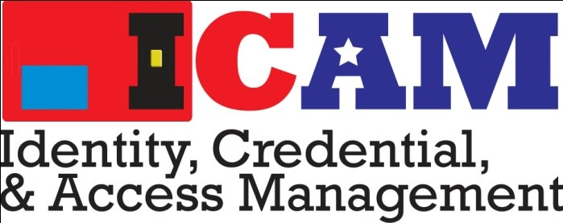
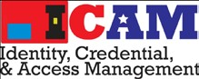

> 
>
> **Federal Identity, Credential, and Access Management **

**E-Governance CA (EGCA) **

> **E-Governance Trust Services (EGTS) Certificate Application and Issuance Process **

Version 1.0

> May 6, 2013

**EGCA EGTS Certificate Application and Issuance Process **

**Tables **

Table 1, Summary of EGTS Certificate Application and Issuance Process .................................................... 2

Table 2, Requests for Sample Signed Material ............................................................................................. 4 Table 3, Steps Needed to Obtain a Test EGTS Certificate ............................................................................. 5

Table 4, Steps Needed to Obtain a Production EGTS Certificate .................................................................. 5 Table 5, Distinguished Name Explanation .................................................................................................. 11 Table 6, Distinguished Name Examples ...................................................................................................... 12

Background 
===========

The E-Governance Certification Authorities (EGCA) were originally deployed in September 2004 in support of the GSA E-Authentication Program (E-Auth). E-Auth has since been supplanted by the Federal Identity, Credentialing and Access Management (ICAM) initiative. Only a few agency applications are still using E-Auth EGCA certificates. The E-Governance Trust Services (EGTS) project seeks to enhance the EGCA infrastructure to support new certificate use cases that more broadly align with the current Federal ICAM approach. Examples of new uses include:

1.  Providing a governance infrastructure for Backend Attribute Exchange (BAE); and

2.  Facilitating trusted metadata (e.g., signing of metadata by ICAM, Trust Framework Providers, and Federal Agencies).

Approval was granted by the E-Authentication Identity Federation Authorizing Official (EAO) to redesign the EGCA and to revise the EGCA CP to support the new EGTS model. The EGTS is now deployed into production.

This document defines the high-level step-by-step application and issuance process for agencies and entities to receive EGTS Certification Authority certificates (test and production certificates). This basic process is the same for Relying Parties (RPs), Identity Providers (IdPs), BAE Brokers, and Metadata Signers.

The EGCAs (both those supporting E-Auth and the new EGTS) are managed by the Federal Public Key

Infrastructure Management Authority (FPKIMA) and part of the FPKI Trust Infrastructure. When the EAO approves one of the EGCAs issue a certificate, a Letter of Authorization (LOA) is sent to the

FPKIMA.

EGTS Certificate Application Process 
=====================================

The EAO is responsible for authorizing the issuance of an EGTS certificate to Level 1-4 IdPs, Relying Parties, BAE Brokers, and MetaData Signers (i.e., trust services). The aforementioned certificates are used by applications when performing security operations specific to their role (e.g., signing metadata, signing authentication tokens, encrypting sensitive personally identifiable information). Technically speaking, a public/private key pair is necessary to perform these security operations (e.g., mutual TLS, signing, and encryption). The private key is kept secret by its owner while the public key is typically signed by a Certification Authority (CA), in this case the EGTS CA. Once the public key is signed, it is referred to as a public key certificate or certificate. The CA is then able to vouch for the validity of the certificate. The following should be noted:

1.  Prior to receiving a production certificate from the FPKIMA, an Applicant requests the certificate from the EAO and signs a Subscriber Agreement with the EAO.

2.  The EAO must authorize the FPKIMA to issue the certificate from the EGCA.

3.  An Applicant must generate a public/private key pair and corresponding Certificate Signing Request (CSR):

    -   All key pairs must be generated using a FIPS 140-2 approved cryptographic module. See the National Institute of Standards and Technology (NIST) [*Cryptographic Module Validation* ](http://csrc.nist.gov/groups/STM/cmvp/validation.html)

> [*Program (CMVP) Module Validation Lists*.](http://csrc.nist.gov/groups/STM/cmvp/validation.html)

-   Public Key Cryptography Standard (PKCS)\#10 format is used for the CSR;

-   Applicants MUST have at least one organizational unit in the Distinguished Name (DN);

-   An explanation of Distinguished Name and sample Subscriber Name Formats can be found in Appendix C of this document; and

1.  Applicants must send the production CSR out-of band (e.g. U.S. Postal Service, FedEx, Secure File Transfer Protocol, digitally-signed email) to be signed.

2.  Obtaining a signed production certificate reply from the EGCA may take up to two weeks.

3.  The recipient must deploy the signed production certificate upon receipt.

Table 1 summarizes the high-level EGTS certificate application and issuance process. Specific certificate issuance steps are discussed in Sections 2.1 and 2.2.

> **Table 1, Summary of EGTS Certificate Application and Issuance Process **

| **No. **   | **Task **                                                                                                                                                                                                                                                                                                                           | **Task **                  
                                                                                                                                                                                                                                                                                                                                                                                
                                                                                                                                                                                                                                                                                                                                                    **Owner **                  |
|------------|-------------------------------------------------------------------------------------------------------------------------------------------------------------------------------------------------------------------------------------------------------------------------------------------------------------------------------------|----------------------------|
| 1.         | The Applicant: (1) completes one EGTS Certificate Request Form (CRF) to request a test certificate; and (2) generates a PKCS\#10 CSR for a test certificate.                                                                                                                                                                        
                                                                                                                                                                                                                                                                                                                                                   
              The Applicant sends the CRF and PKCS\#10 CSR for a test certificate to the FPKIMA whose                                                                                                                                                                                                                                              
                                                                                                                                                                                                                                                                                                                                                   
              address is specified on the Federal ICAM web site. See Appendix A for the CRF Template.                                                                                                                                                                                                                                              | **Applicant **             |
| 2.         | The FPKIMA coordinates with the EAO to obtain authorization to proceed with test certificate issuance.                                                                                                                                                                                                                              
                                                                                                                                                                                                                                                                                                                                                   
              The EAO reviews the CRF in business terms to determine whether issuing the requested EGTS certificate to the Applicant is in the best interest of the Federal Government.                                                                                                                                                            | **FPKIMA, EAO **           |
| 3.         | If the EAO accepts or rejects the request, the EAO notifies the FPKIMA who then notifies the Applicant of the status.                                                                                                                                                                                                               | **EAO, **                  
                                                                                                                                                                                                                                                                                                                                                                                
                                                                                                                                                                                                                                                                                                                                                    **FPKIMA **                 |
| 4.         | The FPKIMA Lab works with the Applicant to verify the certificate request and issue a test certificate (see Table 2 and Section 2.1 for details). As needed, the EAO may assign resources to verify and document the Applicant's use of the test certificate in their trust service.                                                | **FPKIMA Lab, Applicant ** |
| 5.         | The Applicant sends the EAO (with the FPKIMA CC'ed) an attestation stating that testing was successful and their trust service conforms to all applicable requirements.                                                                                                                                                             | **Applicant, **            
                                                                                                                                                                                                                                                                                                                                                                                
                                                                                                                                                                                                                                                                                                                                                    **EAO **                    |
| 6.         | The EAO reviews the Applicant's attestation and any other applicable documentation.                                                                                                                                                                                                                                                 
                                                                                                                                                                                                                                                                                                                                                   
              If the EAO accepts the Applicant's attestation, the EAO (1) has the Applicant sign a Subscriber Agreement; and (2) sends a Letter of Authorization (LOA) for a production certificate and the Applicant-signed Subscriber Agreement to the FPKIMA. These steps may be performed in parallel. See Appendix B for the LOA template.    
                                                                                                                                                                                                                                                                                                                                                   
              If the EAO does not accept the Applicant's attestation, the EAO notifies the Applicant that a production certificate will not be issued and the reasons why. Earlier steps may be repeated as necessary.                                                                                                                             | **FPKIMA, **               
                                                                                                                                                                                                                                                                                                                                                                                
                                                                                                                                                                                                                                                                                                                                                    **Applicant, **             
                                                                                                                                                                                                                                                                                                                                                                                
                                                                                                                                                                                                                                                                                                                                                    **EAO **                    |
| 7.         | Upon receipt of the signed LOA, the FPKIMA schedules issuance of a production certificate.                                                                                                                                                                                                                                          | **FPKIMA **                |
| 8.         | The FPKIMA Operations Team coordinates with the Point of Contact (POC) specified in the LOA to obtain a PKCS\#10 CSR for a production certificate from the Applicant. The FPKIMA Operations Team processes the production certificate issuance request. See Section 2.2 for details of the production certificate issuance process. | **FPKIMA **                
                                                                                                                                                                                                                                                                                                                                                                                
                                                                                                                                                                                                                                                                                                                                                    **Operations Team **        |
| **No. **   | **Task **                                                                                                                                                                                                                                                                                                                           | **Task **                  
                                                                                                                                                                                                                                                                                                                                                    >                           
                                                                                                                                                                                                                                                                                                                                                    > **Owner **                |
| 9.         | The FPKIMA Operations Team delivers the production certificate to the Applicant. Upon receipt of the production certificate, the Applicant is considered a Subscriber.                                                                                                                                                              | **FPKIMA **                
                                                                                                                                                                                                                                                                                                                                                                                
                                                                                                                                                                                                                                                                                                                                                    **Operations Team **        |

**Table 2, Requests for Sample Signed Material **

| **Policy Name/OID **              | **Constituency **      | **Use Case **      | **Security Purpose **              | **Adopted Scheme ** | **Required **                                                                                                   
                                                                                                                                                                                                                                                               
                                                                                                                                              **Implementation Specification **                                                                                |
|-----------------------------------|------------------------|--------------------|------------------------------------|---------------------|-----------------------------------------------------------------------------------------------------------------|
| id-eGov-Level1-IdP                
 >                                  
 > ::= {2.16.840.1.101.3.2.1.3.28}  | Identity Provider      | Assertion Response | Digital Signature                  | SAML 2.0            | [• *Federal ICAM SAML* ](http://www.idmanagement.gov/documents/SAML20_Web_SSO_Profile.pdf)                      
                                                                                                                                              >                                                                                                                
                                                                                                                                              > [*2.0 Profile*;](http://www.idmanagement.gov/documents/SAML20_Web_SSO_Profile.pdf)                             |
| id-eGov-Level2-IdP                
 >                                  
 > ::= {2.16.840.1.101.3.2.1.3.29}  | Identity Provider      | Assertion Response | Digital Signature                  | SAML 2.0            |                                                                                                                 |
| id-eGov-Level3-IdP                
 >                                  
 > ::= {2.16.840.1.101.3.2.1.3.30}  | Identity Provider      | Assertion Response | Digital Signature                  | SAML 2.0            |                                                                                                                 |
| id-eGov-Level4-IdP                
 >                                  
 > ::= {2.16.840.1.101.3.2.1.3.31}  | Identity Provider      | Assertion Response | Digital Signature                  | SAML 2.0            |                                                                                                                 |
| id-eGov-BAE-Broker                
 >                                  
 > ::= {2.16.840.1.101.3.2.1.3.32}  | BAE Broker             | BAE                
                                                                                  
                                                              > Exchanges         | Digital Signature, Encryption, TLS | BAE v2 Suite        | [• *BAE v2 SAML 2.0* *Profile* ](http://www.idmanagement.gov/documents/BAE_v2_SAML2_Profile_Final_v1.0.0.pdf)   |
| id-eGov-RelyingParty              
 >                                  
 > ::= {2.16.840.1.101.3.2.1.3.33}  | Relying Party          | Assertion Request  | Digital Signature, TLS             | SAML 2.0,           
                                                                                                                                             
                                                                                                                        > OpenID 2.0,        
                                                                                                                        >                    
                                                                                                                        > BAE v2 Suite       | -   [*Federal ICAM SAML* ](http://www.idmanagement.gov/documents/SAML20_Web_SSO_Profile.pdf)                    
                                                                                                                                                                                                                                                               
                                                                                                                                              > [*2.0 Profile* ](http://www.idmanagement.gov/documents/SAML20_Web_SSO_Profile.pdf)                             
                                                                                                                                                                                                                                                               
                                                                                                                                              -   [*Federal ICAM* ](http://www.idmanagement.gov/documents/ICAM_OpenID20Profile.pdf)                            
                                                                                                                                                                                                                                                               
                                                                                                                                              > [*OpenID 2.0 Profile* ](http://www.idmanagement.gov/documents/ICAM_OpenID20Profile.pdf)                        
                                                                                                                                                                                                                                                               
                                                                                                                                              -   [*BAE v2 SAML 2.0* *Profile* ](http://www.idmanagement.gov/documents/BAE_v2_SAML2_Profile_Final_v1.0.0.pdf)  |
| id-eGov-MetaSigner                
 >                                  
 > ::= {2.16.840.1.101.3.2.1.3.34}  | Relying Party,         
                                                             
                                     Identity                
                                                             
                                     > Provider, BAE Broker  | SAML 2 Metadata    | Digital Signature                  | SAML 2.0,           
                                                                                                                                             
                                                                                                                        > OpenID 2.0,        
                                                                                                                        >                    
                                                                                                                        > BAE v2 Suite       | -   [*Federal ICAM SAML* ](http://www.idmanagement.gov/documents/SAML20_Web_SSO_Profile.pdf)                    
                                                                                                                                                                                                                                                               
                                                                                                                                              > [*2.0 Profile*;](http://www.idmanagement.gov/documents/SAML20_Web_SSO_Profile.pdf)                             
                                                                                                                                                                                                                                                               
                                                                                                                                              -   [*Federal ICAM* ](http://www.idmanagement.gov/documents/ICAM_OpenID20Profile.pdf)                            
                                                                                                                                                                                                                                                               
                                                                                                                                              > [*OpenID 2.0 Profile* ](http://www.idmanagement.gov/documents/ICAM_OpenID20Profile.pdf)                        |
| id-eGov-MetaSignerHardware        
 >                                  
 > ::= {2.16.840.1.101.3.2.1.3.35}  | Relying Party,         
                                                             
                                     Identity                
                                                             
                                     > Provider, BAE Broker  | SAML 2 Metadata    | Digital Signature                  | SAML 2.0,           
                                                                                                                                             
                                                                                                                        > OpenID 2.0,        
                                                                                                                        >                    
                                                                                                                        > BAEv2 Suite        |                                                                                                                 |
| id-eGov-Level2                    
 >                                  
 > ::= {2 16 840 1 101 3 2 1 3 10}  | Identity Provider      | Assertion Exchange | Mutual TLS                         | SAML 1.0            | The Federal ICAM SAML 1.0 Profile has been deprecated.                                                          |
|                                   |                        |                    |                                    |                     |                                                                                                                 |
| id-eGov-Applications              
 >                                  
 > ::= {2 16 840 1 101 3 2 1 3 11}  | Relying Party          | Assertion Exchange | Mutual TLS                         | SAML 1.0            | Please contact the FPKIMA.                                                                                      |

EGTS Test Certificate Issuance 
-------------------------------

The activities and tasks listed in Table 3 are the steps that must be performed to obtain a test EGTS certificate.

**Table 3, Steps Needed to Obtain a Test EGTS Certificate **

| **No. **   | **Tasks **                                                                                                                                                                                                                                                                                                                             | **Task **         
                                                                                                                                                                                                                                                                                                                                                       >                  
                                                                                                                                                                                                                                                                                                                                                       > **Owner **       |
|------------|----------------------------------------------------------------------------------------------------------------------------------------------------------------------------------------------------------------------------------------------------------------------------------------------------------------------------------------|-------------------|
| 1.         | The FPKIMA Lab verifies content in the CRF for a test certificate against content in the PKCS\#10 CSR for a test certificate. The FPKIMA Lab then verifies PKCS\#10 CSR content and CRF content against the applicable content definition source (see Table 2 last column). For example, verify DN, key length, and signing algorithm. 
                                                                                                                                                                                                                                                                                                                                                      
              If either verification check fails, the FPKIMA Lab notifies the Applicant.                                                                                                                                                                                                                                                              | **FPKIMA Lab **   |
| 2.         | The FPKIMA Lab uses the EGCA to digitally sign the Applicant’s PKCS\#10 CSR for a test certificate, and generates a test certificate.                                                                                                                                                                                                  | **FPKIMA Lab **   |
| 3.         | The FPKIMA Lab sends the PKCS\#7 containing the signed test certificate and test EGCA root certificate to the Applicant.                                                                                                                                                                                                               | **FPKIMA Lab **   |

EGTS Production Certificate Issuance 
-------------------------------------

The activities and tasks listed in Table 4 are the steps that must be performed to obtain a production EGTS certificate.

**Table 4, Steps Needed to Obtain a Production EGTS Certificate **

| **No. ** | **Tasks **                                                                                                                                                                                                                                                                                                                                                                    | **Task **                   
                                                                                                                                                                                                                                                                                                                                                                                                                         
                                                                                                                                                                                                                                                                                                                                                                                            **Owner **                   |
|----------|-------------------------------------------------------------------------------------------------------------------------------------------------------------------------------------------------------------------------------------------------------------------------------------------------------------------------------------------------------------------------------|-----------------------------|
| 1.       | The FPKIMA Operations Team coordinates with the Applicant POC specified in the LOA to complete the issuance process for a production certificate. This includes details of submission and schedule.                                                                                                                                                                           | **FPKIMA Operations Team ** |
| 2.       | The Applicant generates a key pair and PKCS\#10 CSR for a production certificate.                                                                                                                                                                                                                                                                                             
                                                                                                                                                                                                                                                                                                                                                                                           
            If the CRF specifies that the certificate requested is for IdP Level 3 or 4, or Metadata                                                                                                                                                                                                                                                                                       
                                                                                                                                                                                                                                                                                                                                                                                           
            Signer Hardware, the private key must be created on a FIPS-140-2 hardware module.                                                                                                                                                                                                                                                                                              | **Applicant **              |
| 3.       | The Applicant POC specified in the LOA sends the PKCS \#10 CSR for a production certificate to the FPKMA Operations Team via a secure delivery method (courier, secure FTP, or digitally-signed email).                                                                                                                                                                       | **Applicant **              |
| 4.       | The FPKIMA Operations Team verifies the CRF for a production certificate by comparing CRF content to LOA content for the requested certificate. The FPKIMA Operations Team then performs content verification of the PKCS \#10 CSR for a production certificate by comparing the contents in the CSR with the applicable content definition source (see Table-2 last column). 
                                                                                                                                                                                                                                                                                                                                                                                           
            If the verification check fails, the FPKIMA Operations Team notifies the Applicant.                                                                                                                                                                                                                                                                                            
                                                                                                                                                                                                                                                                                                                                                                                           
            Repeat earlier steps, beginning where necessary. A new LOA may need to be issued.                                                                                                                                                                                                                                                                                              | **FPKIMA Operations Team ** |
| 5.       | The FPKIMA Operations Team uses the EGTS CA to digitally sign the PKCS \#10 CSR for a production certificate, and creates a corresponding PKCS\#7.                                                                                                                                                                                                                            | **FPKIMA Operations Team ** |
| **No. ** | **Tasks **                                                                                                                                                                                                                                                                                                                                                                    | **Task **                   
                                                                                                                                                                                                                                                                                                                                                                                                                         
                                                                                                                                                                                                                                                                                                                                                                                            **Owner **                   |
| 6.       | The FPKIMA Operations Team sends the PKCS\#7 containing the signed production certificate and EGCA root certificate to the Applicant POC specified in the LOA via a secure delivery mechanism (courier, secure FTP, or digitally-signed email).                                                                                                                               | **FPKIMA Operations Team ** |
| 7.       | The FPKIMA Operations Team notifies the EAO of certificate issuance.                                                                                                                                                                                                                                                                                                          | **FPKIMA Operations Team ** |

Appendix A EGTS Certificate Request Form (CRF) 
===============================================

An EGTS Certificate Request Form (CRF) is required for each production PKCS\#10 CSR sent to the EGCA.

| **EGTS Certificate Request Form **                   |
|------------------------------------------------------|
| **Entity Information **                              |
| **Request Date: **                                   |
| **Entity Name: **                                    |
| **Entity Point of Contact (POC): **                  |
| **Entity Alternate POC: **                           |
| **Entity Technical POC: **                           |
| **Request Reason: **                                 
 >                                                     
 > ***(Select One Only)* **                            |
|                                                      |
| **Certificate Requested: *(Select One Only)* **      |
|                                                      |
| **Certificate Information **                         |
| **EGTS Certificate For: **                           
 >                                                     
 > ***(Select One Only) ***                            |
|                                                      |
| **Subscriber Name (Subject Distinguished Name): **   |
| **SubjectAltName(s): **                              |
| **Validity Period: **                                |
| **Extended Key Usage (EKU): **                       |
| **KeyUsage: **                                       |
| **Subject Key Identifier (SKI): **                   |
| **Server Information **                              |
| **Server Hostname: **                                
                                                       
 **Server IP Address: **                               |
|                                                      |

Appendix B EGTS Certificate Issuance Letter of Authorization (LOA) 
===================================================================

> 

| **Date:**           |     | Insert Date Here                                                                            |
|---------------------|-----|---------------------------------------------------------------------------------------------|
| **Memorandum For:** |     | Darlene Gore                                                                                
                                                                                                                          
                             Federal Public Key Infrastructure Management Authority (FPKIMA)                              
                                                                                                                          
                             Program Manager                                                                              |
|                     |     |                                                                                             |
| **From:**           |     | Deb Gallagher                                                                               
                             >                                                                                            
                             > E-Authentication Authorizing Official (EAO)                                                |
|                     |     |                                                                                             |
| **Subject:**        |     | Authorization to Issue E-Governance Trust Services (EGTS) Certificate to Insert Name Here   |

The EAO authorizes the FPKIMA to issue an EGTS CA certificate to Insert Name Here from the Production EGTS CA as follows:

| **Entity Information **                              |     |
|------------------------------------------------------|-----|
| **Entity Name: **                                    |     |
| **Entity Point of Contact (POC): **                  |     |
| **Entity Alternate POC: **                           |     |
| **Entity Technical POC: **                           |     |
| **Request Reason: **                                 |     |
|                                                      |     |
| **Certificate Requested: **                          |     |
|                                                      |     |
|                                                      |     |
|                                                      |     |
| **Server Information **                              |     |
| **Production Server Hostname: **                     |     |
| **Production Server IP Address: **                   |     |
| **Certificate Information **                         |     |
| **Subscriber Name (Subject Distinguished Name): **   |     |
| **SubjectAltName(s): **                              |     |
| **Validity Period: **                                |     |
| **Extended Key Usage (EKU): **                       |     |
| **KeyUsage: **                                       |     |

Appendix C Distinguished Name Explanation 
==========================================

Table 5 provides an explanation of each distinguished name field. Table 6 provides more comprehensive examples.

**Table 5, Distinguished Name Explanation **

| **Distinguished Name Field** | **Description**                                                                                                                                                                                                       | **Example**                                                                       |
|------------------------------|-----------------------------------------------------------------------------------------------------------------------------------------------------------------------------------------------------------------------|-----------------------------------------------------------------------------------|
| **Country/Region = c**       | The two-letter ISO abbreviation for your country.                                                                                                                                                                     | *c=US *                                                                           |
| **Organization= o**          | The exact legal name of your organization. Do not abbreviate your organization name.                                                                                                                                  | *O=U.S. Government *                                                              |
| **Organization Unit = ou**   | The organizational units department and agency appear when applicable and are used to specify the federal entity that employs the subscriber. For agencies, at least one organizational unit must appear in the DN.   | *ou=Department, ou=Agency, *                                                      |
| **Common Name = cn **        | See Table C-2 below.                                                                                                                                                                                                  | See Table C-2 below.                                                              |
| **SubjectAltName(s) **       | An email address for a human point of contact shall be entered in the SubjectAltName.                                                                                                                                 
                                >                                                                                                                                                                                                                      
                                > An IP address, fully-qualified DN, or URI for a web server is recommended.                                                                                                                                           | *rfc822Name for the Email address of helpdesk, or support personnel iPAddress *   
                                                                                                                                                                                                                                                        >                                                                                  
                                                                                                                                                                                                                                                        > *dNSName *                                                                       
                                                                                                                                                                                                                                                        >                                                                                  
                                                                                                                                                                                                                                                        > *URI *                                                                           
                                                                                                                                                                                                                                                        >                                                                                  
                                                                                                                                                                                                                                                        > *DN *                                                                            |

> **Table 6, Distinguished Name Examples **

| **Certificate Type ** | **Example Subject DN **                                                                                                                                       | **Notes **                                                                                                                                                                                                      |
|-----------------------|---------------------------------------------------------------------------------------------------------------------------------------------------------------|-----------------------------------------------------------------------------------------------------------------------------------------------------------------------------------------------------------------|
| Level 1 IdP           
                        
 Level 2 IdP            
                        
 Level 3 IdP            
                        
 Level 4 IdP            | C=US, o=*Organization*, \[ou=*major unit*\], \[ou=*minor unit*\], cn=*IdP name*                                                                               | Se[e *EGCA Certificate Policy, Section 3.1.1*](http://www.idmanagement.gov/fpkipa/documents/EGovCA-CP.pdf) for IdP (known as Credential Service Provider in Legacy E-Authentication\] cn formatting guidance.   |
| Relying Party         | C=US, o=U.S. Government, \[ou=*department*\], \[ou=*agency*\], cn=*RP server name*                                                                            | Se[e *EGCA Certificate Policy, Section 3.1.1*](http://www.idmanagement.gov/fpkipa/documents/EGovCA-CP.pdf) for RP (known as Agency Application in Legacy E-Authentication) cn formatting guidance.              |
| BAE Broker            | ***For PIV:***                                                                                                                                                
                         >                                                                                                                                                              
                         > C=US, o=U.S. Government, \[ou=*department*\],                                                                                                                
                         >                                                                                                                                                              
                         > \[ou=*agency*\],*cn=*urn:idmanagement.gov:icam:bae:v2:7000:00 00                                                                                             | Se[e *FICAM BAE SAML Profile, Section 3.1.1 *](http://www.idmanagement.gov/documents/BAE_v2_SAML2_Profile_Final_v1.0.0.pdf)for PIV cn formatting guidance.                                                      |
|                       | ***For PIV-I: ***                                                                                                                                             
                         >                                                                                                                                                              
                         > C=US, o=*Organization*, \[ou=*major unit*\], \[ou=*minor unit*\]*, cn=*urn:idmanagement.gov:icam:bae:v2:052488204eb0b251cc cba1d9e9672486d5f9b045:ACME-CORP  | Se[e *FICAM BAE SAML Profile, Section 3.1.2 *](http://www.idmanagement.gov/documents/BAE_v2_SAML2_Profile_Final_v1.0.0.pdf)for PIV-I cn formatting guidance.                                                    |
| Metadata Signer       
                        
 Metadata               
                        
 Signer                 
                        
 (Hardware)             | C=US, o=U.S. Government, \[ou=*department*\], \[ou=*agency*\], *cn=MS.example.com *                                                                           | Se[e *EGCA Certificate Policy, Section 3.1.1*](http://www.idmanagement.gov/fpkipa/documents/EGovCA-CP.pdf) for Metadata Service cn formatting guidance.                                                         |

