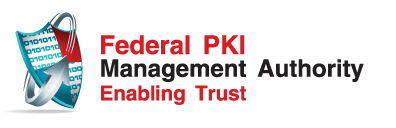
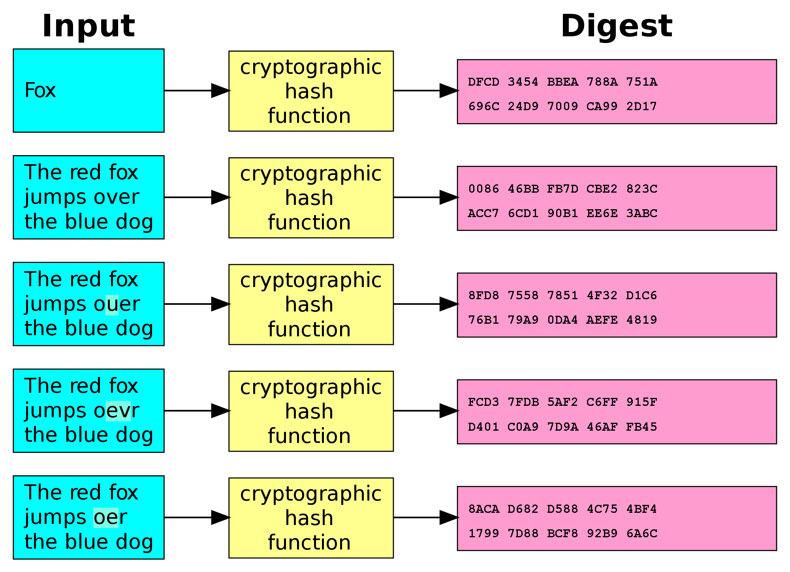
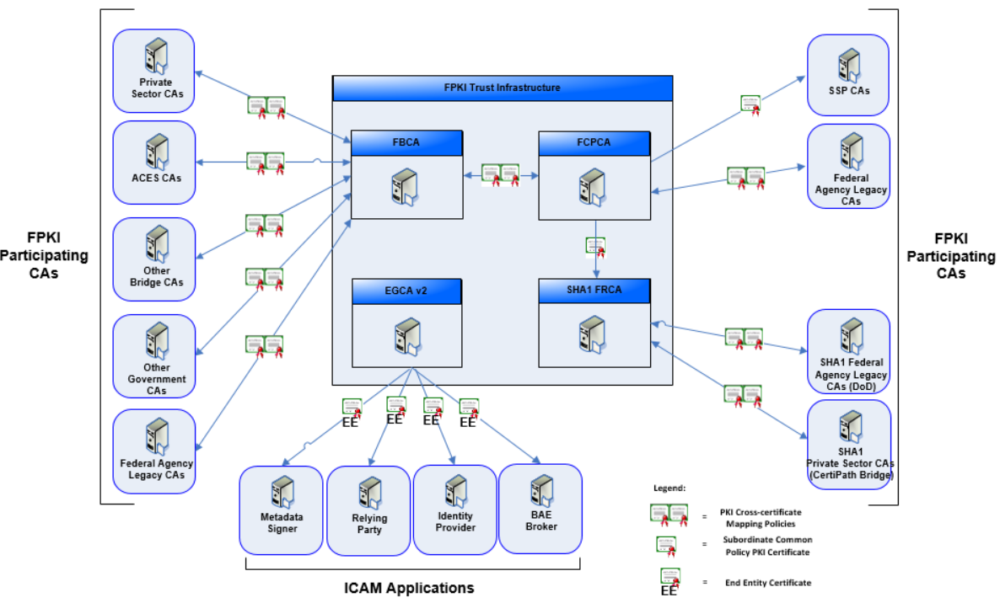
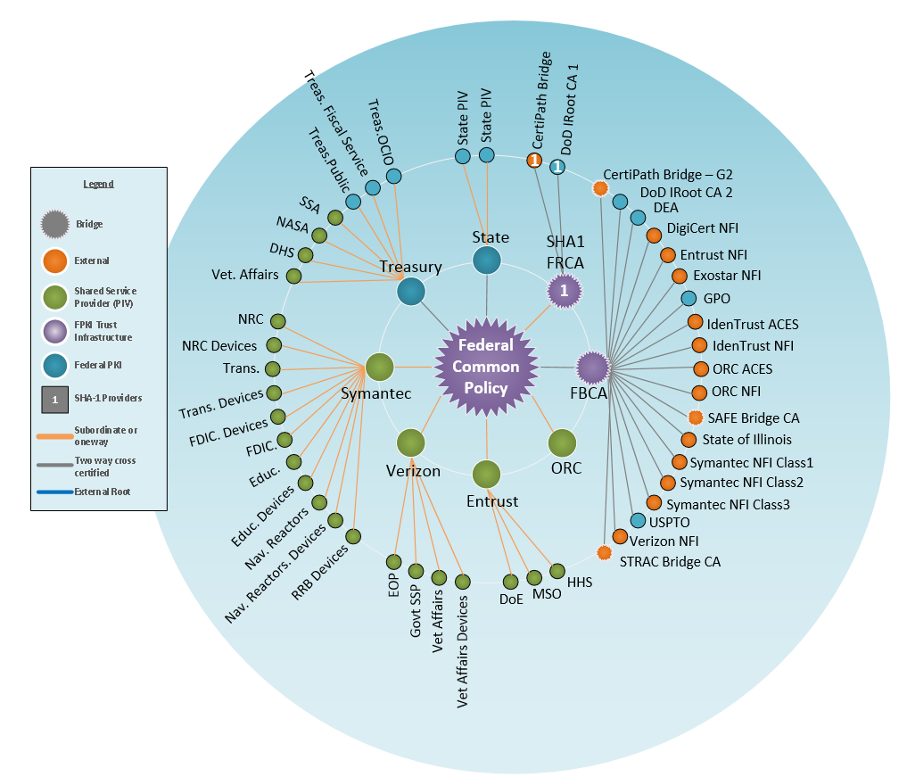
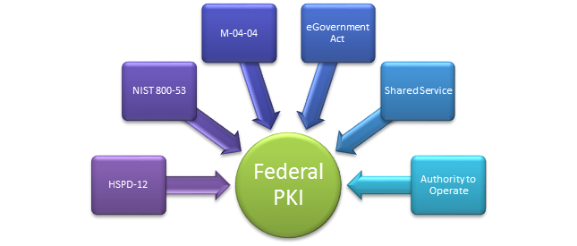
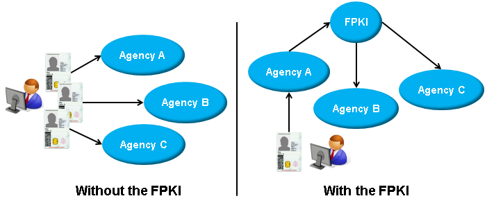
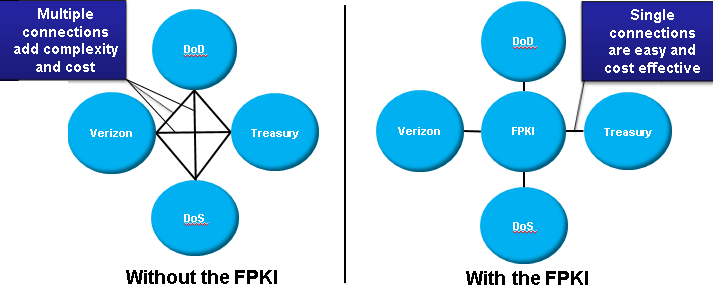
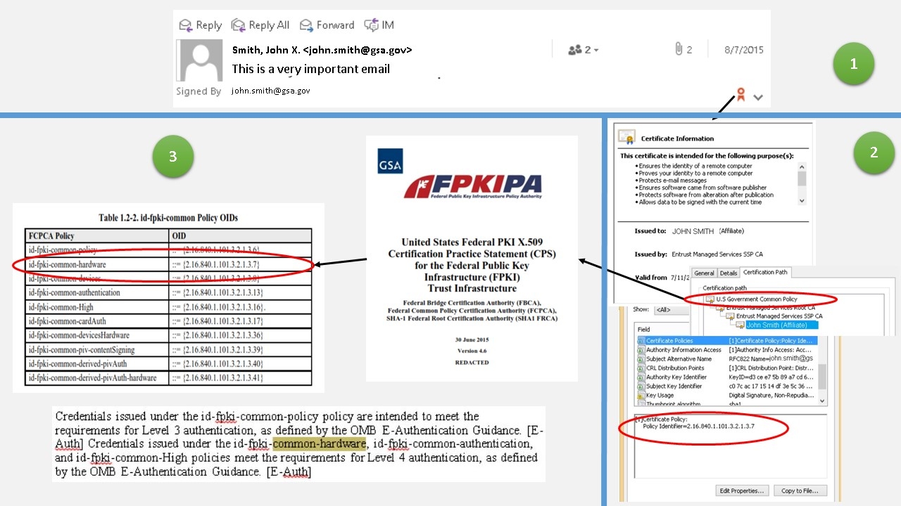
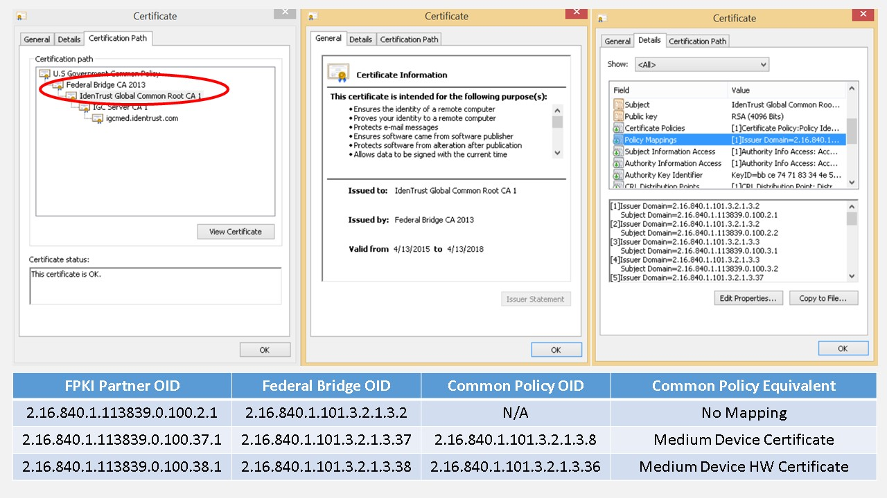
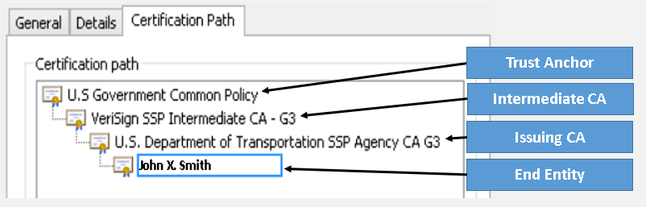

**Federal PKI **

**Trust Infrastructure **

**Overview**

V1.0

September 21, 2015

**Table of Contents**

### 1. Introduction 1

### 2. Public Key Infrastructure Overview 2

### 3. Federal Public Key Infrastructure Overview 3

### 4. FPKI Executive Support 6

4.1. Establish FPKI Value 6

### 5. Certificate Policies 8

### 6. Certificate Levels of Assurance 11

### 7. Certificate Policy Mapping 12

7.1. How to Identify a Cross-Certificate in the FPKI 12

### 8. Certificate Path Validation 13

### 9. Resiliency in Certificate and Certificate Path Validation 14

9.1 Validation Overview 14

9.2 Validation Resiliency 15

### 10. FICAM Approved Product List 16

### Appendix A - Acronyms 17

**Table of Figures**

[Figure 1. Example of a Hash Function 2](#_Toc430632721)

[Figure 2. FPKI Overview 3](#_Toc430632722)

[Figure 3. FPKI Participating CAs as of July 2015 5](#_Toc430632723)

[Figure 4. Federal PKI Compliance 6](#_Toc430632724)

[Figure 5. FPKI as a Trust Broker 7](#_Toc430632725)

[Figure 6. FPKI Eliminates Redundancy 7](#_Toc430632726)

[Figure 7. Manually Validating a Certificate Policy 8](#_Toc430632727)

[Figure 8. Certificate Policy Mapping in a Certificate 12](#_Toc430632728)

[Figure 9. Certificate Path Characteristics 13](#_Toc430632729)

[Figure 10. FICAM Testing Program Approved Product List Categories 16](#_Toc430632730)

**Record of Changes**

| Version Number | Date of Change | Change Description |
|----------------|----------------|--------------------|
| 1.0            | 09/21/2015     | Initial Document   |

Introduction
============

The Federal Public Key Infrastructure (FPKI) was created out of the E-Government Act of 2002 which directed the General Services Administration to establish and operate the Federal Bridge Certification Authority (FBCA). From this pilot program, the Federal PKI has grown into a diverse PKI ecosystem of hundreds of certification authorities (CAs) for federal and state government agencies as well as foreign and US commercial participating PKIs.  The purpose of this document is to aid relying parties to take advantage of the FPKI for their logical and physical identity, credential, and access management (ICAM) requirements by providing a technical overview of the Federal PKI Trust Infrastructure and its PKI operations. Companion material will be collected from agency and industry best practices to provide implementation guidance for relying on FPKI certificates. As feedback is collected, more operating system and application instructions will be integrated and updated.

Public Key Infrastructure Overview
==================================

Public Key Infrastructure or PKI is the most cost effective tool to ensure the confidentiality, integrity, and availability of electronic transactions. PKI utilizes asymmetric cryptography, meaning a different key is used to encrypt (public key) than is used to decrypt (private key). Only the private key can be used to decrypt a message; the amount of confidentiality provided is based on the size of the key (in bits) that is used. An encrypted hash value or digest of the message is also created to ensure integrity and authentication of the originator.

Figure 1. Example of a Hash Function

The hash or digest is a one-way function of the digital data and any change in the data will change the hash. PKI certificates can be used to digitally sign many different types of digital artifacts like documents, computer code, web sites, application installation packages and many other things. The digital signature is an encrypted hash of the data which can be verified to ensure that the data has not changed since it was “signed” by someone in possession of the associated private key. This digital signature offers an easy and scalable method of creating secure transactions that securely identify the parties involved and ensures the data has not been changed in transit.

Federal Public Key Infrastructure Overview
==========================================

The FPKI consists of the FPKI Trust Infrastructure, FPKI Affiliates CAs, and ICAM Applications as shown in the figure below.

Figure 2. FPKI Overview

**The FPKI Trust Infrastructure** is the backbone of the FPKI hierarchy. It consists of four main certification authorities operated by the FPKI Management Authority (FPKIMA) referred to as FPKI Trust Infrastructure CAs. Any CA in the FPKI can be referred to as an “FPKI CA,” but only those operated by the FPKIMA are FPKI Trust Infrastructure CAs. The four main CAs are:

1.  The **Federal Common Policy CA (FCPCA)** is the trust anchor[1] for the federal government. Through the Shared Service Provider (SSP) program, authorized CAs under FCPCA issue certificates for exclusive use by the federal government for federal employees, contractors, and federal devices to include the PKI certificates on the Personal Identity Verification (PIV) card. It was designed so any certificate issued by an FPKI CA can validate to a single point.

2.  The **Federal Bridge CA (FBCA)** is the PKI Bridge that enables interoperability between different federal PKIs and between Federal and external PKIs both commercial and state, local, or foreign governments. The FBCA provides a means to map participating PKI certificate policies so they validate to the FCPCA trust anchor.

3.  The **SHA1 Federal Root CA (SHA1 FRCA)** is a federal CA supporting federal legacies that still require the deprecated SHA1 signature hash for certificates.

4.  The **E-Governance CA (EGCA)** is an end entity issuing CA supporting ICAM applications such as metadata signers, relying party application, identity providers, and backend attribute exchanges.

An **FPKI Participating CA** is either an industry, other government (e.g., state, local, or foreign), or federal legacy CA. Examples of FPKI Participating CAs:

1.  **Federal Agency Legacy PKIs** –With the release of OMB Memo 05-05, all federal agencies were required to use the SSP program over establishing a PKI unless they were already operating a PKI. These Federal Agency Legacy PKIs operate an internal PKI that is cross-certified[2] with one or more FPKI Trust Infrastructure CAs.

2.  **Private Sector CA** – An industry PKI participating CA that is cross-certified with the FBCA and has shown a need to either do business or provide PKI services to the federal government. These CAs are often referred to as Nonfederal Issuers or NFI.

3.  **Access Certificates for Electronic Services (ACES) CA** – A GSA program operated by a contracted private sector participating CA. Similar to the SSP program of approved vendors issuing certificates with government certificate policies, ACES issue certificates to citizens including authorized business representatives and unaffiliated individuals instead of federal employees.

4.  **Other Bridge CAs** – Bridge CAs that connect member PKIs and are designed to enable interoperability between different PKIs operating under their own Certificate Policy (CP)[3]. A bridge CA is not intended to be used as a trust anchor.

5.  **Other Government CAs** –CAs that consist of state, local, or foreign government CAs.

6.  **SSP CAs** – A CA subordinate to the FCPCA and contracted by the federal government to issue certificates exclusively to federal employees, contract support, and federal devices. The SSP may be a commercial vendor or a Federal Agency and is required to have an Authority to Operate (ATO) among other security requirements to issue government certificates.

The figure below illustrates depicts Participating FPKI CAs as of July 2015.

Figure 3. FPKI Participating CAs as of July 2015

**ICAM Applications** are private sector and federal agency applications used for identity federation services such as credential service providers, backend attribute exchanges, metadata authorities and relying party applications. For more information, go to the Trust Framework Solutions (TFS) website (<http://idmanagement.gov/trust-framework-solutions>) or read the FICAM Roadmap (<http://www.idmanagement.gov/documents/ficam-roadmap-and-implementation-guidance>).

FPKI Executive Support
======================

The Federal PKI was created to benefit the government and is used to meet federal requirements around ICAM for both federal and citizen access to federal information systems. Part of using the Federal PKI requires executive support to invest in the FPKI Trust Infrastructure as well as department/agency (D/A) level software and hardware.

4.1. Establish FPKI Value
-------------------------

A public key infrastructure or PKI is an infrastructure that enables and supports the use of public-key cryptography to implement scalable, strong, and secure services such as authentication, authorization, non-repudiation, confidentially, and integrity. Applications utilize PKI as an enabling and supportive security infrastructure. In the Federal Government, PKI is implemented through three components:

1.  **Federal PKI Policy Authority** - A federal program chartered under the Federal CIO Council ICAM Subcommittee (ICAMSC) governing PKI interoperability policy.

2.  **Federal PKI Management Authority** – A GSA program which implements federal-wide PKI interoperability policy through operating the Federal PKI Trust Infrastructure.

3.  **D/A level PKI Programs** – Certificate issuance authorities issuing personal (PIV/CAC card program as well as other individual certificates) and device certificates.

The Federal PKI offers many benefits and the following are a few of its key objectives:

-   **Increased security** through the use of strong authentication PKI credentials reduce identity theft, data breaches from weak credentials (username/password), and trust violations. Specifically, PKI closes security gaps of user identification and authentication, encryption of sensitive data, and data integrity.

-   **Compliance** with laws, regulations, and standards as well as resolution of security issues identified in GAO reports. Using the Federal PKI means almost automatic compliance with several executive orders, initiatives, and laws and can be used in contracts to ensure vendor compliance. The Federal PKI compliance team verifies PKI participating CAs are audited and operate in a secure manner.

Figure 4. Federal PKI Compliance

> As the figure above illustrates, the Federal PKI is a single requirement federal agencies can use when writing contract vehicles for identity and authentication services because it meets all government FICAM requirements.

-   **Improved interoperability** with other federal agencies and commercial participating CAs to trust FPKI certificates. The Federal PKI is a federated trust fabric that reduces the need of issuing multiple credentials.

Figure 5. FPKI as a Trust Broker

-   **Elimination of redundancy** through both PKI consolidation processes and workflows and provisioning of government-wide services. The Federal PKI is a trust broker or hub of logical trust, reducing the need for multiple trust agreements and duplicating associated trust agreement tasks.

Figure 6. FPKI Eliminates Redundancy

Certificate Policies
====================

A PKI certificate is considered trusted at a specific level of assurance based on security requirements for issuance procedures of the certificate and protection of the associated private key. The certificate policy or Object Identifier (OID) asserted in the certificate is associated with the security requirements as defined in a Certificate Policy (CP) and implemented through a Certification Practice Statement (CPS). Figure 7 below is an example of how to identify the criteria of a certificate policy. In this example, the certificate was issued by an FCPCA SSP and asserts policies which are identified in the FCPCA CP. A copy of the CP is publicly available so an individual can verify the trust in the identity and security of that specific OID. It is up to the organization to determine if the security criteria is sufficient to trust the identity being asserted in the PKI certificate based on the level of transaction. Higher assurance credentials should be used for higher risk transactions. The following provides a real-world example of validating a CP:

1.  Bob receives a digitally signed email from John Smith and wants to validate the certificate manually.

2.  Bob clicks on the red ribbon in the email to view the certificate. He finds the root of the certificate is the U.S. Government Common Policy which is the subject name of the Federal Common Policy CA. He can also see the certificate asserts the 2.16.840.1.101.3.2.1.3.7 certificate policy.

3.  Bob finds the Federal Common Policy certificate policy and certification practice statement on the idmanagement.gov website to look up the requirements of this certificate policy. Bob finds that the common hardware certificate is associated with the PIV card meaning the user had to use their PIV card to digitally sign the email. Bob can have a high level of assurance that John Smith from GSA signed this email.

Figure 7. Manually Validating a Certificate Policy

Luckily for Bob and everyone else, the Federal PKI has taken the work out of manually validating certificates by working with public PKI trust store software and browser vendors to trust certain policies and root certificates.

The FPKI has a total of 25 certificate policies supporting the FBCA and FCPCA for people and non-person (NPE) certificates. The Commercial Best Practices (CBP) identifier on FBCA and SHA1 FRCA certificate policies indicate the trusted roles or individuals assigned a role in certificate issuance do not have to be U.S. citizens. All common (FCPCA) certificate policies denote a US Government (USG) issued and authorized certificate. A hardware (HW) identifier used to signal the private key is generated and protected by a hardware based token for either people or NPE. In the FPKI, SSPs and authorized Federal Agency Legacy PKI are authorized to assert FCPCA OIDs, but no entity is authorized to assert an FBCA policy in subscriber certificates because they are strictly used to map other organizational PKI policies. The risk level referenced in the below table refers to the level of risk associated with transactions accepting certificates issued under the specified certificate policy.

Table 1. List of FPKI Certificate Policies

| Certificate Policy        | OID                        | Purpose                                                                                                                                                             |
|---------------------------|----------------------------|---------------------------------------------------------------------------------------------------------------------------------------------------------------------|
| FBCA-rudimentary          | 2.16.840.1.101.3.2.1.3.1   | Low risk – authentication, signature or encryption of individual person.                                                                                            |
| FBCA-basic                | 2.16.840.1.101.3.2.1.3.2   | Low risk – authentication, signature or encryption of individual person.                                                                                            |
| FBCA-medium               | 2.16.840.1.101.3.2.1.3.3   | Medium risk – authentication, signature or encryption of individual person, group, device, or role.                                                                 |
| FBCA-mediumHW             | 2.16.840.1.101.3.2.1.3.12  | Medium risk – authentication, signature or encryption of individual person, group, device, or role where private key is protected on hardware token.                |
| FBCA-mediumCBP            | 2.16.840.1.101.3.2.1.3.14  | Medium risk – authentication, signature or encryption of individual person, group, device, or role.                                                                 |
| FBCA-mediumHW-CBP         | 2.16.840.1.101.3.2.1.3.15  | Medium risk – authentication, signature or encryption of individual person, group, or role where private key is protected on hardware token.                        |
| FBCA-mediumDevice         | 2.16.840.1.101.3.2.1.3.37  | Medium risk - authentication or encryption of device                                                                                                                |
| FBCA-mediumDevice-HW      | 2.16.840.1.101.3.2.1.3.38  | Medium risk - authentication or encryption of device where private key protected on hardware token.                                                                 |
| FBCA-High                 | 2.16.840.1.101.3.2.1.3.4   | High risk – authentication, signature or encryption of USG individual person, group, role, or device where private key protected on hardware token.                 |
| FBCA-PIVI-HW              | 2.16.840.1.101.3.2.1.3.18  | Medium risk – authentication, signature or encryption of individual person where private key is protected on APL approved smartcard and requires biometric on card. |
| FBCA-PIVI-cardAuth        | 2.16.840.1.101.3.2.1.3.19  | Shows possession of PIV-I card w/o PIN use.                                                                                                                         |
| FBCA-PIVI-contentSigning  | 2.16.840.1.101.3.2.1.3.20  | Signs security objects on PIV-I card.                                                                                                                               |
| SHA1-mediumCBP            | 2.16.840.1.101.3.2.1.3.21  | Medium risk – authentication, signature or encryption of individual person, group, device, or role. (SHA1)                                                          |
| SHA1-mediumHW-CBP         | 2.16.840.1.101.3.2.1.3.22  | Medium risk – authentication, signature or encryption of individual person, group, or role where private key is protected on hardware token. (SHA1)                 |
| SHA1-medium               | 2.16.840.1.101.3.2.1.3.23  | Medium risk – authentication, signature or encryption of individual person, group, device, or role. (SHA1)                                                          |
| SHA1-mediumHW             | 2.16.840.1.101.3.2.1.3.24  | Medium risk – authentication, signature or encryption of individual person, group, or role where private key is protected on hardware token. (SHA1)                 |
| SHA1-devices              | 2.16.840.1.101.3.2.1.3.25  | Medium risk - authentication or encryption of device .(SHA1)                                                                                                        |
| common-policy             | 2.16.840.1.101.3.2.1.3.6   | Medium risk – authentication, signature or encryption of USG individual person, group, device, or role.                                                             |
| common-HW                 | 2.16.840.1.101.3.2.1.3.7   | High risk – authentication, signature or encryption of USG individual person, group, role, or device where private key is protected on hardware token.              |
| common-devices            | 2.16.840.1.101.3.2.1.3.8   | Medium risk – USG authentication or encryption of device.                                                                                                           |
| common-devicesHW          | 2.16.840.1.101.3.2.1.3.36  | Medium risk - authentication or encryption of USG device where private key protected on hardware token.                                                             |
| common-auth               | 2.16.840.1.101.3.2.1.3.13  | High risk - Shows possession of PIV card with PIN use                                                                                                               |
| common-High               | 2.16.840.1.101.3.2.1.3.16  | High risk – authentication, signature or encryption of USG individual person, group, role, or device where private key is protected on hardware token.              |
| common-cardAuth           | 2.16.840.1.101.3.2.1.3.17  | Shows possession of PIV card w/o PIN use.                                                                                                                           |
| common-piv-contentSigning | 2. 16.840.1.101.3.2.1.3.39 | Signs security objects on PIV or Derived PIV.                                                                                                                       |

Certificate Levels of Assurance
===============================

An FPKI certificate can be mapped to an electronic authentication (e-auth) level of assurance. These levels correspond to both the strength of the identity proofing, token, and token and credential management. A higher level of assurance credential can mitigate authentication risk of a higher risk transaction.

Table 2. FPKI Certificate Policies Mapped to E-Auth Assurance Levels (NIST 800-63-2)

| Certificate Policy | ID Proofing | Token | Token and Credential Management | Overall LOA Equivalence |
|--------------------|-------------|-------|---------------------------------|-------------------------|
| Common-Auth PIV-I Auth SHA1 Auth | LOA 4       | LOA 4 | LOA 4                           | LOA 4                   |
| Common –SW         | LOA 4       | LOA 3 | LOA 4                           | LOA 3                   |
| Common-HW  PIV-I HW SHA1-HW             | LOA 4       | LOA 4 | LOA 4                           | LOA 4                   |
| Common-High FBCA-High           | LOA 4       | LOA 4 | LOA 4                           | LOA 4                   |
| FBCA Basic         | LOA 3       | LOA 3 | LOA 3                           | LOA 3                   |
| FBCA Medium FBCA Medium CBP     | LOA 3       | LOA 3 | LOA 4                           | LOA 3                   |
| FBCA MediumHW FBCA MediumHW-CBP   | LOA 3       | LOA 4 | LOA 4                           | LOA 3                   |
| Common-cardAuth PIVI-cardAuth  SHA1-cardAuth       | LOA 4       | LOA 2 | LOA 4                           | LOA 2                   |

Agencies can use the above table to determine which FPKI certificate policy best fit an application’s authentication requirements.

Certificate Policy Mapping
==========================

A certificate policy mapping is when two organizations operating a PKI want to trust each other’s certificates while retaining use of their organizational PKI. They respectively review the other organization’s certificate policies and determine which policies are comparable and then issue a certificate (otherwise known as a cross-certificate) between CAs in their respective PKIs. A cross-certificate will allow a subscriber certificate issued under one CA to be trusted by an application using a root from the other PKI. In the FPKI, policy mapping certifies comparable certificate polices, resolves any comparability issue, facilitates interoperability between government and participating PKIs and is conducted by Agency PKI Subject Matter Experts (SMEs) at the FPKI Policy Authority Certificate Policy Working Group (CPWG). Even though a policy is not mapped, it may validate if it is listed in the certificate policies of one of the CA certificates in the trust path.

Table 3. FCPCA – FBCA Policy Mapping

| FCPCA Policy     | FCPCA OID                 | FBCA OID                  | FBCA Policy          |
|------------------|---------------------------|---------------------------|----------------------|
| common-policy    | 2.16.840.1.101.3.2.1.3.6  | 2.16.840.1.101.3.2.1.3.3  | FBCA-medium          |
| common-High      | 2.16.840.1.101.3.2.1.3.16 | 2.16.840.1.101.3.2.1.3.4  | FBCA-High            |
| common-HW        | 2.16.840.1.101.3.2.1.3.7  | 2.16.840.1.101.3.2.1.3.12 | FBCA-mediumHW        |
| common-devices   | 2.16.840.1.101.3.2.1.3.8  | 2.16.840.1.101.3.2.1.3.37 | FBCA-mediumDevice    |
| common-devicesHW | 2.16.840.1.101.3.2.1.3.36 | 2.16.840.1.101.3.2.1.3.38 | FBCA-mediumDevice-HW |

7.1. How to Identify a Cross-Certificate in the FPKI
----------------------------------------------------

The most common cross-certificates in the FPKI are with certificates of the Federal Bridge and Federal Agency Legacy PKI under FCPCA. Figure 8 has an example of a certificate issued by the Federal Bridge which contains a policy mapping so that FPKI participating CA OIDs can validate to FCPCA. Even though there is no mapping for the first policy it will still validate to FCPCA because the policy is asserted in the certificate policy extension.

Figure 8. Certificate Policy Mapping in a Certificate

Certificate Path Validation
===========================

Certificate path validation is the process of validating a certificate trust path from the end entity certificate to a trust anchor. Applications use path validation to ensure digitally signed artifacts maintain integrity after being signed and the signature certificate was issued from a trusted CA.

Figure 9. Certificate Path Characteristics

The three most common path validation tools in Windows are the Microsoft Crypto API (CAPI), Online Certificate Service Protocol (OCSP) service or a Server-Based Certificate Validation Protocol (SCVP) service. Approved OCSP and SCVP software can be found on the FICAM Approved Product List (<http://www.idmanagement.gov/approved-products-list>).

1.  **Microsoft CAPI** is the standard tool used when opening a certificate on a Windows OS and is proprietary to Microsoft. It takes the certificate path which has the most information as the most secure path to a Trust Anchor and uses the trusted root certificates in the Microsoft Trust Store. CAPI verifies certificate validation through the Certificate Revocation List (CRL) published by the CA. The CRL publishing is set in the Certificate Policy and can be anything from hours to an end entity issuing CA to a month for trust anchors.

2.  An **OCSP service** implements an IETF standard with companies creating open source and proprietary products. It is a real-time revocation check of an individual certificate against a revocation list on an OCSP responder. This is a much more efficient check of a certificate’s revocation status than pulling down an entire CRL.

3.  An **SCVP service** also implements an IETF standard and is similar to Microsoft CAPI, but can be set up as a standalone service for any operating system. It can be set with custom parameters and can also conduct dynamic path discovery and validation. Dynamic path discovery is building the certificate trust path in real-time rather than against the static certificates in a trust store. Dynamic path validation is validating the path as it is discovered. Using static or dynamic path validation and discovery will depend on the system needs and requirements.

Resiliency in Certificate and Certificate Path Validation
=======================================================================================================================================================

9.1 Validation Overview
---------------------------------------------------------------------------------------------------------------------

Central to the trust created by a Public Key Infrastructure is the requirement to check the validity of a given certificate and the validity of the entire certificate path. If an application fails to validate both, the application is subject to a number of potential risks:

-   The certificate having been revoked.

-   The certificate not being valid for the intended use through missing or inappropriate key usage or policy OIDs, e.g., attempt to use an encryption certificate for digital signing.

-   The authority of any of the certification authorities in the certificate’s path having been revoked.

Certificates can be revoked for many reasons, e.g., they were reported lost or stolen or because of a compromise of the certification authority. In any case, certificates that fail validation or path validation should not be trusted.

The ability to perform certificate and certificate path validation depends on an application having access to one or more of the following:

-   The CRLs for the certification authority that issued the certificate and of the certification authorities in the certificate’s path. A CRL contains a list of any certificates issued by the certification authority that have been revoked. This list is often small for root certification authorities, but can become very large for certification authorities that issue end entity (user) certificates for large organizations or organizations with a large turnover. CRL are described in IETF RFC 5280.

> Note that CRLs are typically published on a set schedule by each certification authority. The interval between CRLs can be from hours to many days, in the case of a CA that is normally kept off-line. The CRLs published by the FPKI Root CAs are typically updated twice daily. This publishing schedule lends itself to caching the FPKI CRL data within an organization’s network.

-   OCSP responders for the certification authority that issued the certificate and of the certification authorities in the certificate’s path. To address the issue of transmitting and processing large CRLs, OCSP provides a method to determine the current status of one or more digital certificates by transmitting the identifier of the certificate(s) in question to the OCSP responder which in turn has access to CRL data. The OCSP is described in IETF RFC 6960.

> Depending on the CA and OCSP responder implementation, the OCSP responder may also be able to determine if the certificate in question was never issued by the CA. An application checking only CRLs can only determine if a CA has issued **and** revoked a given certificate. This distinction is important to potentially detect a fraudulently issued certificate.

-   An SCVP server can offload much or all of the validation process by performing either delegated path discovery (DPD) or delegated path validation (DPV) on the behalf of clients. Delegated path discovery is the process of constructing a valid certification path. Delegated path validation is DPD combined with validating the certificates against specified criteria. The SCVP is described in IETF RFC 5055.

> SCVP servers will require access to CRL data and/or OCSP responders to perform their processing.

9.2 Validation Resiliency
-----------------------------------------------------------------------------------------------------------------------

Using any of the validation technologies implies that applications have access to CRL Repositories, OCSP Responders or SCVP Servers either within or external to the organization. Organizations therefore need to consider the resiliency of their networks along with the resiliency of internal or external CRL Repositories, OCSP Responders or SCVP Servers in order to be able to properly validate certificates. As noted above, CRL data lends itself to caching within an organization’s network vs. making real time requests to the CA’s CRL Repository. OCSP and SCVP are protocols implying real time requests and responses; many OCSP Responders and SCVP Servers will cache CRL data to improve resiliency and performance.

In addition, an organization will have to make policy decisions on whether to allow access to a given physical or logical resource should a certificate not be able to be validated due to an outage of the network or internal or external CRL Repositories, OCSP Responders or SCVP Servers. That is, does the application fail safe/secure or fail open/insecure?

The Federal PKI Management Authority has taken many steps to ensure the resiliency of the FPKIMA’s CRL Repositories including geographically diverse facilities, diverse facility vendors, diverse network vendors and automated failover technologies. However, this only addresses the Federal Root CAs. An organization needs to consider the resiliency of other certification authorities in the path between the Federal Root CAs and their end entity certificates, combined with the resiliency of the organization’s networks used to access validation data.

Some organization will choose to cache CRL data at their organization’s network edge or the edge of a campus or building network. Organizations can implement OCSP Responders or SCVP Servers centralized to the organization or within a campus or building network. These types of architectural decisions can mitigate the impact of network outages that isolate a building or campus.

FICAM Approved Product List
===========================

The GSA operates the FICAM Testing Program that was tasked to provide a comprehensive evaluation capability to support the selection and procurement of qualified FICAM products and services. The primary objectives of the FICAM Testing program include:

1.  Provide a common government-wide testing capability for FICAM products and services;

2.  Provide compliance, consistency and alignment of commercially-available products and services with requirements and functional needs of government FICAM implementers;

3.  Ensure the availability and choice among vendor products and services to support different FICAM components;

4.  Interact with the ICAM vendor community to improve the integration of FICAM requirements into product and service offerings; and

5.  Promote cost effective FICAM implementation through qualification of products and services that have demonstrated successful operation against FICAM requirements.

The FICAM Testing Program both tests products and allow agency’s to use loaner test cards to conduct their own testing. The Approved Product List (APL) testing categories are broken down by four major and multiple minor categories that align with the FICAM conceptual diagram from the FICAM Roadmap and Implementation Guidance.

Figure 10. FICAM Testing Program Approved Product List Categories

More information on the FICAM Testing Program can be found at <http://www.idmanagement.gov/ficam-testing-program>. The APL can be found at <http://www.idmanagement.gov/approved-products-list>.

Appendix A - Acronyms
=====================

**APL** – Approved Products List

**ATO** – Authority to Operate

**CA** – Certification Authority

**CAC** – Common Access Card

**CAPI** – Microsoft Crypto Application Programming Interface

**CBP** – Commercial Best Practice

**CP** – Certificate Policy

**CPS** – Certification Practice Statement

**CRL** – Certificate Revocation List

**CPWG** – Certificate Policy Working Group

**EGCA** – E-Governance Certification Authority

**FBCA** – Federal Bridge Certification Authority

**FCPCA** – Federal Common Policy Certification Authority

**FICAM** – Federal Identity, Credential, and Access Management

**FPKI** – Federal Public Key Infrastructure

**FPKIMA** – Federal PKI Management Authority

**FPKIPA** – Federal PKI Policy Authority

**GPO** – Group Policy Object

**GSA**- General Services Administration

**HW** – Hardware

**ICAM** – Identity, Credential, and Access Management

**NPE** – Non-Person Entity

**OCSP** – Online Certificate Status Protocol

**OID** – Object Identifier

**PIV** – Personal Identity Verification

**SAN** – Subject Alternate Name

**SCVP** – Server-Based Certificate Validation Protocol

**SHA1 FRCA** – SHA-1 Federal Root Certification Authority

**SME** – Subject Matter Expert

**SSP** – Shared Service Provider

**TFS** – Trust Framework Solutions

**UPN** – User Principal Name

**USG** – U.S. Government

[1] A trust anchor will be explained in more detail later in the guide.

[2] Cross-certification will be explained later in this guide, but is a method to show comparable security between organizational PKI policies.

[3] A more thorough description will be provided later in this guide.
