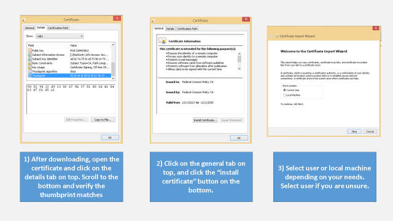
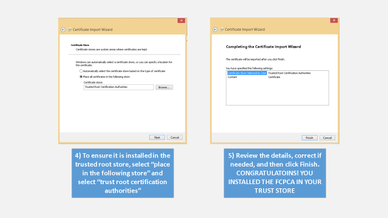
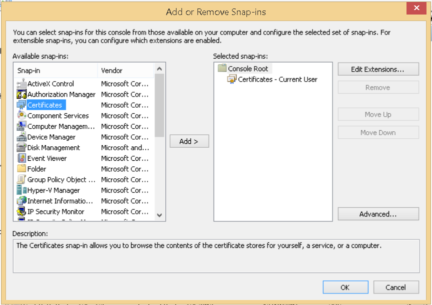
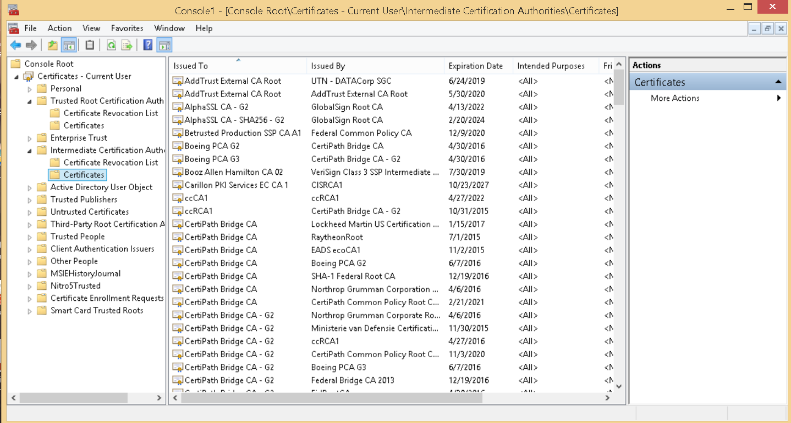
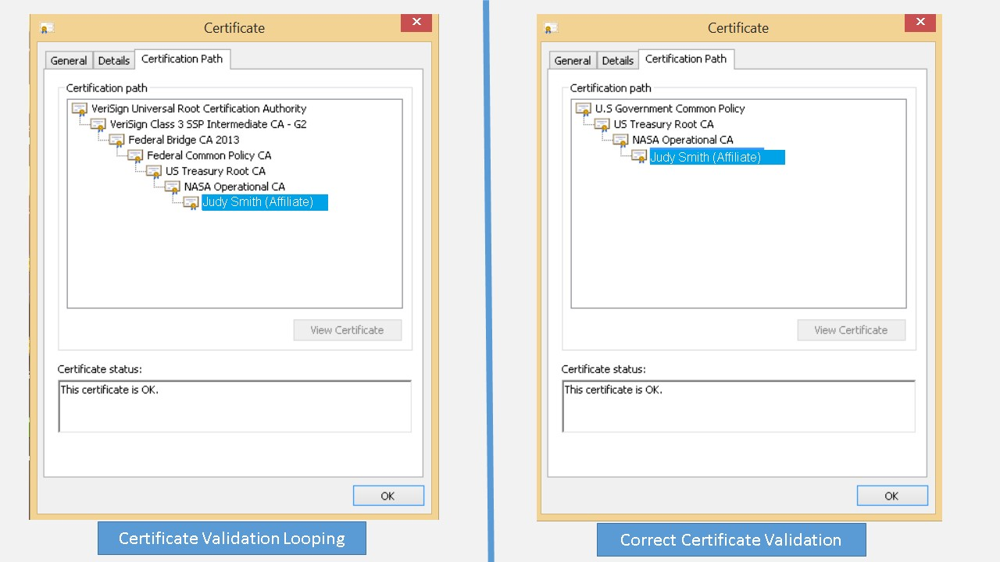

**Federal PKI **

**Trust Store Management Guide**

V1.0

September 21, 2015

***Disclaimer***

The Federal PKI Management Authority (FPKIMA) has designed and created the *Trust Store Management Guide* as an education resource for Department, Agency, corporate and other organizational system level administrators and managers who use the Federal PKI as part of regular business practices. Some items identified in this guide may require changes to system configuration including registry and trust store settings. These types of changes should not be implemented without proper change management and system owner authorization. The FPKIMA makes no claim, representation, or warranty that the steps identified in this guide are a best approach to implementation. It will depend on individual organizational processes and requirements to make that determination. Please send any questions or comments to [FPKI-Help@GSA.gov](file:///C:\Users\kenmye03\AppData\Local\Microsoft\Windows\INetCache\Content.Outlook\N3H4VS6W\FPKI-Help@GSA.gov).

**Table of Contents**

### 1. Introduction 1

### 2. Trust Anchor Management 2

2.1 How to Manage a PKI Trust Store 2

2.2 Download and install the FCPCA Trust Anchor 2

2.3 Download and Install the FPKI Intermediate and Issuing CAs 3

2.4 Trust Store Management via Group Policy Object (GPO) 5

2.5 Set Dynamic Path Validation in Windows 5

2.6 How to Fix Certificate Validation Looping 6

### Appendix A - Acronyms 9

**Table of Figures**

[Figure 1. Installing the FCPCA Trust Anchor 3](#_Toc430633602)

[Figure 2. Open the Certificate Snap-in 4](#_Toc430633603)

[Figure 3. Install FPKI Intermediate Certificates 4](#_Toc430633604)

[Figure 4. Example of a Certificate Validation Loop 6](#_Toc430633605)

[Figure 5. Open the Certificate Manager Snap-In 7](#_Toc430633606)

[Figure 6. Remove the FPKI Participating CA Cross-Certificates 7](#_Toc430633607)

**Record of Changes**

| Version Number | Date of Change | Change Description |
|----------------|----------------|--------------------|
| 1.0            | 09/21/2015     | Initial Document   |
|                |                |                    |
|                |                |                    |
|                |                |                    |
|                |                |                    |

Introduction
============

The Federal Public Key Infrastructure (FPKI) was created out of the E-Government Act of 2002 which directed the General Services Administration to establish and operate the Federal Bridge Certification Authority (FBCA). From this pilot program, the Federal PKI has grown into a diverse PKI ecosystem of hundreds of certification authorities for federal and state government agencies as well as foreign and US commercial PKI participating certification authorities (CAs). The purpose of this technical implementation guide is to aid relying parties to take advantage of the FPKI for their logical and physical identity, credential, and access management (ICAM) requirements. The majority of material in this guide was collected from agency and industry best practices to implement FPKI certificates. As feedback is collected, more operating system and application instructions will be integrated and updated.

Trust Anchor Management
=======================

A PKI trust anchor or root certificate establishes a chain of trust that is used to verify other certificates signed by it. Operating systems and some software manufacturers such as Microsoft, Apple, Mozilla, Java, and Opera maintain a trusted root store of approved trust anchors. Out of the box, the FCPCA is included in the Microsoft, Adobe, and Apple trust store, but should be verified with all applications.

The reliable method to ensure a user can trust all FPKI certificates is to install the FPKI trust anchor, intermediate, and issuing certificates either in the user trust store or a temporary trust store used by applications for certificate validation. Follow the below instructions to download and configure the FPKI Trust Anchor and FPKI Intermediate Certificates[1]. This process will have to be conducted every time a new certificate is issued by a FPKI CA. A better method is to set your system to conduct dynamic path validation or use a SCVP service.

2.1 How to Manage a PKI Trust Store
-----------------------------------

Managing a PKI trust store is very important to ensure certificates validate to the proper trust anchor and can be difficult given the nature of the federal and industry PKI marketplace. The Microsoft Trust Store alone contains over 330 third-party root CAs, but not all of them are needed depending on system requirements and could present an attack vector if not managed properly. Each root has a specific purpose to include server authentication (SSL/HTTPS), client authentication (digital signature), code signing, etc., and can be removed or trimmed if it is found they are not needed.

1.  Identify your PKI trust anchor needs based on use cases. If the system is only intended to operate within the federal government then all non-FPKI trust anchors should be removed or if it is a completely closed system then potentially all pre-loaded anchors can be removed except those to validate required updates.

2.  Trim intermediate cross-certificates to prevent validation looping. Cross-certificates allow an organization to trust other PKI credentials yet use its own organizational trust anchor. This occurs by two CAs issuing certificates to each other to allow transitive trust, but it can also cause issues in certificate validation. Instructions to fix a certificate validation loop are located in the certificate path validation section of this document.

2.2 Download and install the FCPCA Trust Anchor
-----------------------------------------------

1.  <http://http.fpki.gov/fcpca/fcpca.crt>

2.  cn=Federal Common Policy CA, ou=FPKI, o=U.S. Government, c=US

3.  90 5f 94 2f d9 f2 8f 67 9b 37 81 80 fd 4f 84 63 47 f6 45 c1

Figure 1. Installing the FCPCA Trust Anchor

2.3 Download and Install the FPKI Intermediate and Issuing CAs
--------------------------------------------------------------

1.  Download the following P7 files

    1.  <http://http.fpki.gov/fcpca/caCertsIssuedByfcpca.p7c>

    2.  <http://http.fpki.gov/bridge/caCertsIssuedByfbca2013.p7c>

    3.  <http://http.fpki.gov/sha1frca/caCertsIssuedBysha1frca.p7c>

2.  Once downloaded, do a windows search for “mmc.exe” (Microsoft Management Console).

3.  Once opened, click ctrl + M to open the snap-in menu.

    

Figure 2. Open the Certificate Snap-in

1.  Click on “Certificates”, add, and then “OK”. A tree hierarchy should appear with the different certificate folders.

2.  Click on the “Intermediate Certificate Authorities” Folder and then on the “Certificates” subfolder.

Figure 3. Install FPKI Intermediate Certificates

1.  Click on the “Action” tab on the top navigation bar and then import.

2.  Follow the prompts to import the FPKI P7 files that were downloaded.

Installing these files should solve 99%of all FPKI trust chain issues, but in some cases there are more intermediate CAs which will need to be installed. A troubleshooting guide is provided in the certificate validation section of this guide.

2.4 Trust Store Management via Group Policy Object (GPO)
--------------------------------------------------------

For enterprise trust store management, the most efficient method for maintaining trust stores in a Windows environment is through a Group Policy Object.

1.  Follow the above instructions to download the FCPCA Trust Anchor.

2.  Open a command prompt as an administrator on the forest domain controller.

3.  Type ***certutil –f –dspublish &lt;location of FCPCA&gt;.crt***[2] ***RootCA***

4.  View the Enterprise Trusted Root, type ***certutil –viewstore –enterprise root***

Once the FCPCA Trust Anchor is installed in the Active Directory forest’s Trusted Root CA store, issuing CAs should be published in the Network Authentication (NTAuth) store to prevent the ability of fraudulent user’s smart card containing valid userPrincipalName (UPN) within the Subject Alternative Name (SAN) field issued from a non-trusted issuing CA.

1.  Open a command prompt as an administrator on the forest domain controller.

2.  Type ***certutil –dspublish –f &lt;issuing ca file name&gt;.cer NTAuthCA***

3.  Follow step two for all issuing CAs

4.  View the NTAuth Trusted Root, type ***certutil –viewstore –enterprise NTAuth***

While not required, to improve the speed of certificate validation publish the intermediate CAs to the domain’s intermediate certificate store.

1.  Open a command prompt as an administrator on the forest domain controller.

2.  Type ***certutil –dspublish –f &lt;intermediate ca file name&gt;.cer subCA***

3.  Follow step two for all intermediate CAs

4.  View the NTAuth Trusted Root, type ***certutil –viewstore –enterprise***

The new GPO will be updated on the users system when they log off and back on or the user can open a command prompt and type “***gpupdate***”.

2.5 Set Dynamic Path Validation in Windows
------------------------------------------

Dynamic path validation differs from static in that the certificate validation software will build the path based on the AIA entry in the certificate. If the FCPCA Trust Anchor is installed, rather than importing all intermediate CA certificates, enable dynamic path validation in Microsoft Windows and let CAPI discover and validate intermediate certificates that are required to validate a certificate.

The following steps will set up Microsoft CAPI to conduct dynamic path validation.

-   NOTE -

    THIS STEP REQUIRES ADDING A REGISTRY ENTRY IN WINDOWS. ENSURE YOU HAVE THE PROPER PRIVILEGES AND AUTHORITY TO DO SO BEFORE PROCEEDING

1.  Press the Windows + “S” button combination to search for “regedit.exe”

2.  Under the HKEY\_LOCAL\_MACHINE\\SOFTWARE\\Microsoft\\Cryptography\\OID\\ EncodingType 0\\CertDllCreateCertificateChainEngine\\Config folder, create a new DWORD entry.

3.  Add MaxAIAUrlRetrievalCertCount as the name and double click to open it

4.  Make the value “30”

5.  Close regedit and then reboot

Setting Windows to conduct dynamic validation will also help find new FPKI CA certificates when they are issued or reissued.

2.6 How to Fix Certificate Validation Looping
---------------------------------------------

Certificate validation looping is when a certificate validates past the FCPCA Trust Anchor and is caused by a misconfigured trust store and can be operating system specific. Microsoft CAPI uses the certificate path with the most certificate information against which certificates are in the Microsoft Trust Store. Because the FCPCA is cross-certified with the Federal Bridge, a federal certificate could validate to a commercial trust store.

Figure . Example of a Certificate Validation Loop

Figure 10 is an example of a NASA certificate validating through FCPCA and the Federal Bridge to a VeriSign Trust Anchor. Follow the below instructions to fix a certificate validation loop only if the FCPCA is your Trust Anchor.

1.  Do a windows search for “mmc.exe” (Microsoft Management Console).

2.  Once opened, click ctrl + M to open the snap-in menu.

    

Figure . Open the Certificate Manager Snap-In

1.  Click on “Certificates”, add, and then “OK.” A tree hierarchy should appear with the different certificate folders.

2.  Click on the “Intermediate Certificate Authorities” folder and then on the “Certificates” subfolder.

Figure . Remove the FPKI Participating CA Cross-Certificates

1.  Sort on the “issued to” field.

2.  Delete all certificates “issued to” the Federal Bridge (Federal Bridge CA and Federal Bridge CA 2013) except the ones issued by the Federal Common Policy CA.

3.  Delete all certificates “issued to” the Federal Common Policy CA.

Appendix A - Acronyms
=====================

**APL** – Approved Products List

**ATO** – Authority to Operate

**CA** – Certification Authority

**CAC** – Common Access Card

**CAPI** – Microsoft Crypto Application Programming Interface

**CBP** – Commercial Best Practice

**CP** – Certificate Policy

**CPS** – Certification Practice Statement

**CRL** – Certificate Revocation List

**CPWG** – Certificate Policy Working Group

**EGCA** – E-Governance Certification Authority

**FBCA** – Federal Bridge Certification Authority

**FCPCA** – Federal Common Policy Certification Authority

**FICAM** – Federal Identity, Credential, and Access Management

**FPKI** – Federal Public Key Infrastructure

**FPKIMA** – Federal PKI Management Authority

**FPKIPA** – Federal PKI Policy Authority

**GPO** – Group Policy Object

**GSA**- General Services Administration

**HW** – Hardware

**ICAM** – Identity, Credential, and Access Management

**NPE** – Non-Person Entity

**OCSP** – Online Certificate Status Protocol

**OID** – Object Identifier

**PIV** – Personal Identity Verification

**SAN** – Subject Alternate Name

**SCVP** – Server-Based Certificate Validation Protocol

**SHA1 FRCA** – SHA-1 Federal Root Certification Authority

**SME** – Subject Matter Expert

**SSP** – Shared Service Provider

**TFS** – Trust Framework Solutions

**UPN** – User Principal Name

**USG** – U.S. Government

[1] The document containing all the locations can be found at <http://idmanagement.gov/documents/urls-federal-pki-management-authority-fpkima-repositories-federal-bridge-ca-federal-common>

[2] Microsoft can understand either a .crt or .cer certificate extension. A P7 file can also be used if there are multiple certificates.
