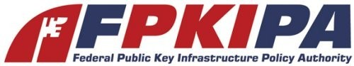
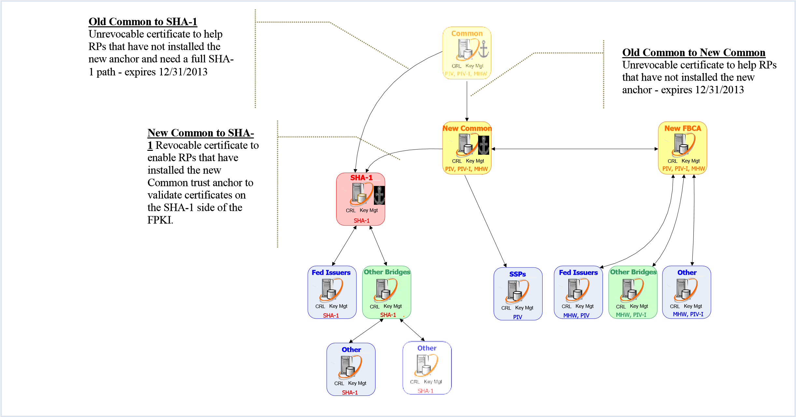
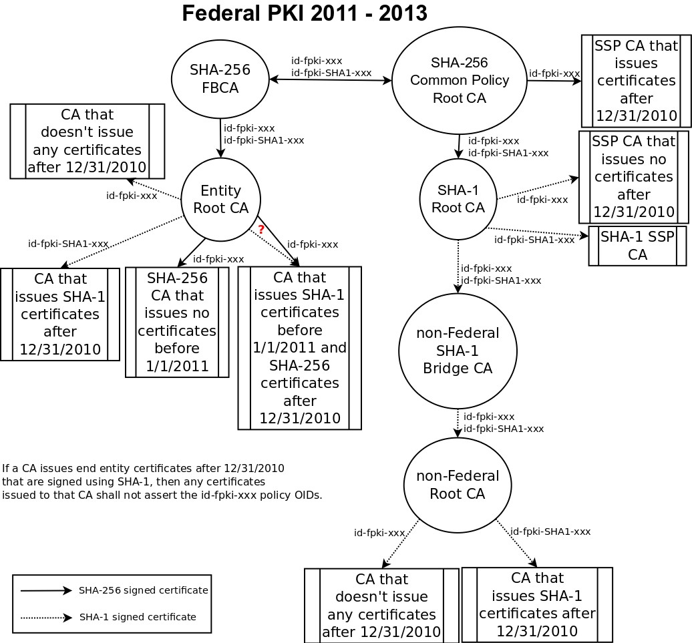

**Federal PKI (FPKI) Community Transition to SHA-256 **

> **Frequently Asked Questions (FAQ) **
>
> Version 1.0
>
> January 18, 2011

2.36 WHEN WILL THE CURRENT COMMON POLICY ROOT CERTIFICATE BE REMOVED FROM THE MICROSOFT

11

1. INTRODUCTION 
================

1.1 Background 
---------------

The Federal government requires the use of SHA-256 in all digital signatures generated by CAs signing Personal Identity Verification (PIV) Cards, beginning on January 1, 2011. While the Federal government allows some limited use of SHA-1 in a deprecated mode, use in the PIV environment is not permitted after January 1, 2011. Therefore, the FPKI Community is currently transitioning its infrastructures to the stronger algorithm and will continue to do so over the next several months. The risk of continued use of SHA-1 is significant. In addition, 80-bit security strength for cryptography does not provide an acceptable level of protection. These risks increase the urgency for transition. There is no value in further delay.

1.2 Objective and Audience 
---------------------------

The objective of this document is to answer the most frequently asked questions regarding the FPKI community’s transition to SHA-256. When there is a conflict, the authoritative documents listed in Section 2.43, References, should be relied upon.

2. FREQUENTLY ASKED QUESTIONS 
==============================

2.1 What is the SHA-256 Transition? 
------------------------------------

The FPKI Community is moving to a stronger hash algorithm to comply with [*National Institute of* *Standards and Technology (NIST)* *Special Publication* *(SP) 800-57*](http://csrc.nist.gov/publications/PubsSPs.html) and [*NIST SP* *800-78*](http://csrc.nist.gov/publications/PubsSPs.html) requirements, and to improve the security posture of systems deployed in the FPKI Community.

2.2 Why is the Federal PKI transitioning to an infrastructure that uses SHA-256 hashes now? 
--------------------------------------------------------------------------------------------

[*NIST SP* *800-78, *Cryptographic Algorithms and Key Sizes for Personal Identification Verification (PIV)**](http://csrc.nist.gov/publications/PubsSPs.html) and the [*Federal PKI Certificate Policies*](http://www.idmanagement.gov/fpkipa/drilldown_fpkipa.cfm?action=certificate_policies) require the use of SHA-256 in all digital signatures generated by CAs signing PIV Cards, beginning on January 1, 2011. [*NIST SP 800-57, *Recommendation for Key** ](http://csrc.nist.gov/publications/PubsSPs.html)

[**Management – Part 1**,](http://csrc.nist.gov/publications/PubsSPs.html) also requires the use of SHA-256 in all digital signatures generated, beginning on

January 1, 2011. While [*NIST SP 800-131, *Draft Recommendation for the** **Transitioning of** ](http://csrc.nist.gov/publications/PubsSPs.html)

[**Cryptographic Algorithms and Key Sizes**,](http://csrc.nist.gov/publications/PubsSPs.html) allows some limited use of SHA-1 in a deprecated mode, use in the PIV environment is not permitted after January 1, 2011. Therefore, the FPKI Community is currently transitioning its infrastructures to the stronger algorithm and will continue to do so over the next several months. The risk of continued use of SHA-1, based on Moore’s Law and \[Wang 2005\] attack is significant. In addition, 80-bit security strength for cryptography does not provide an acceptable level of protection. Moore’s law and attacks on the algorithm increase the urgency for transition. There is no value in further delay.

2.3 What effect will the SHA-256 Transition have on Federal Agencies? 
----------------------------------------------------------------------

All PIV credentials issued on or after January 1, 2011 will contain digital certificates (PIV

Authentication, Card Authentication, Digital Signature and Key Management) signed using SHA256, and all certificate status information will be signed using SHA-256. Without appropriate attention, this transition to SHA-256 may be problematic for applications within your Agency or Organization that utilize digital credentials, including those applications currently being enabled to accept PIV credentials.

2.4 How do I know my agency is ready for the SHA-256 Transition? 
-----------------------------------------------------------------

Agencies that are ready for the SHA-256 transition have verified that applications can perform the following functions:

1.  Accept SHA-256 certificates;

2.  Validate certificates with SHA-256 Certificate Revocation Lists (CRLs) in the path; and 3. Generate signatures for signing data.

2.5 How should agencies prepare for the SHA-256 Transition? 
------------------------------------------------------------

1.  Inventory existing public key enabled applications within your Agency or Organization that use certificates for authentication, digital signature, and/or encryption.

2.  Determine which applications are at risk of being unable to process SHA-256 by

    1.  Verifying COTS Vendor/Manufacturer support of SHA-256;

    2.  Verifying COTS product minimum required versions for SHA-256 support.

3.  Request SHA-256 signed test CA certificates from the Federal ICAM (FICAM) SHA-256 Test Infrastructure by sending an email to *wendy.brown@pgs.protiviti.com*. In addition, the General Services Administration HSPD-12 Managed Services Office (MSO) is making end user SHA-256 signed test certificates available to Federal agencies in limited quantities. These can be requested by sending an email to *stephen.duncan@gsa.gov*.

4.  Create a SHA-256 Test Plan and institute a testing program for all PKI/PIV-enabled applications. There are three fundamental capabilities that must be tested for each application:

    1.  Capability to **accept** SHA-256 signed PIV certificates and CRLs;

    2.  Capability to **process** SHA-256 signed data; and

    3.  Capability to **produce** SHA-256 signatures.

5.  Voluntarily report test results are posted to [*https://www.idmanagement.gov/fpkipa/sha2*](https://www.idmanagement.gov/fpkipa/sha2) (this web page requires a user name and password, which can be attained by contacting *FPKI.Webmaster@gsa.gov*).

2.6 What should a Federal Agency do that is not yet ready to transition to SHA256? 
-----------------------------------------------------------------------------------

If you are a PKI Shared Service Provider (SSP) customer, coordinate with your SSP. If your agency runs a Legacy PKI, write a letter to the Federal PKI Policy Authority (FPKIPA) indicating your intention to continue to operate using SHA-1 and coordinate with the Federal PKI Management Authority (FPKIMA) to cross certify with the SHA-1 Federal Root CA (FRCA). Discontinue issuing certificates until your agency is ready to issue SHA-256 certificates.

2.7 For Federal Bridge Certification Authority (FBCA) cross certified entities, how will the transition to SHA-256 affect my relationship with the Federal Bridge? 
-------------------------------------------------------------------------------------------------------------------------------------------------------------------

Agencies prepared to move to SHA-256 on January 1, 2011 will continue their relationship with the FBCA. Agencies that are not prepared to move to SHA-256 on January 1, 2011 must establish a separate relationship with the SHA-1 Federal Root CA (FRCA).

2.8 For PKI SSPs, how will the transition to SHA-256 affect my relationship with the Common Policy Root? 
---------------------------------------------------------------------------------------------------------

An SSP who wishes to issue SHA-1 certificates after December 31, 2010 must stop issuing from their old

CA after December 31, 2010, and begin issuing from a new CA starting January 1, 2011 and assert the SHA-1 differentiated OIDs from the SHA-1 FRCA. However, these certificates will no longer be compliant with HSPD-12 / FIPS 201.

2.9 Can PIV or PIV Interoperability (PIV-I) Cards be issued with SHA-1 after December 31, 2010? 
------------------------------------------------------------------------------------------------

No. PIV and PIV-I Card issuers must cease issuing cards using SHA-1 on or before January 1, 2011.

2.10 For Legacy Federal Agencies transferring their cross certification from the FBCA to COMMON, what does this mean in terms of the transition to SHA256? 
-----------------------------------------------------------------------------------------------------------------------------------------------------------

The CA must issue certificates at SHA-256. The current mappings are retained in the new cross certificate issued from the COMMON policy with the following exceptions:

1.  FBCA Medium becomes Common Policy

2.  FBCA Medium Hardware becomes Common Hardware

3.  FBCA High becomes Common High

2.11 Can legacy Federal Agencies transferring the cross certification from the FBCA to COMMON retain their lower (i.e., Basic and Rudimentary) assurance level OIDs since there are no equivalent COMMON policy assurance levels? 
----------------------------------------------------------------------------------------------------------------------------------------------------------------------------------------------------------------------------------

The cross-certificate is with the Common CA, and the Rudimentary and Basic policies remain mapped to FBCA Rudimentary and Basic.

2.12 Do PIV Cards previously issued with SHA-1 certificates need to be reissued; and if so, by what timeline? 
--------------------------------------------------------------------------------------------------------------

No. All PIV cards issued before December 31, 2010 are valid until they expire or are revoked.

2.13 When do the current FBCA and Common CA Root shut down and what will be the impact to me? 
----------------------------------------------------------------------------------------------

The current FBCA and Common CA Root shut down on March 31, 2011. CAs that currently maintain a relationship with the FPKI and that wish to continue a relationship with the FPKI must establish a relationship with the new FBCA, new Common CA, or the SHA-1 Federal Root CA.

2.14 By when must I transition completely to SHA-256? 
------------------------------------------------------

To maintain a relationship with the FPKI, CAs must transition to SHA-256 by December 31, 2013.

2.15 What happens if I cannot transition to SHA-256 by December 31, 2013? 
--------------------------------------------------------------------------

Since the SHA-1 FRCA will shut down on December 31, 2013, any relationship with the Federal PKI through cross certificates will cease.

2.16 Do end-entity certificates issued with SHA-1 have to expire by December 31, 2013, or will they remain valid for a full three-year period from the time of issuance? 
-------------------------------------------------------------------------------------------------------------------------------------------------------------------------

Since the SHA-1 FRCA will shut down on December 31, 2013, any relationship with the Federal PKI through cross certificates will cease.

2.17 What is the FPKIPA, NIST, and OMB going to do to ensure that vendors have compliant products available? 
-------------------------------------------------------------------------------------------------------------

The Federal Government is continuing to coordinate with vendors to encourage development of compliant products.

2.18 Do I need a new mapping to get a SHA-1 FRCA certificate? 
--------------------------------------------------------------

No. To request a SHA-1 FRCA certificate, an authorized official must write a letter to the FPKIPA indicating that the organization who operates the CA is accepting the risk of using SHA-1 past December 31, 2010. The FPKIPA will then authorize the FPKIMA to issue a cross certificate with the appropriate policy mappings from the SHA-1 FRCA.

Detailed Technical Questions 
=============================

Validation: 
============

2.19 How does this transition affect certificate validation of SHA-1 certificates using CRLs? 
----------------------------------------------------------------------------------------------

CRLs can be signed using SHA-1 through December 31, 2011. A CA that has only issued certificates signed with SHA-1 may continue to use SHA-1 when signing CRLs. Certificates issued prior to December 31, 2010 with expiration dates after December 31, 2010 can be validated against CRLs signed with SHA-1. CAs that previously issued SHA-1 certificates and now issue SHA-2 certificates can continue to issue CRLs using SHA-1 through December 31, 2011.

2.20 How does this transition affect certificate validation of SHA-1 certificates using Online Certificate Status Protocol (OCSP)? 
-----------------------------------------------------------------------------------------------------------------------------------

Certificates issued to OCSP responders that cover SHA-1 certificates can be signed using SHA-1 through December 31, 2013 provided that the OCSP responses are pre-generated.

2.21 If I have applications that will be unable to validate SHA-256 certificates, how do I accommodate authentication of users who have been issued SHA-256 certificates by their agency or PIV-I vendor? 
----------------------------------------------------------------------------------------------------------------------------------------------------------------------------------------------------------

Until applications are upgraded to validate SHA-256 certificates, users who have been issued SHA-256 certificates cannot be authenticated. Agencies that are not fully transitioning to SHA-256 must focus first on those applications with external partner users to ensure they can support validation of certificates with SHA-256 hashes.

2.22 Will I still be able to validate certificates that chain back to the old Federal PKI infrastructure after it is shut down on March 31, 2011? 
--------------------------------------------------------------------------------------------------------------------------------------------------

Certificates should chain back to the new COMMON policy. It is expected that the new COMMON policy Root certificate will be distributed as the new Federal Trust Anchor. However, the FPKIMA has been asked to issue cross-certificates from the Legacy Common Policy CA to the new Common Policy CA and to the SHA-1 FRCA. These cross certificates will allow a longer time to fully deploy the new Federal Trust Anchor.

Signing: 
=========

2.23 How long can CRLs and OCSP responses be signed with SHA-1? 
----------------------------------------------------------------

CAs that do not begin signing certificates with a minimum of SHA-224 may continue signing CRLs with SHA-1 until December 31, 2013. CAs that previously signed certificates using SHA-1 that begin signing certificates with a minimum of SHA-224 may continue using SHA-1 to sign CRLs through December 31, 2011.

If the CRL or OCSP Response only covers SHA-1 certificates, CRLs can be signed with SHA-1 until December 31, 2013.

2.24 Are there special security requirements for signing OCSP Responses with SHA-1? 
------------------------------------------------------------------------------------

After December 31, 2010, OCSP responders that generate signatures on OCSP responses using SHA-1 shall only provide signed responses that are pre-produced (i.e., any signed response that is provided to an OCSP client shall have been signed before the OCSP responder received the request from the client).

Cross-Certificates 
===================

2.25 What does the new Federal PKI architecture look like? 
-----------------------------------------------------------

The new Federal PKI Architecture is depicted in the figures below. The first diagram depicts the FPKI Root Relationships. The second diagram depicts the relationships between the FPKI and entities that have relationships with the FPKI.

**-256 FAQ v 1.0 **

> 
>
> 8
>
> 

2.26 How do I get a SHA-256 cross-certificate if I am currently cross certified with the FBCA or Common Policy CA? 
-------------------------------------------------------------------------------------------------------------------

Provide the FPKIMA with the correct subjectInfoAccess (SIA) value and indicate if you require the full three year validity (or ten years for SSPs) period (instead of the current expiration date). If a new certificate request (PKCS \#10) is required, it must be submitted to the FPKIMA. In addition, you must ensure your contact information on file with the FPKIMA and the Memorandum of Agreement (MOA) with the FPKIPA is current. Contact the FPKIMA for more information.

2.27 What do I need to do to get a cross-certificate from the SHA-1 FRCA? 
--------------------------------------------------------------------------

First, write a letter to the FPKIPA stating that your organization accepts responsibility for the risk associated with the continued use of SHA-1. Then, provide the FPKIMA with a copy of the letter to the FPKIPA and the correct value for your SIA and Distinguished Name (DN). If you want the certificate for a validity period up to December 31, 2013, provide a new p10 to the FPKIMA. Contact the FPKIMA for more information.

2.28 What is the SIA to include when I issue a new cross-certificate to the new FBCA? 
--------------------------------------------------------------------------------------

> http://http.fpki.gov/bridge/caCertsIssuedByfbca.p7c
>
> ldap://ldap.fpki.gov/cn=Federal%20Bridge%20CA,ou=FPKI,o=U.S.%20Government,c= US?cACertificate;binary,crossCertificatePair;binary

2.29 What is the SIA to include when I issue a new cross-certificate to the new Federal Common Policy CA? 
----------------------------------------------------------------------------------------------------------

> http://http.fpki.gov/fcpca/caCertsIssuedByfcpca.p7c ldap://ldap.fpki.gov/cn=Federal%20Common%20Policy%20CA,ou=FPKI,o=U.S.%20Go vernment,c=US?cACertificate;binary,crossCertificatePair;binary

2.30 What is the SIA to include when I issue a cross certificate to the new SHA-1 FRCA? 
----------------------------------------------------------------------------------------

> http://http.fpki.gov/sha1frca/caCertsIssuedBysha1frca.p7c ldap://ldap.fpki.gov/cn=SHA-
>
> 1%20Federal%20Root%20CA,ou=FPKI,o=U.S.%20Government,c=US?cACertificate;bi nary,crossCertificatePair;binary

2.31 What is the DN for the new FBCA? 
--------------------------------------

>  cn=Federal Bridge CA, ou=FPKI, o=U.S. Government, c=US

2.32 What is the DN for the new Federal Common Policy CA? 
----------------------------------------------------------

>  cn=Federal Common Policy CA, ou=FPKI, o=U.S. Government, c=US

2.33 What is the DN for the new SHA-1 FRCA? 
--------------------------------------------

>  cn= SHA-1 Federal Root CA, ou= FPKI, o=U.S. Government, c=US

2.34 Will my current cross-certificate be revoked when I receive my new crosscertificate? 
------------------------------------------------------------------------------------------

Current cross-certificates will not be revoked until the FPKIMA is notified that the new certificate has been deployed. However, all current cross-certificates will be revoked no later than March 31, 2011.

2.35 How are certificate policies mapped in the new environment? 
-----------------------------------------------------------------

Current policy mappings are retained when new cross-certificates with the new SHA-256 FBCA are issued. If a cross-certificate with the new Federal Common Policy CA is requested, current policy mappings are retained with the exception that mappings to:

> id-fpki-certpcy-mediumAssurance =&gt; ***become mapped to*** id-fpki-common-policy id-fpki-certpcy-mediumHardware =&gt; ***become mapped to*** id-fpki-common-hardware id-fpki-certpcy-highAssurance =&gt; ***become mapped to*** id-fpki-common-High

If a cross-certificate with the SHA-1 FRCA is requested, current policy mappings are translated to the equivalent SHA-1 policy.

Trust Stores (Root Certificate Distribution) 
=============================================

**2.36 When will the current Common Policy Root certificate be removed from the **

Microsoft Trust List? 
----------------------

The FPKIMA will request that it be removed after March 31, 2011. However, actual removal depends on Microsoft’s update cycle.

2.37 When will the new Federal Common Policy certificate be in the Microsoft Trust List? 
-----------------------------------------------------------------------------------------

The FPKIMA will request that it be added as soon as possible. However, the actual date depends on Microsoft’s update cycle. It is anticipated that the new Common Policy certificate will be included in a February 2011 update to the Microsoft Trust Store.

2.38 What vendors will be distributing the Federal Common Policy certificate? 
------------------------------------------------------------------------------

The FPKIMA will be requesting that the Federal Common Policy certificate be distributed in the Adobe AATL by Apple, Java, Microsoft, and Mozilla.

2.39 When do I need to have the new Federal Common Policy certificate distributed to my users? 
-----------------------------------------------------------------------------------------------

The new Federal Common Policy certificate must be distributed to users by no later than December 31, 2013. However, users are encouraged to begin using the new Federal Common Policy certificate as soon as possible, preferably before March 31, 2011.

2.40 Will the new FBCA certificate be installed in vendor Trust Lists, and if so, by when? 
-------------------------------------------------------------------------------------------

No. The FBCA certificate should not be used as a trust anchor.

2.41 Does the displayed “thumbprint” of the certificate have to be SHA-256? 
----------------------------------------------------------------------------

No. The “thumbprint” is calculated and displayed by the application used to view the certificate, and is not an attribute of the certificate itself.

2.42 Do the biometric containers on a PIV or PIV-I Card have to be signed with SHA-256? 
----------------------------------------------------------------------------------------

Yes. After December 31, 2010 all valid signatures must be at SHA-256.

REFERENCES 
===========

2.43 What authoritative documents should I read to successfully accomplish the Transition to SHA-256? 
------------------------------------------------------------------------------------------------------

>  [*NIST SP* *800-78, *Cryptographic Algorithms and Key Sizes for Personal Identification** **Verification (PIV)** ](http://csrc.nist.gov/publications/PubsSPs.html)
>
>  [*Federal PKI Certificate Policies*](http://www.idmanagement.gov/fpkipa/drilldown_fpkipa.cfm?action=certificate_policies)
>
>  [*NIST SP 800-57, *Recommendation for Key Management – Part 1**](http://csrc.nist.gov/publications/PubsSPs.html)
>
>  [*NIST SP 800-131, *Draft Recommendation** **for the Transitioning of Cryptographic Algorithms and** **Key Sizes** ](http://csrc.nist.gov/publications/PubsSPs.html)
